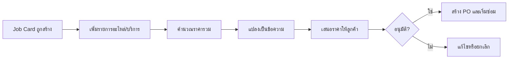
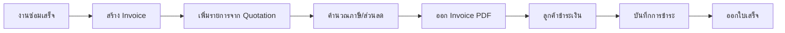
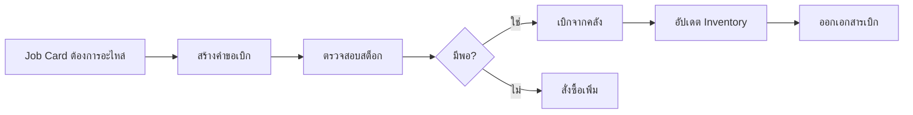
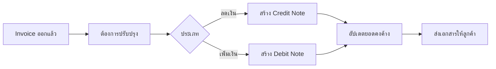
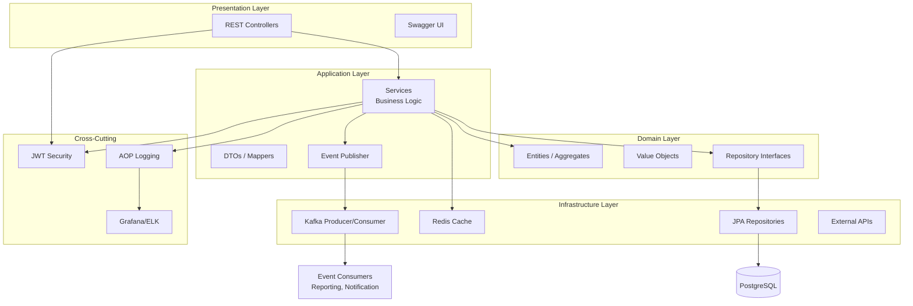
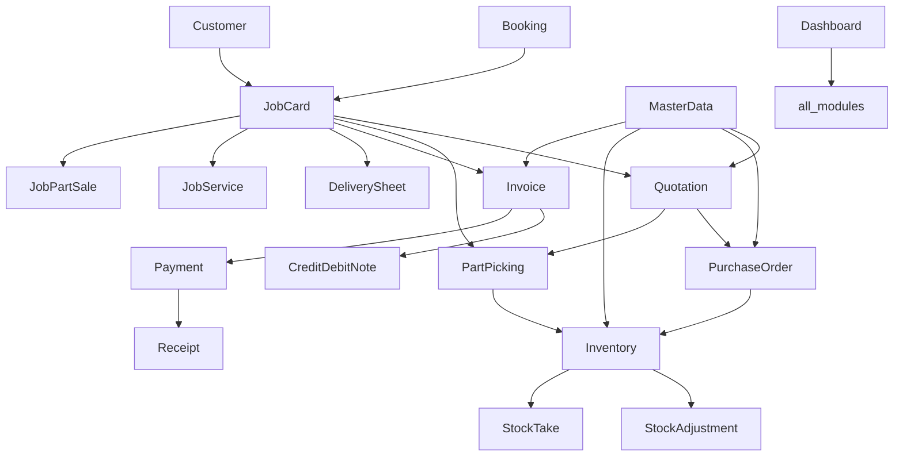
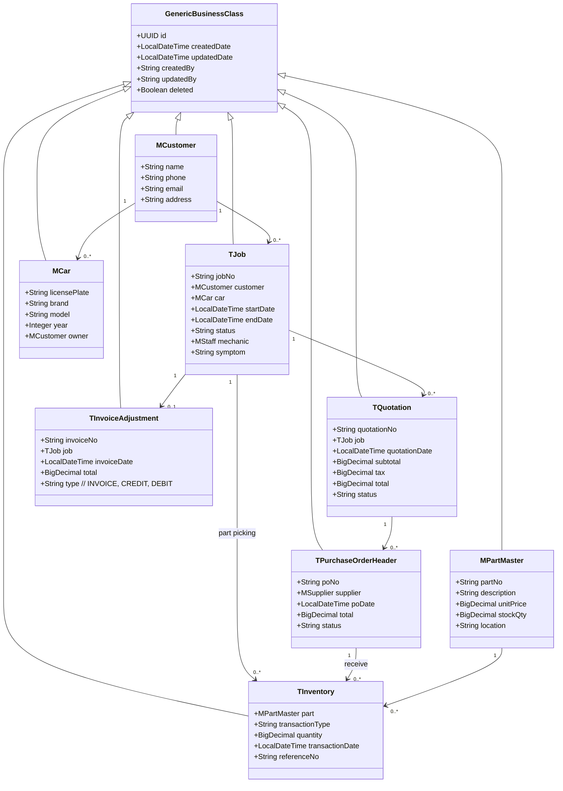

# เอกสารโครงการระบบบริหารจัดการอู่ซ่อมรถ  
**Auto Repair Shop Management System**

---

## สารบัญ

1. [บทนำ](#1-บทนำ)
2. [บทนิยาม](#2-บทนิยาม)
3. [บทหัวข้อ (ภาพรวมระบบ)](#3-บทหัวข้อ-ภาพรวมระบบ)
4. [ขอบเขตของระบบ](#4-ขอบเขตของระบบ) *(เพิ่มเติม)*
5. [ออกแบบคู่มือ](#5-ออกแบบคู่มือ)
6. [ออกแบบ Workflow](#6-ออกแบบ-workflow)
7. [Diagram แผนภาพโครงสร้างระบบ](#7-diagram-แผนภาพโครงสร้างระบบ)
8. [ออกแบบฐานข้อมูล](#8-ออกแบบฐานข้อมูล)
9. [ออกแบบ API](#9-ออกแบบ-api)
10. [ออกแบบ Module](#10-ออกแบบ-module)

---

## 1. บทนำ

### 1.1 วัตถุประสงค์
ระบบบริหารจัดการอู่ซ่อมรถ (Auto Repair Shop Management System) ถูกพัฒนาขึ้นเพื่อเพิ่มประสิทธิภาพในการดำเนินงานของศูนย์บริการหรืออู่ซ่อมรถ โดยครอบคลุมตั้งแต่การรับรถเข้าซ่อม การวินิจฉัยปัญหา การเสนอราคา การสั่งซื้ออะไหล่ การเบิกจ่ายสินค้าคงคลัง การออกใบแจ้งหนี้ และการติดตามประวัติการซ่อมบำรุงของลูกค้าและยานพาหนะ

ระบบถูกออกแบบให้มีความยืดหยุ่น รองรับการขยายตัวในอนาคต และสามารถปรับใช้กับธุรกิจขนาดกลางถึงขนาดใหญ่ได้ โดยใช้สถาปัตยกรรมแบบ **Domain‑Driven Design (DDD)** ผสานกับ **Clean Architecture** และ **Event‑Driven** เพื่อแยกความรับผิดชอบและเพิ่มความสามารถในการบำรุงรักษา

### 1.2 เทคโนโลยีหลัก (Tech Stack)

| หมวดหมู่ | เทคโนโลยี |
|---------|-----------|
| ภาษา | Java 17+ / 21 |
| Framework | Spring Boot 3.4.1 |
| ORM | Spring Data JPA (Hibernate) |
| ฐานข้อมูลหลัก | PostgreSQL |
| Cache | Redis |
| Message Queue / Event Bus | Apache Kafka |
| Logging & Monitoring | ELK (Elasticsearch, Logstash, Kibana), Grafana, Micrometer |
| การจัดการเอกสาร | JasperReports (PDF), Apache POI (Excel) |
| Workflow Automation | n8n |
| CI/CD | Jenkins, Docker Compose, AWS (EC2, S3) |
| Testing | JUnit, TestContainers, Mockito, Robot Framework |
| OCR | Tesseract / Google Vision (Image to Text) |
| IoT | MQTT, InfluxDB (สำหรับอุปกรณ์ IoT และ GPS Tracking) |

### 1.3 สถาปัตยกรรมภาพรวม
ระบบใช้ **Layered Architecture** ประกอบด้วย 4 ชั้นหลัก:
- **Controller Layer** – รับ HTTP Request, ตรวจสอบ JWT, Validate DTO
- **Service Layer** – จัดการ Business Logic, Transaction, เรียกใช้ Cache
- **Repository Layer** – Spring Data JPA เชื่อมต่อ PostgreSQL
- **Domain Layer** – Entity และ Value Objects ตามหลัก DDD

นอกเหนือจากนั้นยังมี **Event Publisher/Consumer** ผ่าน Kafka เพื่อแยกงานหนัก (เช่น การสร้างรายงาน, การแจ้งเตือน, การอัปเดต Elasticsearch) ออกจาก REST API หลัก ช่วยให้ระบบตอบสนองได้รวดเร็วและสามารถขยายในแนวราบได้

### 1.4 กลุ่มผู้ใช้งาน
- **พนักงานหน้าร้าน (Service Advisor)** – รับรถ, สร้าง Job Card, ออกใบเสนอราคา, ปิดงาน
- **ช่างเทคนิค (Mechanic)** – วินิจฉัย, ซ่อมแซม, อัปเดตสถานะงาน
- **พนักงานคลังสินค้า (Store Keeper)** – จัดการสินค้าคงคลัง, เบิกจ่ายอะไหล่, รับสินค้า
- **ฝ่ายจัดซื้อ (Purchasing)** – สร้างใบสั่งซื้อ, ติดตาม Supplier
- **ฝ่ายบัญชี/การเงิน (Finance)** – ออกใบแจ้งหนี้, รับชำระเงิน, จัดการเอกสารปรับปรุง
- **ผู้ดูแลระบบ (Admin)** – จัดการผู้ใช้, สิทธิ์การใช้งาน, ข้อมูลพื้นฐาน
- **ผู้บริหาร (Executive)** – ดู Dashboard และรายงานสรุป

---

## 2. บทนิยาม

| คำศัพท์ | คำอธิบาย |
|---------|----------|
| **Job Card (ใบงาน)** | เอกสารหลักที่บันทึกข้อมูลการรับรถเข้าซ่อม ประกอบด้วยข้อมูลลูกค้า, รถยนต์, อาการเบื้องต้น, และช่างที่รับผิดชอบ |
| **Quotation (ใบเสนอราคา)** | เอกสารแสดงรายการอะไหล่และค่าบริการที่ต้องใช้ในการซ่อม พร้อมราคา เพื่อให้ลูกค้าอนุมัติก่อนดำเนินการ |
| **Purchase Order (ใบสั่งซื้อ)** | เอกสารที่ใช้สั่งซื้ออะไหล่จาก Supplier เมื่อสินค้าในคลังไม่เพียงพอ |
| **Invoice (ใบแจ้งหนี้)** | เอกสารเรียกเก็บเงินจากลูกค้าหลังจากงานซ่อมเสร็จสิ้น |
| **Credit Note (ใบลดหนี้)** | เอกสารลดจำนวนเงินที่ต้องชำระจากใบแจ้งหนี้ (เช่น ส่วนลด, การคืนเงิน) |
| **Debit Note (ใบเพิ่มหนี้)** | เอกสารเพิ่มจำนวนเงินที่ต้องชำระจากใบแจ้งหนี้ (เช่น ค่าใช้จ่ายเพิ่มเติม) |
| **Part Picking (การเบิกอะไหล่)** | กระบวนการหยิบอะไหล่จากคลังตามที่ระบุใน Job Card หรือ Quotation เพื่อนำไปใช้ในการซ่อม |
| **Delivery Sheet (ใบส่งของ)** | เอกสารประกอบการส่งมอบอะไหล่หรือสินค้าให้ลูกค้าหรือแผนกอื่น |
| **Inventory (สินค้าคงคลัง)** | สินค้าทั้งหมดที่เก็บไว้ในคลัง รวมถึงอะไหล่รถและอุปกรณ์ต่างๆ |
| **Stock Adjustment (ปรับปรุงสต็อก)** | การปรับจำนวนสินค้าคงคลังให้ตรงกับความเป็นจริง (เช่น สูญหาย, ชำรุด) |
| **Stock Take (ตรวจนับสต็อก)** | การนับสินค้าจริงเพื่อเปรียบเทียบกับระบบ |
| **Supplier (ผู้จัดจำหน่าย)** | บริษัทหรือร้านค้าที่จัดหาอะไหล่ให้อู่ |
| **Master Data (ข้อมูลหลัก)** | ข้อมูลพื้นฐานที่ใช้ร่วมกัน เช่น รายการอะไหล่, รายการบริการ, ลูกค้า, รถยนต์ |
| **Batch Job (งานประจำ)** | งานที่ทำงานอัตโนมัติตามเวลาที่กำหนด (Cron) เช่น การส่งอีเมลแจ้งเตือน, การสร้างรายงาน |
| **Bounded Context** | ขอบเขตของโมเดลใน DDD ที่แยกแต่ละส่วนของระบบออกจากกันตามความหมายทางธุรกิจ |

---

## 3. บทหัวข้อ (ภาพรวมระบบ)

ระบบประกอบด้วยโมดูลหลักตามบัญชีรายการด้านล่าง ซึ่งแต่ละโมดูลทำงานร่วมกันอย่างเป็นระบบภายใต้สถาปัตยกรรมเดียวกัน

### โมดูลหลัก

```
├── 🔑 Authentication & Permission        ← เข้าสู่ระบบ / จัดการสิทธิ์
├── 🚗 Job Card Management                 ← ใบงานซ่อมรถ
├── 👥 Customer Management                 ← ข้อมูลลูกค้า
├── 📋 Quotation                           ← ใบเสนอราคา
├── 🛒 Purchase Order                      ← ใบสั่งซื้อ
├── 📦 Inventory Management                ← คลังสินค้า / อะไหล่
├── 💰 Payment Management                  ← การชำระเงิน
├── 📅 Booking Management                  ← การนัดหมาย
├── 👨‍💼 Staff Management                    ← จัดการพนักงาน
├── 🏢 Company & Supplier                  ← บริษัท / Supplier
├── 📊 Dashboard & Reports                 ← รายงานและ Dashboard
├── 📧 Email Service                       ← ส่ง Email อัตโนมัติ
├── 📄 Document Management                 ← จัดการเอกสาร (PDF, Excel)
├── 🔍 OCR (Image to Text)                 ← อ่านข้อความจากรูปภาพ
├── ⏱️ Batch Jobs (6 jobs)                 ← งาน Scheduled อัตโนมัติ
├── 🌏 Multi-Language (18 ภาษา)            ← รองรับหลายภาษา
├── 📡 IoT & GPS Tracking                  ← ติดตามอุปกรณ์และตำแหน่ง
├── 🎛️ Device Access Control               ← ควบคุมการเข้าถึงอุปกรณ์
└── 🛍️ Web Order System (WOS)             ← ระบบสั่งซื้อออนไลน์
    ├── 📚 Catalogue Management
    ├── 🛒 Shopping Cart
    └── 💵 Sales Price
```

---

## 4. ขอบเขตของระบบ

ระบบนี้ครอบคลุมขอบเขตการทำงานดังนี้:

1. **การจัดการงานซ่อม** ตั้งแต่รับรถจนถึงปิดงาน พร้อมสถานะการดำเนินการ
2. **การจัดการอะไหล่และสินค้าคงคลัง** รวมถึงการเบิก, รับ, ปรับปรุง, และตรวจนับ
3. **การจัดซื้อ** ผ่านใบสั่งซื้อและติดตาม Supplier
4. **การเงินและการเรียกเก็บเงิน** ผ่านใบแจ้งหนี้, ใบลด/เพิ่มหนี้, และใบเสร็จรับเงิน
5. **การจัดการข้อมูลลูกค้าและยานพาหนะ** แบบรวมศูนย์
6. **การวิเคราะห์และรายงาน** ด้วย Dashboard และรายงาน PDF/Excel
7. **การสื่อสารอัตโนมัติ** ผ่านอีเมลและ LINE Notify (ตามที่กำหนด)
8. **การทำงานแบบ Event‑Driven** เพื่อแยกประมวลผลหนัก (รายงาน, แจ้งเตือน, Logging)
9. **การเชื่อมต่อกับอุปกรณ์ IoT** สำหรับติดตามสถานะและตำแหน่ง

ระบบไม่ครอบคลุมการผลิตอะไหล่หรือการบัญชีแยกประเภทเต็มรูปแบบ แต่สามารถเชื่อมต่อกับระบบบัญชีภายนอกได้ผ่าน API

---

## 5. ออกแบบคู่มือ

### 5.1 การติดตั้งและกำหนดค่าเบื้องต้น

#### ข้อกำหนดเบื้องต้น
- Java 21+ (หรือ 17+)
- Maven 3.8+
- Docker & Docker Compose
- Git

#### ขั้นตอน
1. **Clone โปรเจกต์**
   ```bash
   git clone https://github.com/your-org/auto-repair-system.git
   cd auto-repair-system
   ```

2. **กำหนดค่าตัวแปรสภาพแวดล้อม**
   ```bash
   cp .env.example .env
   # แก้ไขไฟล์ .env ให้ตรงกับสภาพแวดล้อมจริง
   ```

3. **เริ่มต้นฐานข้อมูลด้วย Docker Compose**
   ```bash
   docker-compose up -d
   ```
   บริการที่ถูก:
   - PostgreSQL (พอร์ต 5432) + PgAdmin (พอร์ต 5050)
   - MongoDB (พอร์ต 27017) สำหรับเก็บ Logs
   - Neo4j (พอร์ต 7474, 7687) สำหรับข้อมูล Graph (ถ้าใช้)
   - Redis (พอร์ต 6379)
   - Kafka + Zookeeper (พอร์ต 9092)

4. **รันแอปพลิเคชัน**
   ```bash
   # Development profile
   mvn spring-boot:run

   # หรือระบุ profile
   mvn spring-boot:run -Dspring-boot.run.profiles=dev
   ```

5. **เข้าถึง Swagger UI**  
   `http://localhost:1080/api/swagger-ui.html`

### 5.2 การใช้งานเบื้องต้น (ตัวอย่างขั้นตอนหลัก)

1. **เข้าสู่ระบบ** ด้วย Username / Password ที่กำหนดไว้ (เริ่มต้น admin/admin)
2. **สร้าง Job Card** – ระบุลูกค้า, รถยนต์, อาการ, และช่างที่รับผิดชอบ
3. **วินิจฉัยและเพิ่มรายการซ่อม** – เพิ่มบริการและอะไหล่ที่ต้องใช้
4. **สร้าง Quotation** – ระบบคำนวณราคารวมและแปลงเป็นข้อความ (บาท/ดอลลาร์)
5. **ให้ลูกค้าอนุมัติ** – เมื่ออนุมัติ ระบบจะสร้าง Purchase Order (ถ้าสินค้าไม่พอ) และดำเนินการเบิกอะไหล่
6. **ดำเนินการซ่อม** – ช่างอัปเดตสถานะงาน
7. **ออก Invoice** – เมื่อซ่อมเสร็จ ระบบสร้างใบแจ้งหนี้จากข้อมูลใน Quotation
8. **รับชำระเงิน** – บันทึกการชำระและออกใบเสร็จ
9. **ปิด Job Card** – สรุปงานและอัปเดตประวัติ

---

## 6. ออกแบบ Workflow

### 6.1 Workflow หลักของระบบ (End‑to‑End)

```mermaid
graph TD
    A[ลูกค้ามาถึง/นัดหมาย] --> B[สร้าง Job Card]
    B --> C[วินิจฉัย/เพิ่มรายการ]
    C --> D[สร้าง Quotation]
    D --> E{ลูกค้าอนุมัติ?}
    E -- ไม่ --> F[ปรับปรุง Quotation / ยกเลิก]
    E -- ใช่ --> G[สร้าง Purchase Order (ถ้าต้องการ)]
    G --> H[เบิกอะไหล่]
    H --> I[ดำเนินการซ่อม]
    I --> J[ตรวจสอบเสร็จ]
    J --> K[สร้าง Invoice]
    K --> L[รับชำระเงิน]
    L --> M[ออกใบเสร็จ]
    M --> N[ปิด Job Card]
```

### 6.2 Workflow ของแต่ละโมดูล

#### Quotation Workflow


#### Purchase Order Workflow


#### Invoice & Payment Workflow


#### Part Picking Workflow


#### Credit/Debit Note Workflow


---

## 7. Diagram แผนภาพโครงสร้างระบบ

### 7.1 แผนภาพสถาปัตยกรรม (Layered + Event‑Driven)



### 7.2 แผนภาพความสัมพันธ์ระหว่างโมดูล (Module Dependency Map)



### 7.3 แผนภาพคลาสหลัก (Core Entities)



---

## 8. ออกแบบฐานข้อมูล

### 8.1 สรุปตารางหลัก

| กลุ่ม | ตาราง | คำอธิบาย |
|-------|-------|----------|
| **Master Data** | `m_company` | ข้อมูลบริษัท/อู่ |
| | `m_customer` | ข้อมูลลูกค้า |
| | `m_car` | ข้อมูลรถยนต์ |
| | `m_supplier` | ข้อมูลผู้จัดจำหน่าย |
| | `m_part_master` | รายการอะไหล่หลัก |
| | `m_service` | รายการบริการ |
| | `m_category` | หมวดหมู่สินค้า/บริการ |
| | `m_staff` | ข้อมูลพนักงาน |
| | `m_user` | ผู้ใช้ระบบ |
| | `m_menu` | เมนูระบบ |
| | `m_payment_method` | วิธีการชำระเงิน |
| | `m_payment_terms` | เงื่อนไขการชำระเงิน |
| | `m_currency` | สกุลเงิน |
| | `m_exchange_rate` | อัตราแลกเปลี่ยน |
| | `m_country`, `m_city`, `m_province` | ข้อมูลภูมิศาสตร์ |
| | `m_shop_profile` | ข้อมูลร้านค้า |
| **Transaction** | `t_job` | ใบงาน |
| | `t_job_service` | รายการบริการในใบงาน |
| | `t_job_part_sales` | รายการอะไหล่ที่ขายในใบงาน |
| | `t_job_service_car_symptom` | อาการของรถ |
| | `t_job_diag_trouble_code` | รหัสข้อบกพร่องจากการวินิจฉัย |
| | `t_quotation` | ใบเสนอราคา |
| | `t_quotation_part` | รายการอะไหล่ในใบเสนอราคา |
| | `t_quotation_service` | รายการบริการในใบเสนอราคา |
| | `t_purchase_order_header` | หัวใบสั่งซื้อ |
| | `t_purchase_order_detail` | รายละเอียดใบสั่งซื้อ |
| | `t_invoice_adjustment` | ใบแจ้งหนี้ / ใบลดหนี้ / ใบเพิ่มหนี้ |
| | `t_invoice_adjustment_part` | รายการอะไหล่ในใบแจ้งหนี้ |
| | `t_invoice_adjustment_service` | รายการบริการในใบแจ้งหนี้ |
| | `t_received_amount` | ประวัติการรับชำระเงิน |
| | `t_inventory` | รายการเคลื่อนไหวสินค้าคงคลัง |
| | `t_inventory_adjustment_header` | หัวการปรับปรุงสต็อก |
| | `t_inventory_adjustment_detail` | รายละเอียดการปรับปรุงสต็อก |
| | `t_stocktake_header` | หัวการตรวจนับสต็อก |
| | `t_stocktake_detail` | รายละเอียดการตรวจนับ |
| | `t_email_promotion` | อีเมลโปรโมชัน |
| | `t_email_reminder` | อีเมลแจ้งเตือน |
| | `t_document_remark` | ข้อความบันทึกในเอกสาร |
| **View** | `v_header_report` | มุมมองสำหรับรายงานหัวเอกสาร |
| | `v_job_card_detail` | รายละเอียดใบงาน |
| | `v_preview_job_card_header_report` | มุมมองหัวใบงานสำหรับ PDF |
| | `v_preview_job_card_details_parts` | มุมมองรายการอะไหล่ในใบงาน |
| | `v_part_picking_request_header` | มุมมองหัวขอเบิก |
| | `v_part_picking_request_detail` | มุมมองรายละเอียดขอเบิก |
| | `v_credit_debit_detail` | มุมมองรายละเอียดใบลด/เพิ่มหนี้ |
| | `v_preview_receipt` | มุมมองใบเสร็จ |
| **Dashboard** | `d_sales_overview` | สรุปยอดขาย |
| | `d_inventory_overview` | สรุปสินค้าคงคลัง |
| | `d_parts_brand` | ยอดขายแยกแบรนด์อะไหล่ |
| | `d_parts_category` | ยอดขายแยกหมวดหมู่ |
| | `d_service_car_detail` | รายละเอียดบริการรถ |
| | `d_service_car_intake` | จำนวนรถเข้าซ่อม |
| | `d_service_category` | ยอดขายแยกประเภทบริการ |
| | `d_accumulate_car_brand` | สะสมยี่ห้อรถ |
| | `d_accumulate_car_name` | สะสมรุ่นรถ |
| | `d_accumulate_finance` | สรุปการเงินสะสม |

### 8.2 ความสัมพันธ์หลัก (ER Diagram สรุป)

- `t_job` → `m_customer` (Many‑to‑One)
- `t_job` → `m_car` (Many‑to‑One)
- `t_job` → `m_staff` (ช่างผู้รับผิดชอบ)
- `t_quotation` → `t_job` (Many‑to‑One)
- `t_quotation_part` → `t_quotation`, `m_part_master`
- `t_purchase_order_header` → `m_supplier` (Many‑to‑One)
- `t_purchase_order_detail` → `m_part_master`
- `t_invoice_adjustment` → `t_job` (One‑to‑One)
- `t_invoice_adjustment_part` → `t_invoice_adjustment`, `m_part_master`
- `t_inventory` → `m_part_master` (Many‑to‑One), `t_job` (optional)
- `t_received_amount` → `t_invoice_adjustment`

---

## 9. ออกแบบ API

### 9.1 หลักการออกแบบ
- RESTful API
- ใช้ JSON เป็นรูปแบบข้อมูลหลัก
- ตรวจสอบสิทธิ์ผ่าน JWT Bearer Token
- มี Swagger/OpenAPI สำหรับเอกสารอัตโนมัติ

### 9.2 สรุป Endpoints หลักแยกตามโมดูล

#### Authentication
| Method | Path | คำอธิบาย |
|--------|------|----------|
| POST | `/auth/login` | เข้าสู่ระบบ |
| POST | `/auth/logout` | ออกจากระบบ |
| POST | `/auth/refresh` | ต่ออายุ Token |
| GET | `/user/profile` | ข้อมูลผู้ใช้ปัจจุบัน |

#### Job Card
| Method | Path | คำอธิบาย |
|--------|------|----------|
| GET | `/job/list` | รายการใบงาน |
| POST | `/job/create` | สร้างใบงานใหม่ |
| PUT | `/job/update/{id}` | แก้ไขใบงาน |
| GET | `/job/{id}` | ดูรายละเอียดใบงาน |
| PUT | `/job/status/{id}` | เปลี่ยนสถานะ |
| GET | `/job/history` | ประวัติการซ่อมของรถ |
| GET | `/job/order/report/{id}` | สร้าง PDF ใบงาน |

#### Quotation
| Method | Path | คำอธิบาย |
|--------|------|----------|
| GET | `/quotation/list` | รายการใบเสนอราคา |
| POST | `/quotation/create` | สร้างใบเสนอราคา |
| PUT | `/quotation/update` | แก้ไข |
| GET | `/quotation/{id}` | ดูรายละเอียด |
| GET | `/quotation/report/{id}` | สร้าง PDF |
| POST | `/quotation/part/create` | เพิ่มรายการอะไหล่ |
| GET | `/quotation/list/{jobId}` | รายการ Quotation ของ Job |

#### Purchase Order
| Method | Path | คำอธิบาย |
|--------|------|----------|
| GET | `/po/list` | รายการ PO |
| POST | `/po/create` | สร้าง PO |
| PUT | `/po/update/{id}` | แก้ไข |
| GET | `/po/{id}` | ดูรายละเอียด |
| GET | `/po/report/{id}` | สร้าง PDF |
| POST | `/po/email/{id}` | ส่ง PO ทางอีเมล |

#### Invoice / Credit / Debit Note
| Method | Path | คำอธิบาย |
|--------|------|----------|
| GET | `/invoice/tab/list` | รายการใบแจ้งหนี้ |
| POST | `/invoice/create` | สร้าง Invoice |
| PUT | `/invoice/update/{id}` | แก้ไข |
| GET | `/invoice/report/{id}` | PDF Invoice |
| GET | `/invoice/summary/{jobId}` | สรุปยอด |
| POST | `/invoice/part/create` | เพิ่มรายการอะไหล่ |
| POST | `/invoice/credit-note/create` | สร้าง Credit Note |
| POST | `/invoice/debit-note/create` | สร้าง Debit Note |
| GET | `/invoice/credit-note/report/{id}` | PDF Credit Note |
| GET | `/invoice/debit-note/report/{id}` | PDF Debit Note |

#### Payment / Receipt
| Method | Path | คำอธิบาย |
|--------|------|----------|
| POST | `/payment/create` | บันทึกการชำระเงิน |
| GET | `/receipt/{id}` | ดูใบเสร็จ |
| GET | `/receipt/report/{id}` | PDF ใบเสร็จ |

#### Inventory & Part Picking
| Method | Path | คำอธิบาย |
|--------|------|----------|
| GET | `/inventory/list` | รายการสินค้าคงคลัง |
| POST | `/inventory/receive` | รับสินค้าเข้า |
| POST | `/inventory/issue` | เบิกจ่ายสินค้า |
| GET | `/stock-summary` | สรุปสต็อก |
| GET | `/stock/location` | ตำแหน่งจัดเก็บ |
| POST | `/part-picking/create` | สร้างคำขอเบิก |
| GET | `/part-picking/pdf` | PDF เอกสารเบิก |

#### Master Data
| Method | Path | คำอธิบาย |
|--------|------|----------|
| GET | `/customer/list` | รายการลูกค้า |
| POST | `/customer/create` | เพิ่มลูกค้า |
| GET | `/car/list` | รายการรถ |
| GET | `/part-master/list` | รายการอะไหล่ |
| GET | `/supplier/list` | รายการ Supplier |
| GET | `/service/list` | รายการบริการ |

#### Dashboard & Reports
| Method | Path | คำอธิบาย |
|--------|------|----------|
| GET | `/dashboard/sales-overview` | ภาพรวมยอดขาย |
| GET | `/dashboard/inventory-overview` | ภาพรวมสต็อก |
| GET | `/dashboard/top-parts` | อะไหล่ขายดี |
| GET | `/report/export-excel` | ส่งออก Excel |
| GET | `/report/export-pdf` | ส่งออก PDF |

---

## 10. ออกแบบ Module

### 10.1 โครงสร้างโปรเจกต์ (Project Structure)

```
src/main/java/com/icmon/app/
├── _shared/                         # ส่วนประกอบร่วม (Generic)
│   ├── application/                 # Service พื้นฐาน
│   ├── domain/                      # Entity พื้นฐาน
│   └── infrastructure/              # Repository พื้นฐาน
│
├── modules/                         # โมดูลธุรกิจ
│   ├── auth/                        # Authentication & Permission
│   ├── job/                         # Job Card
│   ├── quotation/                   # Quotation
│   ├── purchase/                    # Purchase Order
│   ├── invoice/                     # Invoice & Credit/Debit Note
│   ├── inventory/                   # Inventory & Part Picking
│   ├── payment/                     # Payment & Receipt
│   ├── customer/                    # Customer & Car
│   ├── supplier/                    # Supplier
│   ├── staff/                       # Staff Management
│   ├── masterdata/                  # Master Data (Part, Service, etc.)
│   ├── dashboard/                   # Dashboard & Reports
│   ├── email/                       # Email Service
│   ├── document/                    # Document Management (PDF/Excel)
│   ├── ocr/                         # OCR (Image to Text)
│   ├── iot/                         # IoT & GPS Tracking
│   ├── batch/                       # Batch Jobs
│   └── weborder/                    # Web Order System (WOS)
│
├── configuration/                   # Spring Configurations
├── exception/                       # Global Exception Handling
├── logging/                         # Logging System (AOP)
└── utils/                           # Utilities
```

### 10.2 รายละเอียดแต่ละโมดูล

#### 10.2.1 Authentication & Permission (`modules/auth`)
- **หน้าที่**: จัดการการเข้าสู่ระบบ, การออกจากระบบ, การจัดการผู้ใช้, การกำหนดสิทธิ์ (Permissions) และการควบคุมการเข้าถึงเมนู
- **คลาสหลัก**: `AuthController`, `UserController`, `PermissionController`, `JwtTokenFilter`, `PermissionInterceptor`
- **เอนทิตี**: `MUser`, `MUserMenu`, `MUserJobRole`
- **คุณสมบัติพิเศษ**: ใช้ JWT, ตรวจสอบสิทธิ์ทุก request ผ่าน Interceptor, ใช้ MDC สำหรับ logging

#### 10.2.2 Job Card (`modules/job`)
- **หน้าที่**: จัดการใบงานซ่อมรถ ตั้งแต่เริ่มจนปิดงาน รวมถึงการเพิ่มบริการ, อะไหล่, อาการ, และการเปลี่ยนสถานะ
- **คลาสหลัก**: `JobController`, `JobOrderController`, `JobStatusController`
- **เอนทิตี**: `TJob`, `TJobService`, `TJobPartSales`, `TJobServiceCarSymptom`, `TJobDiagTroubleCode`
- **สถานะ**: OPEN, IN_PROGRESS, QUOTATION_PENDING, QUOTATION_APPROVED, PART_PICKING, REPAIR_IN_PROGRESS, REPAIR_DONE, INVOICE_PENDING, INVOICE_CREATED, PAYMENT_RECEIVED, CLOSED, CANCELLED, ON_HOLD, WAITING_PARTS

#### 10.2.3 Quotation (`modules/quotation`)
- **หน้าที่**: สร้างใบเสนอราคาจาก Job Card, เพิ่มรายการอะไหล่/บริการ, คำนวณราคา, แปลงจำนวนเงินเป็นข้อความ
- **คลาสหลัก**: `QuotationController`, `QuotationPartController`, `QuotationServiceController`
- **เอนทิตี**: `TQuotation`, `TQuotationPart`, `TQuotationService`
- **การทำงาน**: ใช้ JasperReports สร้าง PDF, ส่งให้ลูกค้าอนุมัติ

#### 10.2.4 Purchase Order (`modules/purchase`)
- **หน้าที่**: สร้างใบสั่งซื้อ Supplier, ส่ง PO ทางอีเมล, ติดตามสถานะการสั่งซื้อ, รับสินค้าเข้าคลัง
- **คลาสหลัก**: `PurchaseOrderController`, `PurchaseOrderDetailController`
- **เอนทิตี**: `TPurchaseOrderHeader`, `TPurchaseOrderDetail`
- **การทำงาน**: หลังจาก Quotation อนุมัติ, ระบบจะสร้าง PO อัตโนมัติ (หรือ manual) และเมื่อรับสินค้าจะอัปเดต Inventory

#### 10.2.5 Invoice & Credit/Debit Note (`modules/invoice`)
- **หน้าที่**: ออกใบแจ้งหนี้, ใบลดหนี้, ใบเพิ่มหนี้ รวมถึงการคำนวณภาษี, ส่วนลด, และการแปลงสกุลเงิน
- **คลาสหลัก**: `InvoiceAdjustmentController`, `InvoiceTabController`, `ReceiptController`
- **เอนทิตี**: `TInvoiceAdjustment`, `TInvoiceAdjustmentPart`, `TInvoiceAdjustmentService`, `TReceivedAmount`
- **การทำงาน**: ใช้ JasperReports สำหรับ PDF, รองรับหลายสกุลเงิน, มี View สำหรับรายงาน

#### 10.2.6 Inventory & Part Picking (`modules/inventory`)
- **หน้าที่**: จัดการสินค้าคงคลัง, การเบิก-จ่าย, การปรับปรุงสต็อก, การตรวจนับ, การระบุตำแหน่งจัดเก็บ
- **คลาสหลัก**: `InventoryController`, `PartPickingRequestController`, `StockAdjustmentController`, `StockTakeController`
- **เอนทิตี**: `TInventory`, `TInventoryAdjustmentHeader`, `TInventoryAdjustmentDetail`, `TStocktakeHeader`, `TStocktakeDetail`, `MPartMaster`, `MStockLocation`
- **การทำงาน**: มี Service สำหรับค้นหาอะไหล่, ตรวจสอบสต็อก, จำลองการเบิก, และรายงานสรุป

#### 10.2.7 Payment (`modules/payment`)
- **หน้าที่**: บันทึกการรับชำระเงิน, สร้างใบเสร็จรับเงิน, เชื่อมโยงกับ Invoice
- **คลาสหลัก**: `PaymentController`, `ReceiptController`
- **เอนทิตี**: `TReceivedAmount`, `VPreviewReceipt`

#### 10.2.8 Customer & Car (`modules/customer`)
- **หน้าที่**: จัดการข้อมูลลูกค้าและรถยนต์ รวมถึงประวัติการซ่อม
- **คลาสหลัก**: `CustomerController`, `CarController`
- **เอนทิตี**: `MCustomer`, `MCar`

#### 10.2.9 Master Data (`modules/masterdata`)
- **หน้าที่**: จัดการข้อมูลพื้นฐานที่ใช้ร่วมกัน เช่น อะไหล่, บริการ, หมวดหมู่, สกุลเงิน, อัตราแลกเปลี่ยน, ประเทศ, จังหวัด
- **คลาสหลัก**: `PartMasterController`, `ServiceController`, `CategoryController`, `CurrencyController`, `CountryController`
- **เอนทิตี**: `MPartMaster`, `MService`, `MCategory`, `MCurrency`, `MExchangeRate`, `MCountry`, `MCity`, `MProvince`

#### 10.2.10 Dashboard & Reports (`modules/dashboard`)
- **หน้าที่**: สร้าง Dashboard แบบ Real‑time และรายงานสรุป (PDF, Excel) สำหรับผู้บริหาร
- **คลาสหลัก**: `DashBoardController`, `ReportController`, `ExportDataController`
- **เอนทิตี**: `DSalesOverview`, `DInventoryOverview`, `DPartsBrand`, `DPartsCategory`, `DServiceCategory`, ฯลฯ
- **การทำงาน**: ใช้ Query แบบ Aggregation และ View, ดึงข้อมูลจาก Kafka Streams (สำหรับ Real‑time)

#### 10.2.11 Email Service (`modules/email`)
- **หน้าที่**: ส่งอีเมลอัตโนมัติ (PO, Invoice, Reminder, Promotion) ผ่าน SMTP
- **คลาสหลัก**: `EmailService`, `EmailListController`, `EmailPromotionController`
- **เอนทิตี**: `TEmailPromotion`, `TEmailReminder`

#### 10.2.12 Document Management (`modules/document`)
- **หน้าที่**: จัดการเอกสาร PDF และ Excel, สร้างเอกสารจาก JasperReports และ Apache POI
- **คลาสหลัก**: `PdfService`, `ExcelGenerator`
- **เทมเพลต**: ไฟล์ `.jrxml` ใน `static/template/jrxml/`

#### 10.2.13 OCR (`modules/ocr`)
- **หน้าที่**: อ่านข้อความจากรูปภาพ (เช่น ใบสั่งซื้อ, บัตรประชาชน) โดยใช้ Tesseract หรือ Google Vision
- **คลาสหลัก**: `OcrController`, `OcrService`

#### 10.2.14 IoT & GPS Tracking (`modules/iot`)
- **หน้าที่**: เชื่อมต่อกับอุปกรณ์ IoT ผ่าน MQTT, รับข้อมูลตำแหน่ง (GPS) และสถานะเครื่องจักร, บันทึกข้อมูลลง InfluxDB
- **คลาสหลัก**: `MqttController`, `GpsTrackingService`, `DeviceHistoryService`
- **ส่วนประกอบ**: MQTT Broker, InfluxDB สำหรับ Time‑series Data, Device Access Control

#### 10.2.15 Batch Jobs (`modules/batch`)
- **หน้าที่**: ทำงานอัตโนมัติตามตารางเวลาที่กำหนด (Cron) ได้แก่ งานแจ้งเตือน, งานสร้างรายงาน, งานล้างข้อมูล, งานซิงค์ข้อมูล
- **คลาสหลัก**: `Schedule.java` (กำหนด 6 Jobs)
- **ตารางเวลา**:
  | Job | Cron | เวลา |
  |-----|------|------|
  | batch001 | `0 30 6 ? * *` | 06:30 ทุกวัน |
  | batch002 | `0 45 6 ? * *` | 06:45 ทุกวัน |
  | batch003 | `0 30 6 ? * *` | 06:30 ทุกวัน |
  | batch004 | `0 0 3 ? * *` | 03:00 ทุกวัน (กลางคืน) |
  | batch005 | `0 0/30 * * * ?` | ทุก 30 นาที |
  | batch006 | `0 30 6 ? * *` | 06:30 ทุกวัน |

#### 10.2.16 Web Order System (WOS) (`modules/weborder`)
- **หน้าที่**: รองรับการสั่งซื้อออนไลน์ผ่านเว็บไซต์ (Catalogue, Shopping Cart, Sales Price)
- **คลาสหลัก**: `CatalogueController`, `CartController`, `SalesPriceController`

---

## ภาคผนวก

### A. เทมเพลตรายงาน (JasperReports)

| เทมเพลต | ไฟล์ |
|---------|------|
| ใบเสนอราคา | `quatation.jrxml` |
| ใบสั่งซื้อ | `purchaseOrder.jrxml` |
| ใบแจ้งหนี้ | `icmon_Invoice.jrxml`, `taxInvoice.jrxml` |
| ใบลดหนี้ | `creditNote.jrxml` |
| ใบเพิ่มหนี้ | `debitNote.jrxml` |
| ใบเสร็จ | `receipt.jrxml` |
| เอกสารเบิกอะไหล่ | `partPicking.jrxml` |
| ใบส่งของ | `deliverySheet.jrxml` |
| ใบงาน | `jobOrder.jrxml` |

### B. การจัดการข้อผิดพลาด (Global Exception Handling)

ระบบใช้ `GlobalExceptionHandler` ที่จัดการกับข้อยกเว้นทั้งหมดและบันทึก Log ลง MongoDB (ผ่าน `ErrorLogSchema`) โดยอัตโนมัติ พร้อมส่ง Response ในรูปแบบมาตรฐานให้กับ Client

### C. การตรวจสอบและติดตาม (Monitoring)

- **Grafana** + **Micrometer** สำหรับ Metric (CPU, Memory, HTTP Request, Database)
- **ELK** (Elasticsearch, Logstash, Kibana) สำหรับ Centralized Logging
- **AOP** (`SystemMonitor`) บันทึก Method Call Log และ Exception

---

## สรุป

เอกสารนี้ครอบคลุมการออกแบบระบบบริหารจัดการอู่ซ่อมรถอย่างครบถ้วน ตั้งแต่สถาปัตยกรรม, เทคโนโลยี, ขอบเขต, คำนิยาม, Workflow, แผนภาพ, ฐานข้อมูล, API, ไปจนถึงโครงสร้างโมดูล โปรเจกต์นี้พร้อมใช้งานเป็นเทมเพลตสำหรับพัฒนาระบบจริง และสามารถปรับแต่งให้เหมาะกับความต้องการเฉพาะของแต่ละองค์กรได้

---
**ผู้เขียน:** Kongnakorn Jantakun  
**วันที่:** 2026-07-04