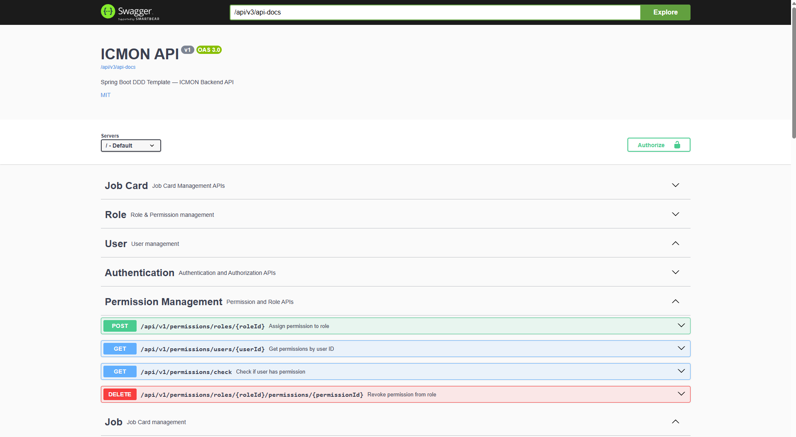
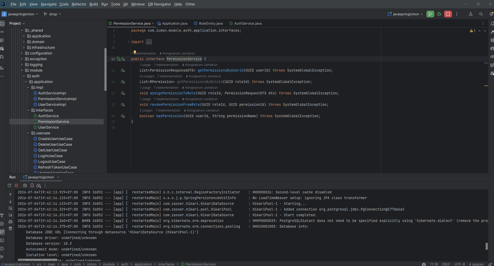
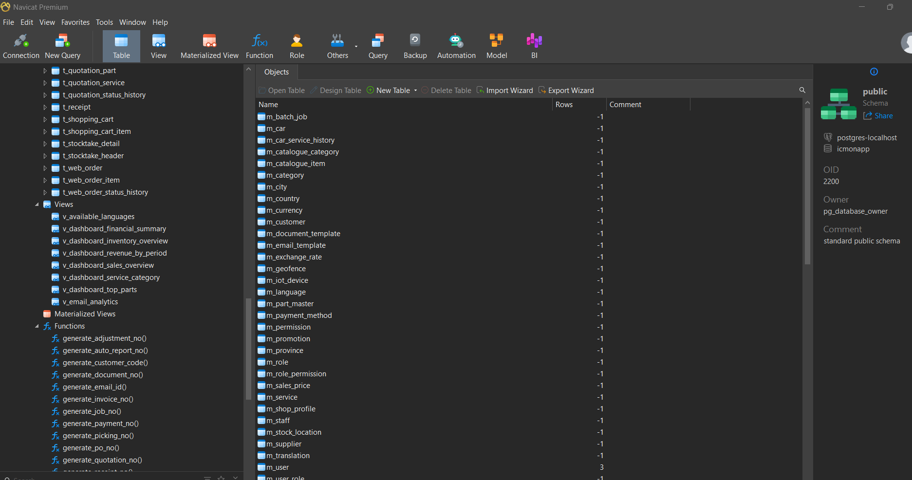
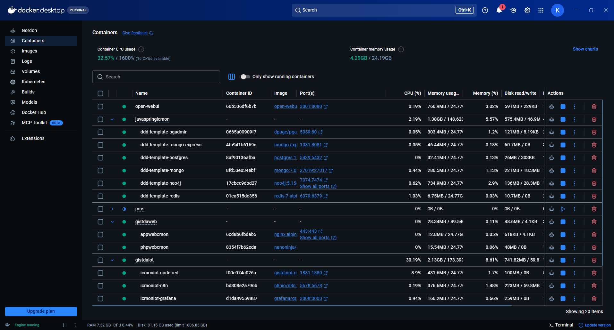
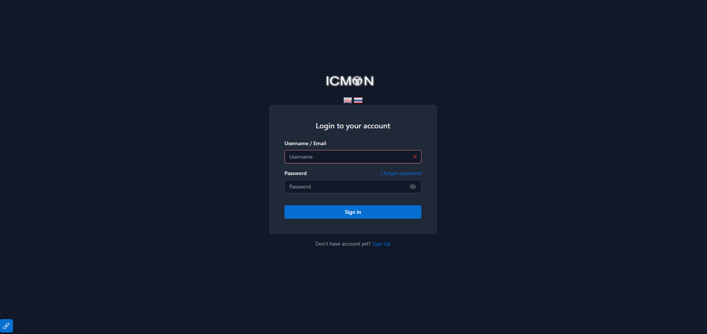
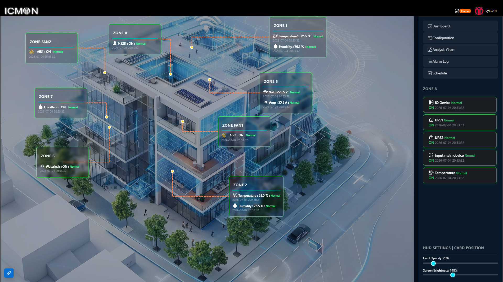
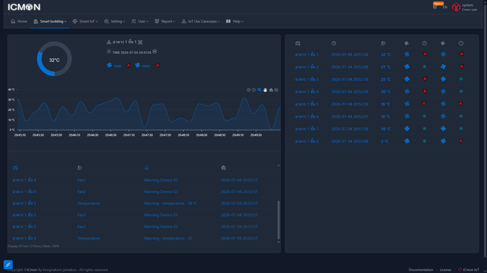
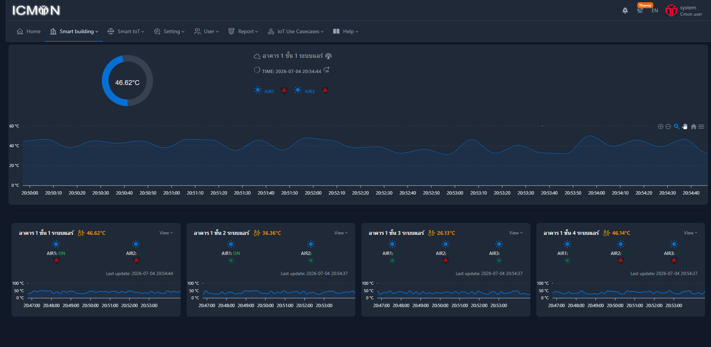

# 🚀 Spring Boot DDD Template

This project was developed with a focus on scalability, maintainability, and productivity in enterprise application development, by applying **Domain-Driven Design (DDD)** and **Clean Architecture** principles.

#### http://localhost:1080/api/swagger-ui/index.html#



[](https://openjdk.java.net/projects/jdk/21/)
[](https://spring.io/projects/spring-boot)
[](LICENSE)



## 📋 Table of Contents

- [🎯 Overview](#-overview)
- [🏗️ Architecture](#️-architecture)
- [🎨 Generic Structures](#-generic-structures)
- [💾 Databases](#-databases)
- [🔧 Configuration and Installation](#-configuration-and-installation)
- [🚀 Execution](#-execution)
- [📊 Execution Profiles](#-execution-profiles)
- [🔍 Monitoring and Logs](#-monitoring-and-logs)
- [📝 Swagger/OpenAPI](#-swaggeropenapi)
- [🧪 Tests](#-tests)
- [🤝 Contributing](#-contributing)
  



## 🎯 Overview

This template was carefully designed to accelerate backend application development following software engineering best practices. With a solid architecture based on DDD and Clean Architecture, it offers:

- **Highly reusable generic structures** for CRUD operations
- **Robust error handling system** with automatic logging
- **Advanced monitoring** with AOP (Aspect-Oriented Programming)
- **Multi-database support** (PostgreSQL, MongoDB, Neo4j)
- **Flexible configuration** with multiple execution profiles
- **Automatic documentation** with Swagger/OpenAPI
  
 

## 🏗️ Architecture

### Domain-Driven Design (DDD) + Clean Architecture

The project follows a well-defined structure that clearly separates responsibilities:

```
src/main/java/com/icmon/app/
├── _shared/                    # Shared components
│   ├── application/           # Generic application services
│   ├── domain/               # Generic domain entities
│   └── infrastructure/       # Generic infrastructure
├── modules/                  # 🎯 BUSINESS LOGIC
│   └── [your_modules]/      # Specific domain contexts
├── configuration/           # Spring configurations
├── exception/              # Global exception system
├── logging/               # Logging system
└── utils/                # Utilities
```

### Architectural Principles

1. **Separation of Concerns**: Each layer has a specific responsibility
2. **Dependency Inversion**: Domain doesn't depend on infrastructure
3. **Code Reuse**: Generic structures reduce duplication
4. **Testability**: Architecture facilitates unit test creation

## 🎨 Generic Structures

### Generic Entity System

The template uses a hierarchical entity system that maximizes code reuse:

#### Domain Hierarchy
```java
GenericClass                    // Base entity for all domains
└── GenericBusinessClass       // For business entities
    └── [YourEntity]          // Your specific entities
```

#### Infrastructure Hierarchy
```java
GenericEntity                   // Base JPA entity
└── GenericBusinessEntity      // For business entities with JPA
    └── [YourEntitySchema]    // Your specific database schemas
```

### Generic Repositories

The repository system offers complete CRUD operations:

```java
// Generic interface with all operations
GenericBusinessRepository<E>

// Implementation with advanced features
GenericBusinessRepositoryImpl<E, S>
```

**Included features:**
- ✅ Synchronous and asynchronous CRUD operations
- ✅ Paginated queries
- ✅ Automatic soft delete
- ✅ Change auditing
- ✅ User/company access control

### Generic Services

Service layer with pre-implemented functionality:

```java
// Generic service with basic operations
GenericServiceImpl<E, R>
```

**Available resources:**
- 🔐 Automatic authentication via MDC
- 🛡️ Standardized exception handling
- 📊 Optimized read operations
- ⚡ Asynchronous operation support

## 💾 Databases

The template comes pre-configured with three databases for different needs:

### PostgreSQL (Main Database)
- **Usage**: Transactional and relational data
- **Port**: 5432
- **Configuration**: JPA/Hibernate with schema validation

### MongoDB (Logging)
- **Usage**: System logs, auditing and analytics
- **Port**: 27017
- **Configuration**: Spring Data MongoDB

### Neo4j (Graphs)
- **Usage**: Complex relationships and graph analysis
- **Ports**: 7474 (HTTP), 7687 (Bolt)
- **Configuration**: Spring Data Neo4j

### Docker Compose

Run all databases with one command:

```bash
docker-compose up -d
```

**Included services:**
- PostgreSQL + PgAdmin (port 5050)
- MongoDB
- Neo4j

## 🔧 Configuration and Installation

### Prerequisites

- Java 21+
- Maven 3.8+
- Docker & Docker Compose

### Installation

1. **Clone the repository:**
```bash
git clone https://github.com/your-user/spring-boot-ddd-template.git
cd spring-boot-ddd-template
```

2. **Configure environment variables:**
```bash
cp .env.example .env
# Edit the .env file with your configurations
```

3. **Start the databases:**
```bash
docker-compose up -d
```

4. **Run the project:**
```bash
mvn spring-boot:run
```

## 🚀 Execution

### Local Execution (Dev)
```bash
# Default profile (development)
mvn spring-boot:run

# Or specifying the profile
mvn spring-boot:run -Dspring-boot.run.profiles=dev
```

### Production Build
```bash
mvn clean package -Pprod
java -jar target/app-1.0.0-SNAPSHOT.jar --spring.profiles.active=prod
```

### Test Execution
```bash
mvn test -Ptest
```

## 📊 Execution Profiles

The project supports multiple profiles for different environments:

### 🛠️ Dev (Development)
**File**: `application-dev.yml`

```yaml
spring:
  application:
    name: app-dev
  jpa:
    show-sql: true
    hibernate:
      ddl-auto: validate
```

**Characteristics:**
- Detailed logging enabled
- Database schema validation
- Configurations optimized for development

### 🚀 Prod (Production)
**File**: `application-prod.yml`

```yaml
spring:
  application:
    name: app-prod
  jpa:
    hibernate:
      ddl-auto: validate
```

**Characteristics:**
- Performance-optimized configurations
- Minimal logging
- Strict schema validation
- Environment variables for sensitive configurations

### 🧪 Test (Tests)
**File**: `application-test.yml`

```yaml
spring:
  application:
    name: app-test
  jpa:
    hibernate:
      ddl-auto: update
```

**Characteristics:**
- In-memory H2 database
- Auto table creation
- Isolated test configurations

### Profile Configuration

Each profile can be configured by editing its respective YAML file:

```yaml
# Example of environment-specific configuration
server:
  port: ${SERVER_PORT:1080}
  
spring:
  datasource:
    url: ${SPRING_DATASOURCE_URL}
    username: ${SPRING_DATASOURCE_USERNAME}
    password: ${SPRING_DATASOURCE_PASSWORD}
```

## 🔍 Monitoring and Logs

### AOP System (Aspect-Oriented Programming)

The template includes an advanced monitoring system based on AOP:

#### SystemMonitor
- **Automatic monitoring** of all methods in business modules
- **Exception capture** with complete context
- **Asynchronous logging** to not impact performance
- **Call tracking** with user/company information

```java
@Around("execution(* com.template.app.modules..application..*(..))")
public Object domainMonitor(ProceedingJoinPoint joinPoint) throws Throwable {
    // Automatically monitors all application methods
}
```

### Logging System

#### Log Structure
- **ErrorLogSchema**: Error logs with complete stack trace
- **MethodCallLogSchema**: Method call logs
- **RequestLogSchema**: HTTP request logs

#### Storage
All logs are stored in **MongoDB** for:
- 📊 Performance analysis
- 🐛 Advanced debugging
- 📈 Usage metrics
- 🔍 Complete audit

### GlobalExceptionHandler

Robust exception handling system:

```java
@RestControllerAdvice
public class GlobalExceptionHandler {
    // Captures ALL system exceptions
    // Saves logs automatically
    // Returns standardized responses
}
```

**Features:**
- ✅ Automatic capture of all exceptions
- ✅ Asynchronous logging for performance
- ✅ Standardized responses for the client
- ✅ Sensitive information filtering

## 📝 Swagger/OpenAPI

### Automatic Documentation

The project generates automatic API documentation using OpenAPI 3.0:

**Access**: `http://localhost:1080/api/swagger-ui.html`

### Swagger Configuration

```java
@OpenAPIDefinition(
    info = @Info(title = "Backend API", version = "v1"),
    tags = {
        // Tags organized by business context
    }
)
@SecuritySchemes({
    @SecurityScheme(
        name = "BearerAuth",
        type = SecuritySchemeType.HTTP,
        scheme = "bearer",
        bearerFormat = "JWT"
    )
})
```

### Available Resources

- 🔐 **JWT Authentication** integrated in documentation
- 📋 **Organized tags** by business context
- 🧪 **Direct testing** of APIs via interface
- 📄 **Export** in standard OpenAPI formats

## 🧪 Tests

### Test Structure

The template includes base classes to facilitate test creation:

```java
// Generic test for repositories
GenericBusinessRepositoryTest<E>

// Base configuration for tests
GenericTest
```

### Execution

```bash
# All tests
mvn test

# Specific test profile
mvn test -Ptest

# Tests with coverage
mvn test jacoco:report
```

### Test Resources

- ✅ **TestContainers** for PostgreSQL
- ✅ **H2** for fast tests
- ✅ **Pre-configured mocks**
- ✅ **Automated test data**

## 🛠️ Customization

### Adding New Modules

1. **Create the module structure** in `src/main/java/com/icmon/app/modules/[your_module]/`

```
your_module/
├── application/           # Application services
│   ├── interfaces/       # Service interfaces
│   └── impl/            # Implementations
├── domain/              # Domain entities
└── infrastructure/      # Repositories and adapters
    ├── repository/
    └── mapper/
```

2. **Extend generic classes:**

```java
// Domain
public class YourEntity extends GenericBusinessClass {
    // Your specific fields
}

// Repository
public class YourRepository extends GenericBusinessRepositoryImpl<YourEntity, YourSchema> {
    // Specific implementations
}

// Service
public class YourService extends GenericServiceImpl<YourEntity, YourRepository> {
    // Specific business logic
}
```

### Advanced Configurations

#### Adding New Database
1. Configure in `application-{profile}.yml`
2. Add dependency in `pom.xml`
3. Create Spring configuration in `configuration/data/`

#### Customizing Exceptions
1. Create your specific exception in `exception/models/`
2. Add handling in `GlobalExceptionHandler`

## 🤝 Contributing

### How to Contribute

1. **Fork** the project
2. Create a **branch** for your feature (`git checkout -b feature/AmazingFeature`)
3. **Commit** your changes (`git commit -m 'Add some AmazingFeature'`)
4. **Push** to the branch (`git push origin feature/AmazingFeature`)
5. Open a **Pull Request**

### Code Standards

- Follow **SOLID** principles
- Keep **test coverage** above 80%
- Use **Javadoc** to document public methods
- Follow established **naming conventions**

### Issues and Bug Reports

Use the available **issue templates** for:
- 🐛 Report bugs
- 💡 Suggest features
- 📚 Improve documentation

## 📄 License

This project is licensed under the MIT License - see the [LICENSE](LICENSE) file for details.

## 🔗 Useful Links

- [Spring Boot Documentation](https://docs.spring.io/spring-boot/docs/current/reference/htmlsingle/)
- [Domain-Driven Design](https://domainlanguage.com/ddd/)
- [Clean Architecture](https://blog.cleancoder.com/uncle-bob/2012/08/13/the-clean-architecture.html)
- [Docker Compose](https://docs.docker.com/compose/)


# Spring Boot DDD Template Architecture

This document details the architecture and design patterns used in the template.

## 📋 Table of Contents

- [Architecture Overview](#architecture-overview)
- [Domain-Driven Design (DDD)](#domain-driven-design-ddd)
- [Clean Architecture](#clean-architecture)
- [Generic Structures](#generic-structures)
- [Design Patterns](#design-patterns)
- [Data Flow](#data-flow)
- [Error Handling](#error-handling)

## Architecture Overview

The template follows a hexagonal architecture (ports and adapters) combined with DDD and Clean Architecture, organizing code into well-defined layers:

```
┌─────────────────────────────────────────────────────────────┐
│                    Presentation Layer                       │
│                   (Controllers/REST)                       │
├─────────────────────────────────────────────────────────────┤
│                   Application Layer                        │
│              (Services, Use Cases, DTOs)                   │
├─────────────────────────────────────────────────────────────┤
│                     Domain Layer                           │
│               (Entities, Value Objects)                    │
├─────────────────────────────────────────────────────────────┤
│                 Infrastructure Layer                       │
│           (Repositories, External Services)                │
└─────────────────────────────────────────────────────────────┘
```

## Domain-Driven Design (DDD)

### Applied Concepts

#### 1. **Bounded Contexts**
Each module represents a bounded context:

```
modules/
├── user/           # User Context
├── company/        # Company Context
├── product/        # Product Context
└── order/          # Order Context
```

#### 2. **Entities**
Objects with unique identity that represent domain concepts:

```java
public class User extends GenericBusinessClass {
    private String name;
    private Email email;
    private UserStatus status;
    
    // Business methods
    public void activate() {
        this.status = UserStatus.ACTIVE;
    }
}
```

#### 3. **Value Objects**
Immutable objects that represent values:

```java
@Value
public class Email {
    private final String value;
    
    public Email(String email) {
        if (!isValid(email)) {
            throw new DomainException("Invalid email format");
        }
        this.value = email;
    }
}
```

#### 4. **Aggregates**
Groups of entities and value objects treated as a unit:

```java
public class Order extends GenericBusinessClass {
    private List<OrderItem> items;
    private OrderStatus status;
    
    public void addItem(Product product, int quantity) {
        // Business rules for adding item
        if (status != OrderStatus.DRAFT) {
            throw new DomainException("Cannot modify confirmed order");
        }
        // ...
    }
}
```

#### 5. **Domain Services**
Services that encapsulate domain logic that doesn't belong to a specific entity:

```java
@Component
public class OrderPricingService {
    public Money calculateTotal(Order order) {
        // Complex calculation logic
    }
}
```

## Clean Architecture

### Dependencies

The architecture follows the dependency rule: **outer layers depend on inner layers, never the opposite**.

```
Infrastructure → Application → Domain
     ↑              ↑
   Database      Use Cases
   External      Services
   APIs
```

### Layers

#### 1. **Domain Layer** (Core)
- **Entities**: Business objects with identity
- **Value Objects**: Immutable values
- **Domain Services**: Domain logic
- **Repository Interfaces**: Contracts for persistence

```java
package com.template.app.modules.user.domain;

public interface UserRepository {
    User save(User user);
    Optional<User> findById(UUID id);
    Optional<User> findByEmail(Email email);
}
```

#### 2. **Application Layer** (Use Cases)
- **Services**: Use case orchestration
- **DTOs**: Data transfer objects
- **Interfaces**: Contracts for external services

```java
@Service
public class UserService extends GenericServiceImpl<User, UserRepository> {
    
    public User createUser(CreateUserDTO dto) {
        // Business validations
        // Dependency orchestration
        // Persistence
    }
}
```

#### 3. **Infrastructure Layer** (Details)
- **Repositories**: Persistence implementations
- **External Services**: External API integration
- **Configuration**: Technical configurations

```java
@Repository
public class UserRepositoryImpl 
    extends GenericBusinessRepositoryImpl<User, UserEntity>
    implements UserRepository {
    
    // Specific implementation if needed
}
```

## Generic Structures

### Entity Hierarchy

The system uses a class hierarchy to maximize code reuse:

```
GenericClass (Base)
├── GenericBusinessClass (Business)
└── User, Product, Order... (Specific)

GenericEntity (JPA Base)
├── GenericBusinessEntity (JPA Business)
└── UserEntity, ProductEntity... (JPA Specific)
```

### Benefits

1. **Reduced Code Duplication**: Common functionality centralized
2. **Consistency**: Uniform patterns throughout the system
3. **Maintainability**: Changes in one place affect the entire system
4. **Testability**: Reusable base tests

### Generic Repository

```java
public interface GenericBusinessRepository<E extends GenericClass> {
    // Basic CRUD operations
    E create(E entity, RepositoryAuth auth);
    E read(UUID id, RepositoryAuth auth);
    E update(E entity, RepositoryAuth auth);
    void delete(UUID id, RepositoryAuth auth);
    
    // Advanced operations
    Page<E> findAllPaginated(PageRequest pageRequest, RepositoryAuth auth);
    Optional<List<E>> findAllByIds(List<UUID> ids, RepositoryAuth auth);
    
    // Asynchronous operations
    CompletableFuture<E> createAsync(E entity, RepositoryAuth auth);
    CompletableFuture<E> updateAsync(E entity, RepositoryAuth auth);
}
```

## Design Patterns

### 1. **Repository Pattern**
Encapsulates data access logic:

```java
// Interface in domain
public interface UserRepository {
    User save(User user);
    Optional<User> findByEmail(String email);
}

// Implementation in infrastructure
@Repository
public class JpaUserRepository implements UserRepository {
    // JPA implementation
}
```

### 2. **Factory Pattern**
For complex object creation:

```java
@Component
public class UserFactory {
    public User createUser(String name, String email, UserType type) {
        // Creation logic based on type
    }
}
```

### 3. **Strategy Pattern**
For interchangeable algorithms:

```java
public interface PricingStrategy {
    Money calculatePrice(Order order);
}

@Component
public class RegularPricingStrategy implements PricingStrategy {
    // Regular price implementation
}

@Component
public class PremiumPricingStrategy implements PricingStrategy {
    // Premium price implementation
}
```

### 4. **Observer Pattern** (via Spring Events)
For inter-module communication:

```java
@EventListener
public void handleUserCreated(UserCreatedEvent event) {
    // Action when user is created
}
```

## Data Flow

### Request Flow

```
1. Controller receives HTTP request
2. Validates input data
3. Calls Service (Application Layer)
4. Service executes business logic
5. Service calls Repository
6. Repository persists/retrieves data
7. Data flows back through the stack
8. Controller returns HTTP response
```

### Practical Example

```java
// 1. Controller
@PostMapping("/users")
public ResponseEntity<UserDTO> createUser(@RequestBody CreateUserDTO dto) {
    User user = userService.createUser(dto);
    return ResponseEntity.ok(userMapper.toDTO(user));
}

// 2. Service
@Transactional
public User createUser(CreateUserDTO dto) {
    // Validations
    validateUserData(dto);
    
    // Entity creation
    User user = User.builder()
        .name(dto.getName())
        .email(new Email(dto.getEmail()))
        .build();
    
    // Persistence
    return repository.create(user, getRepositoryAuth());
}

// 3. Repository
public User create(User user, RepositoryAuth auth) {
    UserEntity entity = mapper.toSchemaForCreate(user);
    setCommonFields(entity, auth);
    UserEntity saved = jpaRepository.save(entity);
    return mapper.toEntity(saved);
}
```

## Error Handling

### Exception Hierarchy

```
SystemGlobalException (Base)
├── DomainException (Business rules)
├── ApplicationException (Use cases)
├── InfrastructureException (Persistence)
└── AdapterException (Integrations)
```

### Global Exception Handler

```java
@RestControllerAdvice
public class GlobalExceptionHandler {
    
    @ExceptionHandler(DomainException.class)
    public ResponseEntity<ErrorResponse> handleDomainException(DomainException ex) {
        // Log exception
        logService.saveErrorLogAsync(buildErrorLog(ex));
        
        // Return standardized response
        return ResponseEntity
            .status(HttpStatus.BAD_REQUEST)
            .body(new ErrorResponse(ex.getMessage()));
    }
}
```

### Aspect-Oriented Programming (AOP)

The system uses AOP for:

1. **Automatic logging** of method calls
2. **Exception capture** with context
3. **Operation auditing**
4. **Performance monitoring**

```java
@Aspect
@Component
public class SystemMonitor {
    
    @Around("execution(* com.template.app.modules..application..*(..))")
    public Object domainMonitor(ProceedingJoinPoint joinPoint) throws Throwable {
        // Capture context
        String requestId = MDC.get("requestId");
        String userId = MDC.get("userId");
        
        try {
            return joinPoint.proceed();
        } catch (Exception ex) {
            // Log exception with full context
            saveMethodCallLog(joinPoint, requestId, userId, true);
            throw ex;
        }
    }
}
```

## Multi-Profile Configuration

### Multi-Profile Strategy

```yaml
# application.yml (Base)
spring:
  profiles:
    active: ${SPRING_PROFILES_ACTIVE:dev}

# application-dev.yml (Development)
spring:
  jpa:
    show-sql: true
    hibernate:
      ddl-auto: validate

# application-prod.yml (Production)
spring:
  jpa:
    show-sql: false
    hibernate:
      ddl-auto: validate
```

### Conditional Configuration

```java
@Configuration
@Profile({"dev", "test"})
public class DevConfiguration {
    // Development-only configurations
}

@Configuration
@Profile("prod")
public class ProductionConfiguration {
    // Production-only configurations
}
```

## Security

### JWT Authentication

```java
@Component
public class JwtTokenFilter extends OncePerRequestFilter {
    
    @Override
    protected void doFilterInternal(HttpServletRequest request, 
                                  HttpServletResponse response, 
                                  FilterChain filterChain) {
        // Extract JWT token
        // Validate token
        // Configure security context
        // Configure MDC for logging
    }
}
```

### Access Control

The system uses MDC (Mapped Diagnostic Context) for:

1. **User tracking** in all operations
2. **Access control** based on company/tenant
3. **Complete audit** of user actions

```java
// Automatically configured by JWT Filter
MDC.put("userId", user.getId().toString());
MDC.put("whitelabelId", user.getCompanyId().toString());
MDC.put("requestId", UUID.randomUUID().toString());
```

## Conclusion

This architecture provides:

✅ **Clear separation of responsibilities**
✅ **High testability and maintainability**
✅ **Maximum code reuse**
✅ **Flexibility for changes**
✅ **Complete observability**
✅ **Integrated security**

The template serves as a solid foundation for complex enterprise applications, maintaining simplicity for smaller projects through intelligent use of generic structures and well-established conventions.



## 👨‍💻 Author

**kongnakorn jantakun**
**Email : kongnakornjantakun@gmail.com **
**Mobile : +66955088091 **

---









<video controls src="docs/vd.mp4" title="Title"></video>