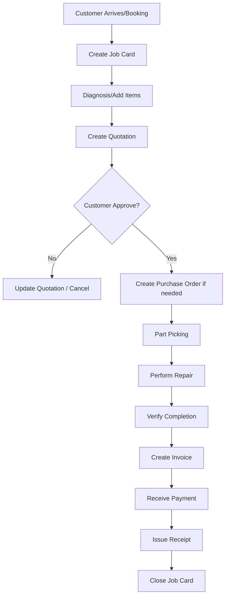
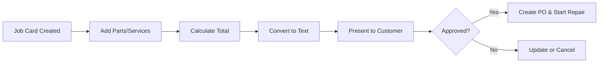
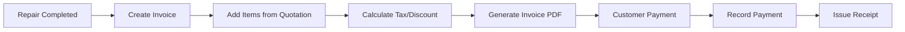
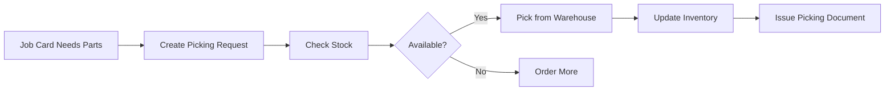
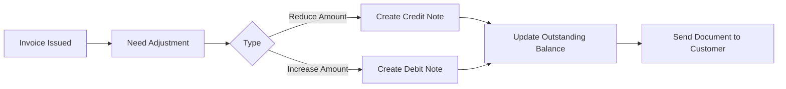
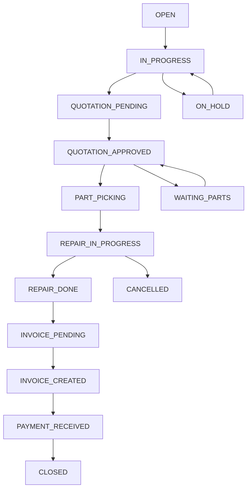
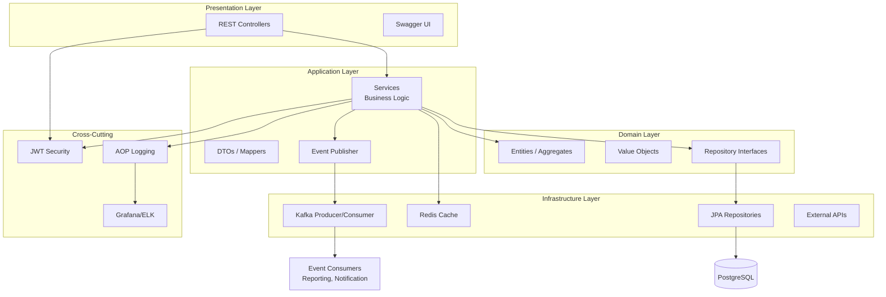
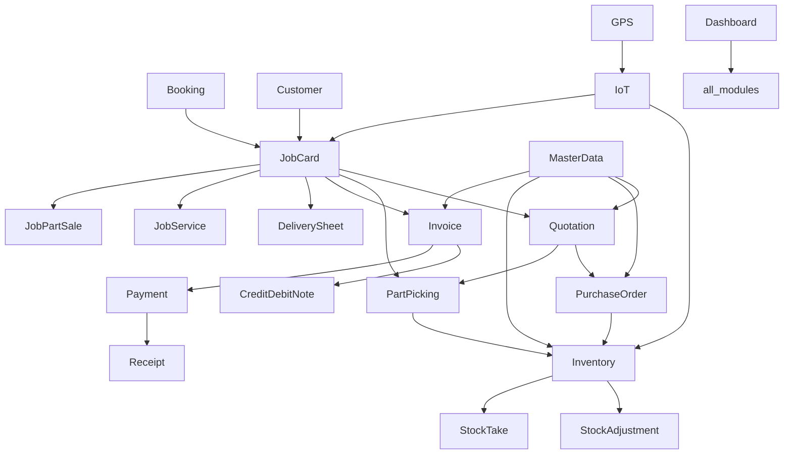
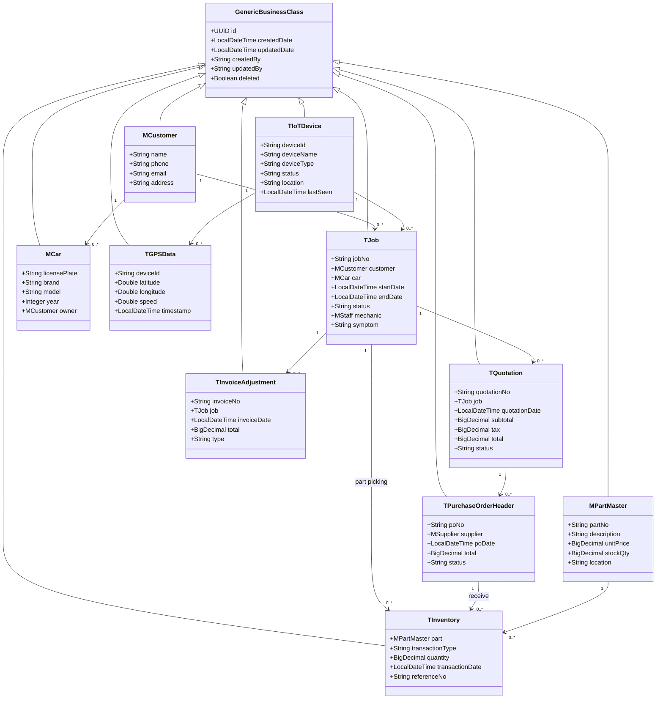

# Auto Repair Support Management System
## Project Documentation - Complete English Version

## 🏗️ Root Structure

```
spring-boot-ddd-template/
├── src/
│   ├── main/
│   │   ├── java/
│   │   │   └── com/
│   │   │       └── template/
│   │   │           └── app/
│   │   │               ├── Application.java
│   │   │               ├── _shared/
│   │   │               ├── modules/
│   │   │               ├── configuration/
│   │   │               ├── exception/
│   │   │               ├── logging/
│   │   │               └── utils/
│   │   └── resources/
│   │       ├── application.yml
│   │       ├── application-dev.yml
│   │       ├── application-prod.yml
│   │       ├── application-test.yml
│   │       ├── static/
│   │       │   └── template/
│   │       │       └── jrxml/
│   │       ├── i18n/
│   │       └── db/
│   │           └── migration/
│   └── test/
│       └── java/
│           └── com/
│               └── template/
│                   └── app/
│                       ├── _shared/
│                       └── modules/
├── docker/
│   ├── docker-compose.yml
│   ├── Dockerfile
│   └── .env.example
├── pom.xml
├── README.md
├── ARCHITECTURE.md
└── LICENSE
```

---

| Item | Details |
|------|---------|
| **Project Name** | Auto Repair Support Management System |
| **Author** | Kongnakorn Jantakun |
| **Date** | 2026-07-04 |
| **Version** | 2.0 |
| **Status** | Complete |

---

## Table of Contents

1. [Introduction](#1-introduction)
2. [Definitions](#2-definitions)
3. [System Overview](#3-system-overview)
4. [System Architecture](#4-system-architecture)
5. [System Scope](#5-system-scope)
6. [Workflow Design](#6-workflow-design)
7. [System Diagrams](#7-system-diagrams)
8. [Database Design](#8-database-design)
9. [API Design](#9-api-design)
10. [Module Design](#10-module-design)
11. [Extended Modules](#11-extended-modules)
12. [Web Order System (WOS)](#12-web-order-system-wos)
13. [Module Dependency Map](#13-module-dependency-map)
14. [Security & Authentication](#14-security--authentication)
15. [Monitoring & Observability](#15-monitoring--observability)
16. [Deployment Architecture](#16-deployment-architecture)
17. [File Count Summary](#17-file-count-summary)
18. [JasperReport Templates](#18-jasperreport-templates)
19. [Installation & User Guide](#19-installation--user-guide)

---

## 1. Introduction

### 1.1 Objectives

The Auto Repair Support Management System is developed to enhance operational efficiency for service centers and auto repair Supports, covering the entire process from vehicle intake, diagnosis, quotation, parts ordering, inventory management, invoicing, and maintenance history tracking for customers and vehicles.

The system is designed to be flexible, scalable for future expansion, and adaptable for medium to large-scale businesses, utilizing **Domain-Driven Design (DDD)** combined with **Clean Architecture** and **Event-Driven** patterns to separate responsibilities and improve maintainability.

### 1.2 Key Goals

1. Improve staff efficiency across all departments
2. Reduce manual errors
3. Enhance customer satisfaction through fast and accurate service
4. Provide accurate data for executive decision-making
5. Support future business expansion

### 1.3 Technology Stack

| Category | Technology | Version |
|---------|-----------|---------|
| **Language** | Java | 17+ / 21 |
| **Framework** | Spring Boot | 3.4.1 |
| **ORM** | Spring Data JPA (Hibernate) | - |
| **Primary Database** | PostgreSQL | 15+ |
| **Cache** | Redis | 7+ |
| **Message Queue** | Apache Kafka | 3.4+ |
| **Logging & Monitoring** | ELK (Elasticsearch, Logstash, Kibana), Grafana, Micrometer | - |
| **Document Management** | JasperReports (PDF), Apache POI (Excel) | - |
| **Workflow Automation** | n8n | - |
| **CI/CD** | Jenkins, Docker Compose, AWS (EC2, S3) | - |
| **Testing** | JUnit, TestContainers, Mockito, Robot Framework | - |
| **OCR** | Tesseract / Google Vision | - |
| **IoT** | MQTT, InfluxDB | - |
| **Documentation** | Swagger/OpenAPI 3.0 | - |
| **Build Tool** | Maven | 3.8+ |

### 1.4 User Groups

| User Group | Role Description |
|-----------|------------------|
| **Service Advisor** | Vehicle intake, Job Card creation, Quotation generation, Job closure |
| **Mechanic** | Diagnosis, Repair, Status updates |
| **Store Keeper** | Inventory management, Parts picking, Goods receiving |
| **Purchasing** | Purchase Order creation, Supplier follow-up |
| **Finance** | Invoicing, Payment collection, Adjustment documents |
| **Admin** | User management, Permissions, Master data |
| **Executive** | Dashboard viewing, Report analysis |

---

## 2. Definitions

| Term | Description |
|------|-------------|
| **Job Card** | Primary document recording vehicle intake, containing customer, vehicle, symptoms, and assigned mechanic information |
| **Quotation** | Document listing parts and service costs required for repair, presented to customer for approval |
| **Purchase Order** | Document used to order parts from suppliers when stock is insufficient |
| **Invoice** | Document for billing customers after repair completion |
| **Credit Note** | Document reducing the payable amount from an invoice (discounts, refunds) |
| **Debit Note** | Document increasing the payable amount from an invoice (additional charges) |
| **Part Picking** | Process of withdrawing parts from inventory as specified in Job Card or Quotation |
| **Delivery Sheet** | Document accompanying parts or goods delivery to customers or other departments |
| **Inventory** | All goods stored in warehouse, including parts and equipment |
| **Stock Adjustment** | Adjusting inventory quantities to match physical counts (losses, damages) |
| **Stock Take** | Physical count of inventory to compare with system records |
| **Supplier** | Company or store supplying parts to the repair Support |
| **Master Data** | Shared foundation data such as parts list, services, customers, vehicles |
| **Batch Job** | Automated scheduled tasks (Cron) like email notifications, report generation |
| **Bounded Context** | DDD model boundaries separating system parts based on business meaning |
| **Event-Driven** | System pattern where responses are triggered by events |
| **AOP (Aspect-Oriented Programming)** | Programming technique separating cross-cutting concerns from core logic |

---

## 3. System Overview

### 3.1 Main Modules

```
├── 🔑 Authentication & Permission        ← Login / Permission Management
├── 🚗 Job Card Management                 ← Repair Work Orders
├── 👥 Customer Management                 ← Customer Information
├── 📋 Quotation                           ← Price Quotations
├── 🛒 Purchase Order                      ← Supplier Orders
├── 📦 Inventory Management                ← Warehouse / Parts
├── 💰 Payment Management                  ← Payment Processing
├── 📅 Booking Management                  ← Appointment Scheduling
├── 👨‍💼 Staff Management                    ← Employee Management
├── 🏢 Company & Supplier                  ← Company / Supplier Data
├── 📊 Dashboard & Reports                 ← Reports and Dashboard
├── 📧 Email Service                       ← Automated Emails
├── 📄 Document Management                 ← Document Management (PDF, Excel)
├── 🔍 OCR (Image to Text)                 ← Image Text Extraction
├── ⏱️ Batch Jobs (6 jobs)                 ← Scheduled Automation
├── 🌏 Multi-Language (18 languages)       ← Internationalization
├── 📡 IoT & GPS Tracking                  ← Device and Location Tracking
├── 🎛️ Device Access Control               ← Device Access Management
├── 🎯 Dashboard Center                    ← Central Dashboard Hub
└── 🛍️ Web Order System (WOS)             ← Online Ordering
    ├── 📚 Catalogue Management
    ├── 🛒 Supportping Cart
    └── 💵 Sales Price
```

### 3.2 Core Capabilities

| Function | Description |
|----------|-------------|
| **Repair Management** | From vehicle intake to job closure with status tracking |
| **Parts & Inventory Management** | Picking, receiving, adjustment, and stock counting |
| **Procurement** | Through Purchase Orders and supplier tracking |
| **Finance & Billing** | Invoices, Credit/Debit Notes, and Receipts |
| **Customer & Vehicle Management** | Centralized data management |
| **Analytics & Reporting** | Dashboard and PDF/Excel reports |
| **Automated Communication** | Via Email and LINE Notify |
| **Event-Driven Processing** | Offloading heavy processing (reports, notifications, logging) |
| **IoT Integration** | Device status and location tracking |

---

## 4. System Architecture

### 4.1 Overall Architecture

The system utilizes **Layered Architecture** (Controller → Service → Repository) combined with **Event-Driven** via Kafka to decouple heavy processing from the main REST API.

#### Architecture Layers

| Layer | Description |
|-------|-------------|
| **Controller Layer** | Receives HTTP Requests, validates JWT, validates DTOs |
| **Service Layer** | Manages Business Logic, handles Transactions, utilizes Redis Cache |
| **Repository Layer** | Uses Spring Data JPA to connect to PostgreSQL |
| **Domain Layer** | Entities and Value Objects following DDD principles |
| **Event Publisher** | Publishes events to Kafka upon state changes |
| **Event Consumer** | Subsystems (Reporting, Notification) consume events to update Elasticsearch and send alerts |
| **Monitoring** | Grafana pulls metrics from Actuator/Micrometer; ELK handles centralized logging |

### 4.2 Architecture Diagram

```
┌─────────────────────────────────────────────────────────────────────────────────┐
│                              EXTERNAL SYSTEMS                                    │
│  ┌──────────┐  ┌──────────┐  ┌──────────┐  ┌──────────┐  ┌──────────────────┐  │
│  │  Mobile  │  │   Web    │  │  Third   │  │   IoT    │  │   Email/SMS      │  │
│  │   App    │  │  Portal  │  │  Party   │  │ Devices  │  │   Gateway        │  │
│  └────┬─────┘  └────┬─────┘  └────┬─────┘  └────┬─────┘  └────────┬─────────┘  │
└───────┼─────────────┼─────────────┼─────────────┼───────────────┼──────────────┘
        │             │             │             │               │
        ▼             ▼             ▼             ▼               ▼
┌─────────────────────────────────────────────────────────────────────────────────┐
│                             API GATEWAY / LOAD BALANCER                          │
│                             (Spring Cloud Gateway / NGINX)                       │
└─────────────────────────────────────────────────────────────────────────────────┘
                                        │
                                        ▼
┌─────────────────────────────────────────────────────────────────────────────────┐
│                             SPRING BOOT APPLICATION                              │
│  ┌───────────────────────────────────────────────────────────────────────────┐  │
│  │                           CONTROLLER LAYER                                 │  │
│  │    REST Controllers │ WebSocket │ GraphQL │ Admin API │ Health Check       │  │
│  └───────────────────────────────────────────────────────────────────────────┘  │
│                                      │                                           │
│  ┌───────────────────────────────────▼───────────────────────────────────────┐  │
│  │                             SERVICE LAYER                                  │  │
│  │       Business Logic │ Transaction Mgmt │ Cache │ Validation │ Events      │  │
│  └───────────────────────────────────┬───────────────────────────────────────┘  │
│                                      │                                           │
│  ┌───────────────────────────────────▼───────────────────────────────────────┐  │
│  │                            REPOSITORY LAYER                                │  │
│  │        Spring Data JPA │ Custom Queries │ Specifications │ Projections      │  │
│  └───────────────────────────────────┬───────────────────────────────────────┘  │
└────────────────────────────────────┼──────────────────────────────────────────┘
                                     │
                 ┌───────────────────┼───────────────────┐
                 ▼                   ▼                   ▼
        ┌──────────────┐    ┌──────────────┐    ┌──────────────┐
        │  PostgreSQL  │    │    Redis     │    │    Kafka     │
        │  (Primary DB)│    │   (Cache)    │    │ (Event Bus)  │
        └──────────────┘    └──────────────┘    └──────┬───────┘
                                                        │
        ┌───────────────────────────────────────────────┼───────────────────┐
        ▼                                               ▼                   ▼
 ┌─────────────┐                                ┌─────────────┐      ┌─────────────┐
 │ Elasticsearch│                                │  InfluxDB   │      │   Grafana   │
 │   (ELK)     │                                │  (IoT Data) │      │  (Metrics)  │
 └─────────────┘                                └─────────────┘      └─────────────┘
```

### 4.3 Design Principles

1. **Separation of Concerns**: Each layer has specific responsibilities
2. **Dependency Inversion**: Domain does not depend on Infrastructure
3. **Code Reuse**: Generic structures reduce code duplication
4. **Testability**: Architecture facilitates unit test creation
5. **Single Responsibility**: Each class has one responsibility
6. **Open/Closed Principle**: Open for extension, closed for modification

---

## 5. System Scope

### 5.1 In-Scope

| # | Scope | Description |
|---|-------|-------------|
| 1 | Repair Management | From vehicle intake to job closure with status tracking |
| 2 | Parts & Inventory Management | Picking, receiving, adjustment, and stock counting |
| 3 | Procurement | Through Purchase Orders and supplier tracking |
| 4 | Finance & Billing | Invoices, Credit/Debit Notes, and Receipts |
| 5 | Customer & Vehicle Management | Centralized data management |
| 6 | Analytics & Reporting | Dashboard and PDF/Excel reports |
| 7 | Automated Communication | Via Email and LINE Notify |
| 8 | Event-Driven Processing | Offloading heavy processing (reports, notifications, logging) |
| 9 | IoT Integration | Device status and location tracking |
| 10 | Document Management | PDF and Excel generation from templates |
| 11 | Web Order System (WOS) | Catalogue, Supportping Cart, Sales Price |
| 12 | Dashboard Center | Central analytics data display |
| 13 | GPS Tracking | Device/vehicle location tracking |
| 14 | Device Access Control | IoT device access management |
| 15 | Multi-Language | 18 languages support |

### 5.2 Out-of-Scope

- Parts manufacturing
- Full-fledged accounting system (can connect to external accounting systems via API)
- Advanced HR management (full HRM)
- Advanced supply chain management

---

## 6. Workflow Design

### 6.1 End-to-End Main Workflow



### 6.2 Module-Specific Workflows

#### 6.2.1 Quotation Workflow



#### 6.2.2 Purchase Order Workflow


#### 6.2.3 Invoice & Payment Workflow



#### 6.2.4 Part Picking Workflow



#### 6.2.5 Credit/Debit Note Workflow



#### 6.2.6 Job Card Status Workflow



---

## 7. System Diagrams

### 7.1 Layered + Event-Driven Architecture Diagram



### 7.2 Module Dependency Map



### 7.3 Core Entities Class Diagram



---

## 8. Database Design

### 8.1 Main Tables Summary

| Group | Table | Description |
|-------|-------|-------------|
| **Master Data** | `m_company` | Company/Support information |
| | `m_customer` | Customer information |
| | `m_car` | Vehicle information |
| | `m_supplier` | Supplier information |
| | `m_part_master` | Master parts list |
| | `m_service` | Service items list |
| | `m_category` | Product/Service categories |
| | `m_staff` | Employee information |
| | `m_user` | System users |
| | `m_menu` | System menus |
| | `m_payment_method` | Payment methods |
| | `m_payment_terms` | Payment terms |
| | `m_currency` | Currencies |
| | `m_exchange_rate` | Exchange rates |
| | `m_country`, `m_city`, `m_province` | Geographic data |
| | `m_Support_profile` | Support profile |
| | `m_stock_location` | Stock storage locations |
| | `m_iot_device` | IoT device information |
| **Transaction** | `t_job` | Job Card |
| | `t_job_service` | Service items in Job Card |
| | `t_job_part_sales` | Parts sold in Job Card |
| | `t_job_service_car_symptom` | Vehicle symptoms |
| | `t_job_diag_trouble_code` | Diagnostic trouble codes |
| | `t_quotation` | Quotation |
| | `t_quotation_part` | Parts in Quotation |
| | `t_quotation_service` | Services in Quotation |
| | `t_purchase_order_header` | Purchase Order header |
| | `t_purchase_order_detail` | Purchase Order details |
| | `t_invoice_adjustment` | Invoice / Credit Note / Debit Note |
| | `t_invoice_adjustment_part` | Parts in Invoice |
| | `t_invoice_adjustment_service` | Services in Invoice |
| | `t_received_amount` | Payment received history |
| | `t_inventory` | Inventory movement |
| | `t_inventory_adjustment_header` | Stock adjustment header |
| | `t_inventory_adjustment_detail` | Stock adjustment details |
| | `t_stocktake_header` | Stock take header |
| | `t_stocktake_detail` | Stock take details |
| | `t_email_promotion` | Promotion emails |
| | `t_email_reminder` | Reminder emails |
| | `t_document_remark` | Document remarks |
| | `t_gps_data` | GPS data |
| | `t_device_history` | Device history |
| | `t_device_access_log` | Device access logs |
| | `t_auto_report` | Auto reports |
| **View** | `v_header_report` | Report header view |
| | `v_job_card_detail` | Job Card details view |
| | `v_preview_job_card_header_report` | Job Card header view for PDF |
| | `v_preview_job_card_details_parts` | Parts view in Job Card |
| | `v_part_picking_request_header` | Picking request header view |
| | `v_part_picking_request_detail` | Picking request details view |
| | `v_credit_debit_detail` | Credit/Debit Note details view |
| | `v_preview_receipt` | Receipt view |
| **Dashboard** | `d_sales_overview` | Sales overview |
| | `d_inventory_overview` | Inventory overview |
| | `d_parts_brand` | Sales by part brand |
| | `d_parts_category` | Sales by category |
| | `d_service_car_detail` | Service details |
| | `d_service_car_intake` | Vehicle intake count |
| | `d_service_category` | Sales by service type |
| | `d_accumulate_car_brand` | Accumulated car brand |
| | `d_accumulate_car_name` | Accumulated car model |
| | `d_accumulate_finance` | Accumulated finance summary |

### 8.2 Key Relationships

| Relationship | Type |
|-------------|------|
| `t_job` → `m_customer` | Many‑to‑One |
| `t_job` → `m_car` | Many‑to‑One |
| `t_job` → `m_staff` | Many‑to‑One |
| `t_quotation` → `t_job` | Many‑to‑One |
| `t_quotation_part` → `t_quotation`, `m_part_master` | Many‑to‑One |
| `t_purchase_order_header` → `m_supplier` | Many‑to‑One |
| `t_purchase_order_detail` → `m_part_master` | Many‑to‑One |
| `t_invoice_adjustment` → `t_job` | One‑to‑One |
| `t_invoice_adjustment_part` → `t_invoice_adjustment`, `m_part_master` | Many‑to‑One |
| `t_inventory` → `m_part_master` | Many‑to‑One |
| `t_inventory` → `t_job` | Many‑to‑One (optional) |
| `t_received_amount` → `t_invoice_adjustment` | Many‑to‑One |
| `t_gps_data` → `m_iot_device` | Many‑to‑One |
| `t_device_history` → `m_iot_device` | Many‑to‑One |

---

## 9. API Design

### 9.1 Design Principles

- RESTful API
- JSON as primary data format
- JWT Bearer Token authentication
- Swagger/OpenAPI for automatic documentation
- Versioning: `/api/v1/...`

### 9.2 Main Endpoints by Module

#### 9.2.1 Authentication

| Method | Path | Description |
|--------|------|-------------|
| POST | `/auth/login` | User login |
| POST | `/auth/logout` | User logout |
| POST | `/auth/refresh` | Refresh Token |
| GET | `/user/profile` | Current user profile |
| PUT | `/user/profile` | Update user profile |
| POST | `/user/change-password` | Change password |

#### 9.2.2 Job Card

| Method | Path | Description |
|--------|------|-------------|
| GET | `/job/list` | List Job Cards |
| POST | `/job/create` | Create new Job Card |
| PUT | `/job/update/{id}` | Update Job Card |
| GET | `/job/{id}` | View Job Card details |
| PUT | `/job/status/{id}` | Change status |
| GET | `/job/history` | Vehicle repair history |
| GET | `/job/order/report/{id}` | Generate Job Order PDF |
| GET | `/job/statuses` | List all statuses |

#### 9.2.3 Quotation

| Method | Path | Description |
|--------|------|-------------|
| GET | `/quotation/list` | List quotations |
| POST | `/quotation/create` | Create quotation |
| PUT | `/quotation/update` | Update quotation |
| GET | `/quotation/{id}` | View quotation details |
| GET | `/quotation/report/{id}` | Generate PDF |
| POST | `/quotation/part/create` | Add part items |
| PUT | `/quotation/part/update/{id}` | Update part item |
| DELETE | `/quotation/part/{id}` | Delete part item |
| POST | `/quotation/service/create` | Add service items |
| GET | `/quotation/list/{jobId}` | Quotations by Job |
| PUT | `/quotation/approve/{id}` | Approve Quotation |
| PUT | `/quotation/reject/{id}` | Reject Quotation |

#### 9.2.4 Purchase Order

| Method | Path | Description |
|--------|------|-------------|
| GET | `/po/list` | List Purchase Orders |
| POST | `/po/create` | Create Purchase Order |
| PUT | `/po/update/{id}` | Update Purchase Order |
| GET | `/po/{id}` | View PO details |
| GET | `/po/report/{id}` | Generate PDF |
| POST | `/po/email/{id}` | Send PO via Email |
| PUT | `/po/receive/{id}` | Receive goods |
| GET | `/po/suggestion/{jobId}` | Suggest PO from Job |

#### 9.2.5 Invoice / Credit / Debit Note

| Method | Path | Description |
|--------|------|-------------|
| GET | `/invoice/tab/list` | List invoices |
| POST | `/invoice/create` | Create Invoice |
| PUT | `/invoice/update/{id}` | Update Invoice |
| GET | `/invoice/{id}` | View details |
| GET | `/invoice/report/{id}` | PDF Invoice |
| GET | `/invoice/summary/{jobId}` | Summary |
| POST | `/invoice/part/create` | Add part items |
| POST | `/invoice/service/create` | Add service items |
| POST | `/invoice/credit-note/create` | Create Credit Note |
| POST | `/invoice/debit-note/create` | Create Debit Note |
| GET | `/invoice/credit-note/report/{id}` | PDF Credit Note |
| GET | `/invoice/debit-note/report/{id}` | PDF Debit Note |
| GET | `/invoice/credit-debit/detail/{id}` | View Credit/Debit details |

#### 9.2.6 Payment / Receipt

| Method | Path | Description |
|--------|------|-------------|
| POST | `/payment/create` | Record payment |
| GET | `/payment/list` | List payments |
| GET | `/payment/{id}` | View payment details |
| GET | `/receipt/{id}` | View receipt |
| GET | `/receipt/report/{id}` | PDF Receipt |

#### 9.2.7 Inventory & Part Picking

| Method | Path | Description |
|--------|------|-------------|
| GET | `/inventory/list` | List inventory |
| POST | `/inventory/receive` | Receive goods |
| POST | `/inventory/issue` | Issue goods |
| GET | `/inventory/{partId}` | View item details |
| GET | `/stock-summary` | Stock summary |
| GET | `/stock/location` | Stock locations |
| POST | `/stock/location/create` | Create location |
| POST | `/part-picking/create` | Create picking request |
| GET | `/part-picking/list` | List picking requests |
| GET | `/part-picking/{id}` | View picking details |
| GET | `/part-picking/pdf/{id}` | PDF Picking document |
| PUT | `/part-picking/confirm/{id}` | Confirm picking |
| POST | `/stock-adjustment/create` | Create stock adjustment |
| POST | `/stock-take/create` | Create stock take |

#### 9.2.8 Master Data

| Method | Path | Description |
|--------|------|-------------|
| GET | `/customer/list` | List customers |
| POST | `/customer/create` | Add customer |
| PUT | `/customer/update/{id}` | Update customer |
| GET | `/customer/{id}` | View customer |
| GET | `/car/list` | List vehicles |
| POST | `/car/create` | Add vehicle |
| GET | `/car/{id}` | View vehicle |
| GET | `/part-master/list` | List parts |
| POST | `/part-master/create` | Add part |
| PUT | `/part-master/update/{id}` | Update part |
| GET | `/supplier/list` | List suppliers |
| POST | `/supplier/create` | Add supplier |
| GET | `/service/list` | List services |
| POST | `/service/create` | Add service |
| GET | `/category/list` | List categories |
| GET | `/currency/list` | List currencies |
| GET | `/exchange-rate` | Current exchange rate |

#### 9.2.9 Dashboard & Reports

| Method | Path | Description |
|--------|------|-------------|
| GET | `/dashboard/sales-overview` | Sales overview |
| GET | `/dashboard/inventory-overview` | Inventory overview |
| GET | `/dashboard/top-parts` | Best-selling parts |
| GET | `/dashboard/revenue-by-period` | Revenue by period |
| GET | `/dashboard/job-status` | Job status summary |
| GET | `/dashboard/service-category` | Service by category |
| GET | `/report/export-excel` | Export Excel |
| GET | `/report/export-pdf` | Export PDF |
| GET | `/report/daily-summary` | Daily summary report |
| GET | `/report/monthly-summary` | Monthly summary report |

#### 9.2.10 IoT & GPS

| Method | Path | Description |
|--------|------|-------------|
| GET | `/iot/devices` | List IoT devices |
| POST | `/iot/devices/register` | Register device |
| PUT | `/iot/devices/{id}` | Update device |
| GET | `/iot/devices/{id}/status` | Device status |
| GET | `/gps/devices/{id}/location` | Latest location |
| GET | `/gps/devices/{id}/history` | Location history |
| POST | `/iot/mqtt/publish` | Publish MQTT message |
| GET | `/device-access/logs` | Access logs |
| POST | `/device-access/authorize` | Authorize access |

---

## 10. Module Design

### 10.1 Project Structure

```
src/main/java/com/icmon/app/
├── _shared/                         # Shared Components
│   ├── application/                 # Base Services
│   │   ├── GenericService.java
│   │   └── GenericServiceImpl.java
│   ├── domain/                      # Base Entities
│   │   ├── GenericClass.java
│   │   └── GenericBusinessClass.java
│   └── infrastructure/              # Base Repositories
│       ├── GenericRepository.java
│       └── GenericRepositoryImpl.java
│
├── modules/                         # Business Modules
│   ├── auth/                        # Authentication & Permission
│   ├── job/                         # Job Card
│   ├── quotation/                   # Quotation
│   ├── purchase/                    # Purchase Order
│   ├── invoice/                     # Invoice & Credit/Debit Note
│   ├── inventory/                   # Inventory & Part Picking
│   ├── payment/                     # Payment & Receipt
│   ├── customer/                    # Customer & Car
│   ├── supplier/                    # Supplier
│   ├── staff/                       # Staff Management
│   ├── masterdata/                  # Master Data
│   ├── dashboard/                   # Dashboard & Reports
│   ├── email/                       # Email Service
│   ├── document/                    # Document Management
│   ├── ocr/                         # OCR
│   ├── iot/                         # IoT & GPS Tracking
│   ├── batch/                       # Batch Jobs
│   ├── weborder/                    # Web Order System
│   └── deviceaccess/                # Device Access Control
│
├── configuration/                   # Spring Configurations
│   ├── data/                        # Database Configurations
│   ├── security/                    # Security Configurations
│   └── kafka/                       # Kafka Configurations
│
├── exception/                       # Global Exception Handling
│   ├── GlobalExceptionHandler.java
│   ├── DomainException.java
│   ├── ApplicationException.java
│   └── InfrastructureException.java
│
├── logging/                         # Logging System (AOP)
│   ├── SystemMonitor.java
│   ├── ErrorLogSchema.java
│   └── MethodCallLogSchema.java
│
└── utils/                           # Utilities
    ├── ConvertBath.java
    ├── ConvertDollar.java
    ├── Round.java
    ├── ExcelGenerator.java
    └── Utility.java
```

### 10.2 Module Details

#### 10.2.1 Authentication & Permission (`modules/auth`)

| Item | Description |
|------|-------------|
| **Purpose** | Login, logout, user management, permissions, menu access control |
| **Main Classes** | `AuthController`, `UserController`, `PermissionController`, `JwtTokenFilter`, `PermissionInterceptor` |
| **Entities** | `MUser`, `MUserMenu`, `MUserJobRole` |
| **Special Features** | JWT, Request interceptor for permission checking, MDC for logging |

#### 10.2.2 Job Card (`modules/job`)

| Item | Description |
|------|-------------|
| **Purpose** | Manage repair work orders from start to closure including services, parts, symptoms, and status changes |
| **Main Classes** | `JobController`, `JobOrderController`, `JobStatusController` |
| **Entities** | `TJob`, `TJobService`, `TJobPartSales`, `TJobServiceCarSymptom`, `TJobDiagTroubleCode` |
| **Statuses** | OPEN, IN_PROGRESS, QUOTATION_PENDING, QUOTATION_APPROVED, PART_PICKING, REPAIR_IN_PROGRESS, REPAIR_DONE, INVOICE_PENDING, INVOICE_CREATED, PAYMENT_RECEIVED, CLOSED, CANCELLED, ON_HOLD, WAITING_PARTS |

#### 10.2.3 Quotation (`modules/quotation`)

| Item | Description |
|------|-------------|
| **Purpose** | Create quotations from Job Cards, add parts/services, calculate totals, convert amounts to text |
| **Main Classes** | `QuotationController`, `QuotationPartController`, `QuotationServiceController` |
| **Entities** | `TQuotation`, `TQuotationPart`, `TQuotationService` |
| **Features** | JasperReports PDF generation, customer approval workflow |

#### 10.2.4 Purchase Order (`modules/purchase`)

| Item | Description |
|------|-------------|
| **Purpose** | Create supplier purchase orders, send PO via email, track order status, receive goods into inventory |
| **Main Classes** | `PurchaseOrderController`, `PurchaseOrderDetailController` |
| **Entities** | `TPurchaseOrderHeader`, `TPurchaseOrderDetail` |
| **Features** | Automatic PO creation on Quotation approval, inventory update on receiving |

#### 10.2.5 Invoice & Credit/Debit Note (`modules/invoice`)

| Item | Description |
|------|-------------|
| **Purpose** | Issue invoices, credit notes, debit notes including tax calculation, discounts, currency conversion |
| **Main Classes** | `InvoiceAdjustmentController`, `InvoiceTabController`, `ReceiptController` |
| **Entities** | `TInvoiceAdjustment`, `TInvoiceAdjustmentPart`, `TInvoiceAdjustmentService`, `TReceivedAmount` |
| **Features** | JasperReports PDF, multi-currency support, report views |

#### 10.2.6 Inventory & Part Picking (`modules/inventory`)

| Item | Description |
|------|-------------|
| **Purpose** | Manage inventory, issue/receive, stock adjustment, stock take, location management |
| **Main Classes** | `InventoryController`, `PartPickingRequestController`, `StockAdjustmentController`, `StockTakeController` |
| **Entities** | `TInventory`, `TInventoryAdjustmentHeader`, `TInventoryAdjustmentDetail`, `TStocktakeHeader`, `TStocktakeDetail`, `MPartMaster`, `MStockLocation` |
| **Features** | Part search, stock checking, picking simulation, summary reports |

#### 10.2.7 Payment (`modules/payment`)

| Item | Description |
|------|-------------|
| **Purpose** | Record payment receipts, generate receipts, link to invoices |
| **Main Classes** | `PaymentController`, `ReceiptController` |
| **Entities** | `TReceivedAmount`, `VPreviewReceipt` |

#### 10.2.8 Customer & Car (`modules/customer`)

| Item | Description |
|------|-------------|
| **Purpose** | Manage customer and vehicle data including repair history |
| **Main Classes** | `CustomerController`, `CarController` |
| **Entities** | `MCustomer`, `MCar` |

#### 10.2.9 Master Data (`modules/masterdata`)

| Item | Description |
|------|-------------|
| **Purpose** | Manage shared base data: parts, services, categories, currencies, exchange rates, countries |
| **Main Classes** | `PartMasterController`, `ServiceController`, `CategoryController`, `CurrencyController`, `CountryController` |
| **Entities** | `MPartMaster`, `MService`, `MCategory`, `MCurrency`, `MExchangeRate`, `MCountry`, `MCity`, `MProvince` |

#### 10.2.10 Dashboard & Reports (`modules/dashboard`)

| Item | Description |
|------|-------------|
| **Purpose** | Real-time dashboard and summary reports (PDF, Excel) for executives |
| **Main Classes** | `DashBoardController`, `ReportController`, `ExportDataController` |
| **Entities** | `DSalesOverview`, `DInventoryOverview`, `DPartsBrand`, `DPartsCategory`, `DServiceCategory`, etc. |
| **Features** | Aggregation queries, views, Kafka Streams for real-time |

---

## 11. Extended Modules

### 11.1 Dashboard Center System

| Item | Description |
|------|-------------|
| **Purpose** | Central hub displaying analytical data and statistics in real-time for executives and managers |
| **Main Classes** | `DashboardCenterController`, `DashboardWidgetService`, `DashboardConfigService` |
| **Features** | Customizable widgets, real-time display, data export, data prioritization |

**Supported Widgets:**
- 📊 Daily/Monthly Sales
- 📈 Revenue Trends
- 🚗 Vehicle Intake Count
- 🔧 Repair Status
- 📦 Low Stock Items
- 💰 Outstanding Receivables
- ⭐ Customer Satisfaction
- 🏆 Top Performing Mechanics

### 11.2 GPS Tracking System

| Item | Description |
|------|-------------|
| **Purpose** | Real-time tracking of devices and vehicles with movement history |
| **Main Classes** | `GpsTrackingController`, `GpsDataService`, `GeofenceService` |
| **Entities** | `TGPSData`, `MGeofence`, `TGeofenceAlert` |
| **Technology** | MQTT for data reception, InfluxDB for time-series storage |

**Key Features:**
- 📍 Real-time location
- 🗺️ Movement history
- ⚠️ Geofence Alerts (enter/exit)
- 📊 Distance and speed reports
- 🗺️ Map display (Google Maps/OpenStreetMap)

### 11.3 IoT System (MQTT, InfluxDB, Device Management)

| Item | Description |
|------|-------------|
| **Purpose** | Connect to IoT devices via MQTT, receive status data, store in InfluxDB, manage devices |
| **Main Classes** | `IotController`, `MqttService`, `DeviceManagementService`, `DeviceHistoryService` |
| **Entities** | `MIoTDevice`, `TDeviceHistory`, `TDeviceAccessLog` |
| **Technology** | MQTT Broker (EMQX/Mosquitto), InfluxDB (Time-series) |

### 11.4 Kafka Queue Processing System

| Item | Description |
|------|-------------|
| **Purpose** | Event-driven processing, offload heavy tasks from REST API, async processing |
| **Main Classes** | `KafkaProducerService`, `KafkaConsumerService`, `EventProcessor` |
| **Topics** | `job-events`, `inventory-events`, `invoice-events`, `notification-events`, `report-events` |

**Event Types:**

| Event | Trigger | Consumer Action |
|-------|---------|-----------------|
| `JOB_CREATED` | Job Card created | Update Dashboard, Send notification |
| `JOB_STATUS_CHANGED` | Job status changed | Update Dashboard, Send notification |
| `QUOTATION_APPROVED` | Quotation approved | Auto-create PO, Notify warehouse |
| `PO_CREATED` | PO created | Send email to Supplier |
| `PO_RECEIVED` | Goods received | Update Inventory, Send notification |
| `INVOICE_CREATED` | Invoice created | Update Dashboard, Send email to customer |
| `PAYMENT_RECEIVED` | Payment received | Update Dashboard, Update balance |
| `INVENTORY_LOW` | Stock below threshold | Create PO alert, Notify purchasing |

---

## 12. Web Order System (WOS)

### 12.1 Module Structure

```
weborder/
├── application/
│   ├── interfaces/
│   │   ├── CatalogueService.java
│   │   ├── CartService.java
│   │   ├── SalesPriceService.java
│   │   └── OrderService.java
│   └── impl/
│       ├── CatalogueServiceImpl.java
│       ├── CartServiceImpl.java
│       ├── SalesPriceServiceImpl.java
│       └── OrderServiceImpl.java
├── domain/
│   ├── MCatalogue.java
│   ├── MCatalogueItem.java
│   ├── TSupportpingCart.java
│   ├── TSupportpingCartItem.java
│   ├── TSalesPrice.java
│   └── TWebOrder.java
└── infrastructure/
    ├── repository/
    │   ├── CatalogueRepository.java
    │   ├── CartRepository.java
    │   ├── SalesPriceRepository.java
    │   └── WebOrderRepository.java
    └── mapper/
        ├── CatalogueMapper.java
        └── WebOrderMapper.java
```

### 12.2 Key Functions

| Function | Description |
|----------|-------------|
| **Catalogue Management** | Manage product catalogue, images, descriptions, categories |
| **Supportping Cart** | Manage Supportping cart, add/remove/update quantities |
| **Sales Price** | Manage pricing, promotions, special discounts |
| **Web Order** | Create orders from cart, link to main system |

**API Endpoints:**

| Method | Path | Description |
|--------|------|-------------|
| GET | `/catalogue/list` | List catalogue items |
| GET | `/catalogue/{id}` | View item details |
| GET | `/catalogue/search` | Search items |
| POST | `/cart/create` | Create Supportping cart |
| POST | `/cart/add-item` | Add item to cart |
| PUT | `/cart/update-item` | Update quantity |
| DELETE | `/cart/remove-item/{id}` | Remove item |
| GET | `/cart/{sessionId}` | View cart |
| POST | `/order/create` | Create order |
| GET | `/order/{orderId}` | View order details |

---

## 13. Module Dependency Map

```
                          ┌─────────────────┐
                          │   BOOKING        │
                          └────────┬────────┘
                                   │
                                   ▼
┌──────────────┐          ┌─────────────────┐          ┌──────────────┐
│  CUSTOMER    │◄─────────│    JOB CARD     │─────────►│    STAFF     │
│              │          │  (Job Order)    │          │  (Mechanic)  │
└──────────────┘          └────────┬────────┘          └──────────────┘
                                   │
              ┌────────────────────┼────────────────────┐
              │                    │                    │
              ▼                    ▼                    ▼
     ┌────────────────┐  ┌────────────────┐  ┌────────────────┐
     │  QUOTATION     │  │  JOB SERVICE   │  │  JOB PART      │
     │                │  │                │  │  (Part Sale)   │
     └───────┬────────┘  └────────────────┘  └────────────────┘
             │
    ┌────────┴────────┐
    │                 │
    ▼                 ▼
┌──────────────┐ ┌──────────────┐
│ PURCHASE     │ │ PART PICKING │
│ ORDER        │ │ (Picking)    │
└──────┬───────┘ └──────┬───────┘
       │                │
       │                ▼
       │         ┌──────────────┐
       └────────►│  INVENTORY   │
                 │ (Warehouse)   │
                 └──────┬───────┘
                        │
         ┌──────────────┼──────────────┬──────────────┐
         │              │              │              │
         ▼              ▼              ▼              ▼
  ┌────────────┐ ┌────────────┐ ┌────────────┐ ┌────────────┐
  │ STOCK      │ │ STOCK      │ │ STOCK TAKE │ │    IoT     │
  │ ADJUSTMENT │ │ LOCATION   │ │ (Count)    │ │  Devices   │
  └────────────┘ └────────────┘ └────────────┘ └────────────┘
         │
         ▼
  ┌──────────────┐
  │   INVOICE    │
  └──────┬───────┘
         │
    ┌────┴────┐
    │         │
    ▼         ▼
┌────────┐ ┌────────┐
│ CREDIT │ │ DEBIT  │
│ NOTE   │ │ NOTE   │
└────────┘ └────────┘
    │         │
    └────┬────┘
         │
         ▼
  ┌──────────────┐     ┌──────────────┐
  │   PAYMENT    │────►│   RECEIPT    │
  └──────────────┘     └──────────────┘
         │
         ▼
  ┌──────────────┐     ┌──────────────┐
  │   DELIVERY   │     │   DASHBOARD  │
  │   SHEET      │     │   CENTER     │
  └──────────────┘     └──────────────┘
```

---

## 14. Security & Authentication

### 14.1 Security Mechanisms

| Mechanism | Description |
|-----------|-------------|
| **JWT Authentication** | JSON Web Token for authentication |
| **Role-Based Access Control** | Access control by role |
| **Permission-Based Access Control** | Fine-grained permission control |
| **Method-Level Security** | `@PreAuthorize` and `@Secured` annotations |
| **Password Encryption** | BCrypt or Argon2 |
| **CORS Configuration** | Cross-origin access configuration |
| **Rate Limiting** | Brute force protection |
| **Audit Logging** | Access and data change logging |

### 14.2 JWT Token Structure

```json
{
  "header": {
    "alg": "RS256",
    "typ": "JWT"
  },
  "payload": {
    "sub": "user123",
    "iss": "auto-repair-system",
    "iat": 1700000000,
    "exp": 1700003600,
    "roles": ["ADMIN", "MANAGER"],
    "permissions": ["READ_JOB", "WRITE_JOB", "READ_INVENTORY"],
    "companyId": "comp001",
    "branchId": "branch001"
  }
}
```

### 14.3 Device Access Control

| Function | Description |
|----------|-------------|
| **Device Registration** | Register IoT devices |
| **Access Authorization** | Authorize device access |
| **Access Logging** | Log device access |
| **Device Status Monitoring** | Monitor device status |
| **Remote Control** | Remotely control devices |

---

## 15. Monitoring & Observability

### 15.1 Monitoring Systems

| System | Technology | Purpose |
|--------|------------|---------|
| **Metrics** | Micrometer + Prometheus | Collect metrics (CPU, Memory, Request) |
| **Dashboard** | Grafana | Real-time metric display |
| **Logging** | ELK Stack (Elasticsearch, Logstash, Kibana) | Store and search logs |
| **Tracing** | Zipkin / Jaeger | Distributed Tracing |
| **Alerting** | AlertManager | Alert on abnormalities |

### 15.2 AOP System

The system uses AOP for logging and system monitoring:

```java
@Aspect
@Component
public class SystemMonitor {
    
    @Around("execution(* com.template.app.modules..application..*(..))")
    public Object domainMonitor(ProceedingJoinPoint joinPoint) throws Throwable {
        // Log Method Call
        // Capture Exception
        // Record execution time
    }
}
```

**Log Types:**
- `ErrorLogSchema` – Error logs with Stack Trace
- `MethodCallLogSchema` – Method Call logs
- `RequestLogSchema` – HTTP Request logs
- `AuditLogSchema` – Audit logs

**Storage:** All logs are stored in MongoDB and forwarded to ELK

---

## 16. Deployment Architecture

### 16.1 Execution Profiles

| Profile | File | Usage |
|---------|------|-------|
| **Dev** | `application-dev.yml` | Development and testing |
| **Test** | `application-test.yml` | Automated testing |
| **Prod** | `application-prod.yml` | Production |

### 16.2 Docker Compose Configuration

```yaml
version: '3.8'
services:
  postgres:
    image: postgres:15
    ports:
      - "5432:5432"
    environment:
      POSTGRES_DB: autorepair
      POSTGRES_USER: admin
      POSTGRES_PASSWORD: secret
  
  redis:
    image: redis:7
    ports:
      - "6379:6379"
  
  kafka:
    image: confluentinc/cp-kafka:latest
    ports:
      - "9092:9092"
  
  mongodb:
    image: mongo:6
    ports:
      - "27017:27017"
  
  influxdb:
    image: influxdb:2.7
    ports:
      - "8086:8086"
  
  elasticsearch:
    image: elasticsearch:8.10
    ports:
      - "9200:9200"
  
  kibana:
    image: kibana:8.10
    ports:
      - "5601:5601"
  
  grafana:
    image: grafana/grafana:10.2
    ports:
      - "3000:3000"
```

### 16.3 AWS Deployment

| Service | Usage |
|---------|-------|
| **EC2** | Host Application Server |
| **RDS** | PostgreSQL Database |
| **ElastiCache** | Redis Cache |
| **MSK** | Kafka Managed Service |
| **S3** | Document and Report storage |
| **CloudWatch** | Monitoring |

---

## 17. File Count Summary

| Layer | Count | Description |
|-------|-------|-------------|
| **Controllers** | 63 | REST API endpoints |
| **Services (Impl)** | 66 | Business logic |
| **Services (Interface)** | 68 | Service contracts |
| **Repositories (JPA)** | 100+ | Database access |
| **Repositories (Custom)** | 47 | Custom queries |
| **Repositories (Impl)** | 50+ | Custom query implementations |
| **Domain (M*)** | 44 | Master Data entities |
| **Domain (T*)** | 35 | Transaction entities |
| **Domain (V*)** | 17 | View/Report entities |
| **Domain (D*)** | 10 | Dashboard entities |
| **DTOs** | 150+ | Data Transfer Objects |
| **Response** | 31 | Response wrapper classes |
| **Utilities** | 13 | Helper classes |
| **Config** | 4 | Configuration classes |
| **Email** | 2 | Email service |
| **Batch** | 1 | Scheduler (6 jobs) |
| **JasperReport Templates** | 16 | PDF report templates |
| **i18n Messages** | 25 | 18+ languages |

---

## 18. JasperReport Templates

| Template | File | Description |
|----------|------|-------------|
| Quotation | `quatation.jrxml` | Quotation PDF |
| Purchase Order | `purchaseOrder.jrxml` | Purchase Order PDF |
| Invoice | `icmon_Invoice.jrxml` | Invoice PDF |
| Tax Invoice | `taxInvoice.jrxml` | Tax Invoice PDF |
| Credit Note | `creditNote.jrxml` | Credit Note PDF |
| Debit Note | `debitNote.jrxml` | Debit Note PDF |
| Receipt | `receipt.jrxml` | Receipt PDF |
| Part Picking | `partPicking.jrxml` | Part Picking PDF |
| Delivery Sheet | `deliverySheet.jrxml` | Delivery Sheet PDF |
| Job Order | `jobOrder.jrxml` | Job Order PDF |
| Invoice Summary | `summary_invoice.jrxml` | Invoice Summary PDF |

---

## 19. Installation & User Guide

### 19.1 Prerequisites

- Java 21+ (or 17+)
- Maven 3.8+
- Docker & Docker Compose
- Git

### 19.2 Installation Steps

#### 19.2.1 Clone Repository
```bash
git clone https://github.com/your-org/auto-repair-system.git
cd auto-repair-system
```

#### 19.2.2 Configure Environment Variables
```bash
cp .env.example .env
# Edit .env file with your actual environment settings
```

#### 19.2.3 Start Databases with Docker Compose
```bash
docker-compose up -d
```

Services Started:
- PostgreSQL (port 5432) + PgAdmin (port 5050)
- MongoDB (port 27017) for Logs
- Neo4j (ports 7474, 7687) for Graph data (optional)
- Redis (port 6379)
- Kafka + Zookeeper (port 9092)
- InfluxDB (port 8086)
- Elasticsearch (port 9200)
- Kibana (port 5601)
- Grafana (port 3000)

#### 19.2.4 Run Application
```bash
# Development profile
mvn spring-boot:run

# Or specify profile
mvn spring-boot:run -Dspring-boot.run.profiles=dev
```

#### 19.2.5 Access Swagger UI
`http://localhost:1080/api/swagger-ui.html`

### 19.3 Basic Usage Steps

1. **Login** with default credentials (admin/admin)
2. **Create Job Card** – Enter customer, vehicle, symptoms, and assigned mechanic
3. **Diagnose and Add Repair Items** – Add services and required parts
4. **Create Quotation** – System calculates total and converts to text
5. **Customer Approval** – After approval, system creates Purchase Order (if needed) and initiates parts picking
6. **Perform Repair** – Mechanic updates job status
7. **Issue Invoice** – System generates invoice from Quotation data
8. **Receive Payment** – Record payment and issue receipt
9. **Close Job Card** – Summarize and update history

### 19.4 Batch Jobs Schedule

| Job | Cron Expression | Time | Purpose |
|-----|----------------|------|---------|
| batch001 | `0 30 6 ? * *` | 06:30 Daily | Send daily email notifications |
| batch002 | `0 45 6 ? * *` | 06:45 Daily | Generate daily reports |
| batch003 | `0 30 6 ? * *` | 06:30 Daily | Update pending job statuses |
| batch004 | `0 0 3 ? * *` | 03:00 Daily | Data cleanup/sync (nightly) |
| batch005 | `0 0/30 * * * ?` | Every 30 min | Real-time data sync |
| batch006 | `0 30 6 ? * *` | 06:30 Daily | Send daily sales summary |

---

## Appendices

### A. Global Exception Handling

The system uses `GlobalExceptionHandler` to handle all exceptions and automatically logs them to MongoDB (via `ErrorLogSchema`), returning standardized responses to clients.

```json
{
  "timestamp": "2026-07-04T10:30:00",
  "status": 400,
  "error": "Bad Request",
  "message": "Invalid quotation data",
  "path": "/api/v1/quotation/create",
  "requestId": "req-12345",
  "details": ["Part number is required", "Quantity must be greater than 0"]
}
```

### B. Monitoring & Observability

- **Grafana** + **Micrometer** for Metrics (CPU, Memory, HTTP Request, Database)
- **ELK** (Elasticsearch, Logstash, Kibana) for Centralized Logging
- **AOP** (`SystemMonitor`) for Method Call Log and Exception logging

### C. Multi-Language Support (i18n)

The system supports 18 languages using Spring i18n:
- Thai (th)
- English (en)
- Chinese (zh)
- Japanese (ja)
- Korean (ko)
- And other languages

### D. System Customization

#### Adding New Modules
1. Create structure in `src/main/java/com/icmon/app/modules/[your_module]/`
2. Create Controller, Service, Repository following the pattern
3. Create Entity and DTO
4. Register in `spring.factories` (if auto-configuration is needed)

#### Adding Report Templates
1. Create `.jrxml` file in `static/template/jrxml/`
2. Create Controller to call it
3. Use `JasperReportService` to generate PDF

---

## Summary

This document comprehensively covers the Auto Repair Support Management System design, including architecture, technology stack, scope, definitions, workflows, diagrams, database design, API design, module structure, and installation guide. The project serves as a template for real system development and can be customized to meet specific organizational needs.

---

**Author:** Kongnakorn Jantakun  
**Date:** 2026-07-04  
**Version:** 2.0  
**Status:** Complete