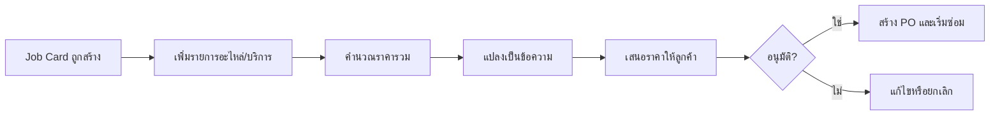
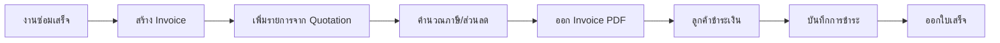
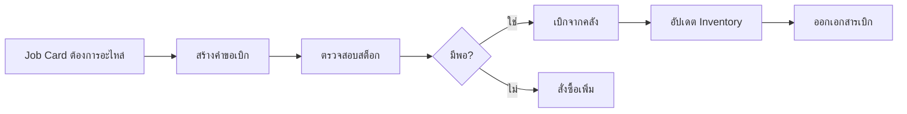
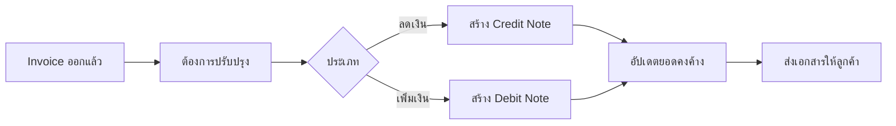
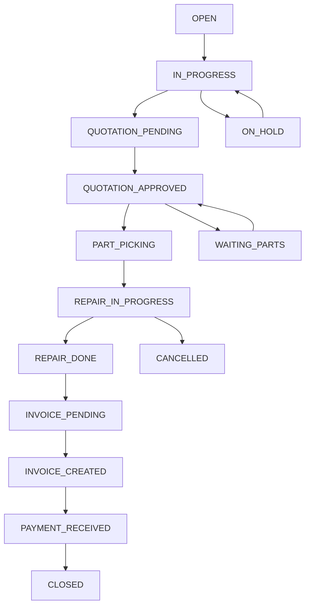
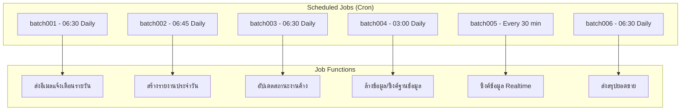
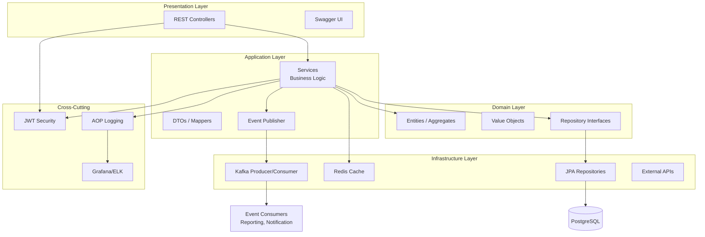
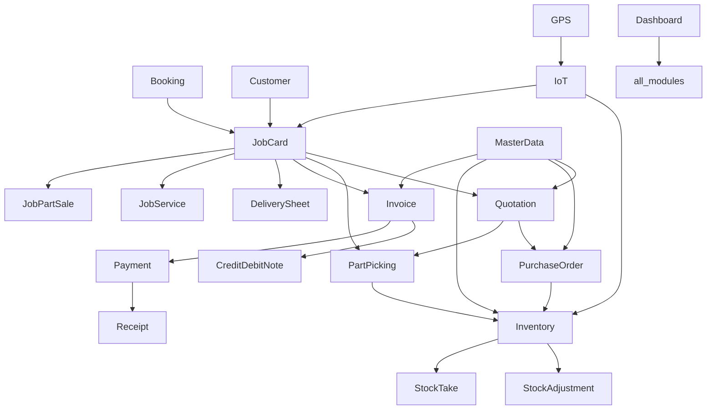
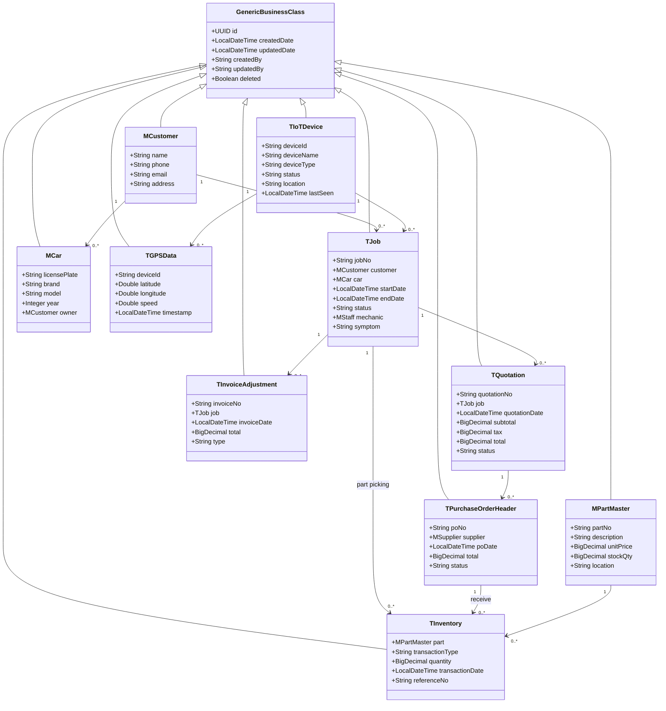

# เอกสารโครงการระบบบริหารจัดการอู่ซ่อมรถ
## Auto Repair Support Management System - Project Documentation

---

| รายการ | รายละเอียด |
|--------|-----------|
| **ชื่อโครงการ** | ระบบบริหารจัดการอู่ซ่อมรถ (Auto Repair Support Management System) |
| **ผู้เขียน** | Kongnakorn Jantakun |
| **วันที่** | 2026-07-04 |
| **เวอร์ชัน** | 2.0 |
| **สถานะ** | ฉบับสมบูรณ์ |

---

## สารบัญ

1. [บทนำ](#1-บทนำ)
2. [บทนิยาม](#2-บทนิยาม)
3. [ภาพรวมระบบ](#3-ภาพรวมระบบ)
4. [สถาปัตยกรรมระบบโดยรวม](#4-สถาปัตยกรรมระบบโดยรวม)
5. [ขอบเขตของระบบ](#5-ขอบเขตของระบบ)
6. [ออกแบบ Workflow](#6-ออกแบบ-workflow)
7. [Diagram แผนภาพโครงสร้างระบบ](#7-diagram-แผนภาพโครงสร้างระบบ)
8. [ออกแบบฐานข้อมูล](#8-ออกแบบฐานข้อมูล)
9. [ออกแบบ API](#9-ออกแบบ-api)
10. [ออกแบบ Module](#10-ออกแบบ-module)
11. [โมดูลขยายใหม่](#11-โมดูลขยายใหม่)
12. [Web Order System (WOS)](#12-web-order-system-wos)
13. [Module Dependency Map](#13-module-dependency-map)
14. [Security & Authentication](#14-security--authentication)
15. [Monitoring & Observability](#15-monitoring--observability)
16. [Deployment Architecture](#16-deployment-architecture)
17. [File Count Summary](#17-file-count-summary)
18. [JasperReport Templates](#18-jasperreport-templates)
19. [คู่มือการติดตั้งและการใช้งาน](#19-คู่มือการติดตั้งและการใช้งาน)

---

## 1. บทนำ

### 1.1 วัตถุประสงค์

ระบบบริหารจัดการอู่ซ่อมรถ (Auto Repair Support Management System) ถูกพัฒนาขึ้นเพื่อเพิ่มประสิทธิภาพในการดำเนินงานของศูนย์บริการหรืออู่ซ่อมรถ โดยครอบคลุมตั้งแต่การรับรถเข้าซ่อม การวินิจฉัยปัญหา การเสนอราคา การสั่งซื้ออะไหล่ การเบิกจ่ายสินค้าคงคลัง การออกใบแจ้งหนี้ และการติดตามประวัติการซ่อมบำรุงของลูกค้าและยานพาหนะ

ระบบถูกออกแบบให้มีความยืดหยุ่น รองรับการขยายตัวในอนาคต และสามารถปรับใช้กับธุรกิจขนาดกลางถึงขนาดใหญ่ได้ โดยใช้สถาปัตยกรรมแบบ **Domain‑Driven Design (DDD)** ผสานกับ **Clean Architecture** และ **Event‑Driven** เพื่อแยกความรับผิดชอบและเพิ่มความสามารถในการบำรุงรักษา

### 1.2 เป้าหมายหลัก

1. เพิ่มประสิทธิภาพการทำงานของพนักงานทุกแผนก
2. ลดความผิดพลาดจากการทำงานด้วยมือ
3. เพิ่มความพึงพอใจของลูกค้าด้วยบริการที่รวดเร็วและถูกต้อง
4. มีข้อมูลที่ถูกต้องสำหรับการตัดสินใจของผู้บริหาร
5. รองรับการขยายธุรกิจในอนาคต

### 1.3 เทคโนโลยีหลัก (Tech Stack)

| หมวดหมู่ | เทคโนโลยี | เวอร์ชัน |
|---------|-----------|----------|
| **ภาษา** | Java | 17+ / 21 |
| **Framework** | Spring Boot | 3.4.1 |
| **ORM** | Spring Data JPA (Hibernate) | - |
| **ฐานข้อมูลหลัก** | PostgreSQL | 15+ |
| **Cache** | Redis | 7+ |
| **Message Queue** | Apache Kafka | 3.4+ |
| **Logging & Monitoring** | ELK (Elasticsearch, Logstash, Kibana), Grafana, Micrometer | - |
| **การจัดการเอกสาร** | JasperReports (PDF), Apache POI (Excel) | - |
| **Workflow Automation** | n8n | - |
| **CI/CD** | Jenkins, Docker Compose, AWS (EC2, S3) | - |
| **Testing** | JUnit, TestContainers, Mockito, Robot Framework | - |
| **OCR** | Tesseract / Google Vision | - |
| **IoT** | MQTT, InfluxDB | - |
| **Documentation** | Swagger/OpenAPI 3.0 | - |
| **Build Tool** | Maven | 3.8+ |

### 1.4 กลุ่มผู้ใช้งาน

| กลุ่มผู้ใช้งาน | บทบาทหน้าที่ |
|--------------|-------------|
| **พนักงานหน้าร้าน (Service Advisor)** | รับรถ, สร้าง Job Card, ออกใบเสนอราคา, ปิดงาน |
| **ช่างเทคนิค (Mechanic)** | วินิจฉัย, ซ่อมแซม, อัปเดตสถานะงาน |
| **พนักงานคลังสินค้า (Store Keeper)** | จัดการสินค้าคงคลัง, เบิกจ่ายอะไหล่, รับสินค้า |
| **ฝ่ายจัดซื้อ (Purchasing)** | สร้างใบสั่งซื้อ, ติดตาม Supplier |
| **ฝ่ายบัญชี/การเงิน (Finance)** | ออกใบแจ้งหนี้, รับชำระเงิน, จัดการเอกสารปรับปรุง |
| **ผู้ดูแลระบบ (Admin)** | จัดการผู้ใช้, สิทธิ์การใช้งาน, ข้อมูลพื้นฐาน |
| **ผู้บริหาร (Executive)** | ดู Dashboard และรายงานสรุป |

---

## 2. บทนิยาม

| คำศัพท์ | คำอธิบาย |
|---------|----------|
| **Job Card (ใบงาน)** | เอกสารหลักที่บันทึกข้อมูลการรับรถเข้าซ่อม ประกอบด้วยข้อมูลลูกค้า, รถยนต์, อาการเบื้องต้น, และช่างที่รับผิดชอบ |
| **Quotation (ใบเสนอราคา)** | เอกสารแสดงรายการอะไหล่และค่าบริการที่ต้องใช้ในการซ่อม พร้อมราคา เพื่อให้ลูกค้าอนุมัติก่อนดำเนินการ |
| **Purchase Order (ใบสั่งซื้อ)** | เอกสารที่ใช้สั่งซื้ออะไหล่จาก Supplier เมื่อสินค้าในคลังไม่เพียงพอ |
| **Invoice (ใบแจ้งหนี้)** | เอกสารเรียกเก็บเงินจากลูกค้าหลังจากงานซ่อมเสร็จสิ้น |
| **Credit Note (ใบลดหนี้)** | เอกสารลดจำนวนเงินที่ต้องชำระจากใบแจ้งหนี้ (เช่น ส่วนลด, การคืนเงิน) |
| **Debit Note (ใบเพิ่มหนี้)** | เอกสารเพิ่มจำนวนเงินที่ต้องชำระจากใบแจ้งหนี้ (เช่น ค่าใช้จ่ายเพิ่มเติม) |
| **Part Picking (การเบิกอะไหล่)** | กระบวนการหยิบอะไหล่จากคลังตามที่ระบุใน Job Card หรือ Quotation เพื่อนำไปใช้ในการซ่อม |
| **Delivery Sheet (ใบส่งของ)** | เอกสารประกอบการส่งมอบอะไหล่หรือสินค้าให้ลูกค้าหรือแผนกอื่น |
| **Inventory (สินค้าคงคลัง)** | สินค้าทั้งหมดที่เก็บไว้ในคลัง รวมถึงอะไหล่รถและอุปกรณ์ต่างๆ |
| **Stock Adjustment (ปรับปรุงสต็อก)** | การปรับจำนวนสินค้าคงคลังให้ตรงกับความเป็นจริง (เช่น สูญหาย, ชำรุด) |
| **Stock Take (ตรวจนับสต็อก)** | การนับสินค้าจริงเพื่อเปรียบเทียบกับระบบ |
| **Supplier (ผู้จัดจำหน่าย)** | บริษัทหรือร้านค้าที่จัดหาอะไหล่ให้อู่ |
| **Master Data (ข้อมูลหลัก)** | ข้อมูลพื้นฐานที่ใช้ร่วมกัน เช่น รายการอะไหล่, รายการบริการ, ลูกค้า, รถยนต์ |
| **Batch Job (งานประจำ)** | งานที่ทำงานอัตโนมัติตามเวลาที่กำหนด (Cron) เช่น การส่งอีเมลแจ้งเตือน, การสร้างรายงาน |
| **Bounded Context** | ขอบเขตของโมเดลใน DDD ที่แยกแต่ละส่วนของระบบออกจากกันตามความหมายทางธุรกิจ |
| **Event-Driven** | รูปแบบการทำงานที่ระบบตอบสนองต่อเหตุการณ์ที่เกิดขึ้น |
| **AOP (Aspect-Oriented Programming)** | เทคนิคการเขียนโปรแกรมที่แยกฟังก์ชันขวาง (cross-cutting concerns) ออกจาก logic หลัก |

---

## 3. ภาพรวมระบบ

### 3.1 โมดูลหลักของระบบ

```
├── 🔑 Authentication & Permission        ← เข้าสู่ระบบ / จัดการสิทธิ์
├── 🚗 Job Card Management                 ← ใบงานซ่อมรถ
├── 👥 Customer Management                 ← ข้อมูลลูกค้า
├── 📋 Quotation                           ← ใบเสนอราคา
├── 🛒 Purchase Order                      ← ใบสั่งซื้อ
├── 📦 Inventory Management                ← คลังสินค้า / อะไหล่
├── 💰 Payment Management                  ← การชำระเงิน
├── 📅 Booking Management                  ← การนัดหมาย
├── 👨‍💼 Staff Management                    ← จัดการพนักงาน
├── 🏢 Company & Supplier                  ← บริษัท / Supplier
├── 📊 Dashboard & Reports                 ← รายงานและ Dashboard
├── 📧 Email Service                       ← ส่ง Email อัตโนมัติ
├── 📄 Document Management                 ← จัดการเอกสาร (PDF, Excel)
├── 🔍 OCR (Image to Text)                 ← อ่านข้อความจากรูปภาพ
├── ⏱️ Batch Jobs (6 jobs)                 ← งาน Scheduled อัตโนมัติ
├── 🌏 Multi-Language (18 ภาษา)            ← รองรับหลายภาษา
├── 📡 IoT & GPS Tracking                  ← ติดตามอุปกรณ์และตำแหน่ง
├── 🎛️ Device Access Control               ← ควบคุมการเข้าถึงอุปกรณ์
├── 🎯 Dashboard Center                    ← ศูนย์กลางแดชบอร์ด
└── 🛍️ Web Order System (WOS)             ← ระบบสั่งซื้อออนไลน์
    ├── 📚 Catalogue Management
    ├── 🛒 Supportping Cart
    └── 💵 Sales Price
```

### 3.2 ความสามารถหลักของระบบ

| ฟังก์ชัน | รายละเอียด |
|---------|-----------|
| **การจัดการงานซ่อม** | ตั้งแต่รับรถจนถึงปิดงาน พร้อมสถานะการดำเนินการ |
| **การจัดการอะไหล่และสินค้าคงคลัง** | การเบิก, รับ, ปรับปรุง, และตรวจนับ |
| **การจัดซื้อ** | ผ่านใบสั่งซื้อและติดตาม Supplier |
| **การเงินและการเรียกเก็บเงิน** | ผ่านใบแจ้งหนี้, ใบลด/เพิ่มหนี้, และใบเสร็จรับเงิน |
| **การจัดการข้อมูลลูกค้าและยานพาหนะ** | แบบรวมศูนย์ |
| **การวิเคราะห์และรายงาน** | ด้วย Dashboard และรายงาน PDF/Excel |
| **การสื่อสารอัตโนมัติ** | ผ่านอีเมลและ LINE Notify |
| **การทำงานแบบ Event‑Driven** | เพื่อแยกประมวลผลหนัก (รายงาน, แจ้งเตือน, Logging) |
| **การเชื่อมต่อกับอุปกรณ์ IoT** | สำหรับติดตามสถานะและตำแหน่ง |

---

## 4. สถาปัตยกรรมระบบโดยรวม

### 4.1 สถาปัตยกรรมภาพรวม (Overall Architecture)

ระบบถูกออกแบบด้วย **Layered Architecture** (Controller → Service → Repository) ร่วมกับ **Event-Driven** ผ่าน Kafka เพื่อแยกการทำงานหนัก (Heavy Processing) ออกจาก REST API หลัก

#### ชั้นต่างๆ ของระบบ

| ชั้น | คำอธิบาย |
|-----|----------|
| **Controller Layer** | รับ HTTP Request, ตรวจสอบ JWT, Validate DTO |
| **Service Layer** | จัดการ Business Logic, จัดการ Transaction, เรียกใช้ Cache |
| **Repository Layer** | ใช้ Spring Data JPA เชื่อมต่อ PostgreSQL |
| **Domain Layer** | Entity และ Value Objects ตามหลัก DDD |
| **Event Publisher** | เมื่อเกิดการเปลี่ยนแปลงสถานะ จะส่ง Event ไปยัง Kafka |
| **Event Consumer** | ระบบย่อย (รายงาน, แจ้งเตือน) ดึง Event ไปอัปเดต Elasticsearch และแจ้งเตือน |
| **Monitoring** | Grafana ดึง Metrics จาก Actuator/Micrometer, ELK จัดการ Logs |

### 4.2 แผนภาพสถาปัตยกรรม (Architecture Diagram)

```
┌─────────────────────────────────────────────────────────────────────────────────┐
│                              EXTERNAL SYSTEMS                                    │
│  ┌──────────┐  ┌──────────┐  ┌──────────┐  ┌──────────┐  ┌──────────────────┐  │
│  │  Mobile  │  │   Web    │  │  Third   │  │   IoT    │  │   Email/SMS      │  │
│  │   App    │  │  Portal  │  │  Party   │  │ Devices  │  │   Gateway        │  │
│  └────┬─────┘  └────┬─────┘  └────┬─────┘  └────┬─────┘  └────────┬─────────┘  │
└───────┼─────────────┼─────────────┼─────────────┼───────────────┼──────────────┘
        │             │             │             │               │
        ▼             ▼             ▼             ▼               ▼
┌─────────────────────────────────────────────────────────────────────────────────┐
│                             API GATEWAY / LOAD BALANCER                          │
│                             (Spring Cloud Gateway / NGINX)                       │
└─────────────────────────────────────────────────────────────────────────────────┘
                                        │
                                        ▼
┌─────────────────────────────────────────────────────────────────────────────────┐
│                             SPRING BOOT APPLICATION                              │
│  ┌───────────────────────────────────────────────────────────────────────────┐  │
│  │                           CONTROLLER LAYER                                 │  │
│  │    REST Controllers │ WebSocket │ GraphQL │ Admin API │ Health Check       │  │
│  └───────────────────────────────────────────────────────────────────────────┘  │
│                                      │                                           │
│  ┌───────────────────────────────────▼───────────────────────────────────────┐  │
│  │                             SERVICE LAYER                                  │  │
│  │       Business Logic │ Transaction Mgmt │ Cache │ Validation │ Events      │  │
│  └───────────────────────────────────┬───────────────────────────────────────┘  │
│                                      │                                           │
│  ┌───────────────────────────────────▼───────────────────────────────────────┐  │
│  │                            REPOSITORY LAYER                                │  │
│  │        Spring Data JPA │ Custom Queries │ Specifications │ Projections      │  │
│  └───────────────────────────────────┬───────────────────────────────────────┘  │
└────────────────────────────────────┼──────────────────────────────────────────┘
                                     │
                 ┌───────────────────┼───────────────────┐
                 ▼                   ▼                   ▼
        ┌──────────────┐    ┌──────────────┐    ┌──────────────┐
        │  PostgreSQL  │    │    Redis     │    │    Kafka     │
        │  (Primary DB)│    │   (Cache)    │    │ (Event Bus)  │
        └──────────────┘    └──────────────┘    └──────┬───────┘
                                                        │
        ┌───────────────────────────────────────────────┼───────────────────┐
        ▼                                               ▼                   ▼
 ┌─────────────┐                                ┌─────────────┐      ┌─────────────┐
 │ Elasticsearch│                                │  InfluxDB   │      │   Grafana   │
 │   (ELK)     │                                │  (IoT Data) │      │  (Metrics)  │
 └─────────────┘                                └─────────────┘      └─────────────┘
```

### 4.3 หลักการออกแบบ (Design Principles)

1. **Separation of Concerns**: แต่ละชั้นมีหน้าที่เฉพาะ
2. **Dependency Inversion**: Domain ไม่ขึ้นกับ Infrastructure
3. **Code Reuse**: โครงสร้าง Generic ลดการเขียนโค้ดซ้ำ
4. **Testability**: สถาปัตยกรรมเอื้อต่อการสร้าง Unit Test
5. **Single Responsibility**: แต่ละคลาสมีหน้าที่เดียว
6. **Open/Closed Principle**: เปิดรับการขยาย ปิดสำหรับการแก้ไข

---

## 5. ขอบเขตของระบบ

### 5.1 ขอบเขตการทำงาน (In-Scope)

| # | ขอบเขต | รายละเอียด |
|---|--------|-----------|
| 1 | การจัดการงานซ่อม | ตั้งแต่รับรถจนถึงปิดงาน พร้อมสถานะการดำเนินการ |
| 2 | การจัดการอะไหล่และสินค้าคงคลัง | การเบิก, รับ, ปรับปรุง, และตรวจนับ |
| 3 | การจัดซื้อ | ผ่านใบสั่งซื้อและติดตาม Supplier |
| 4 | การเงินและการเรียกเก็บเงิน | ผ่านใบแจ้งหนี้, ใบลด/เพิ่มหนี้, และใบเสร็จรับเงิน |
| 5 | การจัดการข้อมูลลูกค้าและยานพาหนะ | แบบรวมศูนย์ |
| 6 | การวิเคราะห์และรายงาน | ด้วย Dashboard และรายงาน PDF/Excel |
| 7 | การสื่อสารอัตโนมัติ | ผ่านอีเมลและ LINE Notify |
| 8 | การทำงานแบบ Event‑Driven | แยกประมวลผลหนัก (รายงาน, แจ้งเตือน, Logging) |
| 9 | การเชื่อมต่อกับอุปกรณ์ IoT | ติดตามสถานะและตำแหน่ง |
| 10 | การจัดการเอกสาร | สร้าง PDF และ Excel จากเทมเพลต |
| 11 | ระบบสั่งซื้อออนไลน์ (WOS) | แคตตาล็อก, ตะกร้าสินค้า, ราคาขาย |
| 12 | Dashboard Center | ศูนย์กลางแสดงข้อมูลเชิงวิเคราะห์ |
| 13 | GPS Tracking | ติดตามตำแหน่งอุปกรณ์/ยานพาหนะ |
| 14 | Device Access Control | ควบคุมการเข้าถึงอุปกรณ์ IoT |
| 15 | Multi-Language | รองรับ 18 ภาษา |

### 5.2 ขอบเขตที่ไม่ครอบคลุม (Out-of-Scope)

- การผลิตอะไหล่
- การบัญชีแยกประเภทเต็มรูปแบบ (สามารถเชื่อมต่อกับระบบบัญชีภายนอกผ่าน API)
- การจัดการบุคลากรขั้นสูง (HRM เต็มรูปแบบ)
- การจัดการห่วงโซ่อุปทานระดับสูง

---

## 6. ออกแบบ Workflow

### 6.1 Workflow หลักของระบบ (End‑to‑End)

```mermaid
graph TD
    A[ลูกค้ามาถึง/นัดหมาย] --> B[สร้าง Job Card]
    B --> C[วินิจฉัย/เพิ่มรายการ]
    C --> D[สร้าง Quotation]
    D --> E{ลูกค้าอนุมัติ?}
    E -- ไม่ --> F[ปรับปรุง Quotation / ยกเลิก]
    E -- ใช่ --> G[สร้าง Purchase Order (ถ้าต้องการ)]
    G --> H[เบิกอะไหล่]
    H --> I[ดำเนินการซ่อม]
    I --> J[ตรวจสอบเสร็จ]
    J --> K[สร้าง Invoice]
    K --> L[รับชำระเงิน]
    L --> M[ออกใบเสร็จ]
    M --> N[ปิด Job Card]
```

### 6.2 Workflow ของแต่ละโมดูล

#### 6.2.1 Quotation Workflow



#### 6.2.2 Purchase Order Workflow


#### 6.2.3 Invoice & Payment Workflow



#### 6.2.4 Part Picking Workflow



#### 6.2.5 Credit/Debit Note Workflow



#### 6.2.6 Job Card Status Workflow



#### 6.2.7 Batch Jobs Workflow



---

## 7. Diagram แผนภาพโครงสร้างระบบ

### 7.1 แผนภาพสถาปัตยกรรม (Layered + Event‑Driven)



### 7.2 แผนภาพความสัมพันธ์ระหว่างโมดูล (Module Dependency Map)



### 7.3 แผนภาพคลาสหลัก (Core Entities)



---

## 8. ออกแบบฐานข้อมูล

### 8.1 สรุปตารางหลัก (Main Tables)

| กลุ่ม | ตาราง | คำอธิบาย |
|-------|-------|----------|
| **Master Data** | `m_company` | ข้อมูลบริษัท/อู่ |
| | `m_customer` | ข้อมูลลูกค้า |
| | `m_car` | ข้อมูลรถยนต์ |
| | `m_supplier` | ข้อมูลผู้จัดจำหน่าย |
| | `m_part_master` | รายการอะไหล่หลัก |
| | `m_service` | รายการบริการ |
| | `m_category` | หมวดหมู่สินค้า/บริการ |
| | `m_staff` | ข้อมูลพนักงาน |
| | `m_user` | ผู้ใช้ระบบ |
| | `m_menu` | เมนูระบบ |
| | `m_payment_method` | วิธีการชำระเงิน |
| | `m_payment_terms` | เงื่อนไขการชำระเงิน |
| | `m_currency` | สกุลเงิน |
| | `m_exchange_rate` | อัตราแลกเปลี่ยน |
| | `m_country`, `m_city`, `m_province` | ข้อมูลภูมิศาสตร์ |
| | `m_Support_profile` | ข้อมูลร้านค้า |
| | `m_stock_location` | ตำแหน่งจัดเก็บสินค้า |
| | `m_iot_device` | ข้อมูลอุปกรณ์ IoT |
| **Transaction** | `t_job` | ใบงาน |
| | `t_job_service` | รายการบริการในใบงาน |
| | `t_job_part_sales` | รายการอะไหล่ที่ขายในใบงาน |
| | `t_job_service_car_symptom` | อาการของรถ |
| | `t_job_diag_trouble_code` | รหัสข้อบกพร่องจากการวินิจฉัย |
| | `t_quotation` | ใบเสนอราคา |
| | `t_quotation_part` | รายการอะไหล่ในใบเสนอราคา |
| | `t_quotation_service` | รายการบริการในใบเสนอราคา |
| | `t_purchase_order_header` | หัวใบสั่งซื้อ |
| | `t_purchase_order_detail` | รายละเอียดใบสั่งซื้อ |
| | `t_invoice_adjustment` | ใบแจ้งหนี้ / ใบลดหนี้ / ใบเพิ่มหนี้ |
| | `t_invoice_adjustment_part` | รายการอะไหล่ในใบแจ้งหนี้ |
| | `t_invoice_adjustment_service` | รายการบริการในใบแจ้งหนี้ |
| | `t_received_amount` | ประวัติการรับชำระเงิน |
| | `t_inventory` | รายการเคลื่อนไหวสินค้าคงคลัง |
| | `t_inventory_adjustment_header` | หัวการปรับปรุงสต็อก |
| | `t_inventory_adjustment_detail` | รายละเอียดการปรับปรุงสต็อก |
| | `t_stocktake_header` | หัวการตรวจนับสต็อก |
| | `t_stocktake_detail` | รายละเอียดการตรวจนับ |
| | `t_email_promotion` | อีเมลโปรโมชัน |
| | `t_email_reminder` | อีเมลแจ้งเตือน |
| | `t_document_remark` | ข้อความบันทึกในเอกสาร |
| | `t_gps_data` | ข้อมูล GPS |
| | `t_device_history` | ประวัติการทำงานของอุปกรณ์ |
| | `t_device_access_log` | บันทึกการเข้าถึงอุปกรณ์ |
| | `t_auto_report` | รายงานอัตโนมัติ |
| **View** | `v_header_report` | มุมมองสำหรับรายงานหัวเอกสาร |
| | `v_job_card_detail` | รายละเอียดใบงาน |
| | `v_preview_job_card_header_report` | มุมมองหัวใบงานสำหรับ PDF |
| | `v_preview_job_card_details_parts` | มุมมองรายการอะไหล่ในใบงาน |
| | `v_part_picking_request_header` | มุมมองหัวขอเบิก |
| | `v_part_picking_request_detail` | มุมมองรายละเอียดขอเบิก |
| | `v_credit_debit_detail` | มุมมองรายละเอียดใบลด/เพิ่มหนี้ |
| | `v_preview_receipt` | มุมมองใบเสร็จ |
| **Dashboard** | `d_sales_overview` | สรุปยอดขาย |
| | `d_inventory_overview` | สรุปสินค้าคงคลัง |
| | `d_parts_brand` | ยอดขายแยกแบรนด์อะไหล่ |
| | `d_parts_category` | ยอดขายแยกหมวดหมู่ |
| | `d_service_car_detail` | รายละเอียดบริการรถ |
| | `d_service_car_intake` | จำนวนรถเข้าซ่อม |
| | `d_service_category` | ยอดขายแยกประเภทบริการ |
| | `d_accumulate_car_brand` | สะสมยี่ห้อรถ |
| | `d_accumulate_car_name` | สะสมรุ่นรถ |
| | `d_accumulate_finance` | สรุปการเงินสะสม |

### 8.2 ความสัมพันธ์หลัก (ER Diagram สรุป)

| ความสัมพันธ์ | รายละเอียด |
|-------------|-----------|
| `t_job` → `m_customer` | Many‑to‑One |
| `t_job` → `m_car` | Many‑to‑One |
| `t_job` → `m_staff` | Many‑to‑One (ช่างผู้รับผิดชอบ) |
| `t_quotation` → `t_job` | Many‑to‑One |
| `t_quotation_part` → `t_quotation`, `m_part_master` | Many‑to‑One |
| `t_purchase_order_header` → `m_supplier` | Many‑to‑One |
| `t_purchase_order_detail` → `m_part_master` | Many‑to‑One |
| `t_invoice_adjustment` → `t_job` | One‑to‑One |
| `t_invoice_adjustment_part` → `t_invoice_adjustment`, `m_part_master` | Many‑to‑One |
| `t_inventory` → `m_part_master` | Many‑to‑One |
| `t_inventory` → `t_job` | Many‑to‑One (optional) |
| `t_received_amount` → `t_invoice_adjustment` | Many‑to‑One |
| `t_gps_data` → `m_iot_device` | Many‑to‑One |
| `t_device_history` → `m_iot_device` | Many‑to‑One |

---

## 9. ออกแบบ API

### 9.1 หลักการออกแบบ

- RESTful API
- ใช้ JSON เป็นรูปแบบข้อมูลหลัก
- ตรวจสอบสิทธิ์ผ่าน JWT Bearer Token
- มี Swagger/OpenAPI สำหรับเอกสารอัตโนมัติ
- Versioning: `/api/v1/...`

### 9.2 สรุป Endpoints หลักแยกตามโมดูล

#### 9.2.1 Authentication

| Method | Path | คำอธิบาย |
|--------|------|----------|
| POST | `/auth/login` | เข้าสู่ระบบ |
| POST | `/auth/logout` | ออกจากระบบ |
| POST | `/auth/refresh` | ต่ออายุ Token |
| GET | `/user/profile` | ข้อมูลผู้ใช้ปัจจุบัน |
| PUT | `/user/profile` | อัปเดตข้อมูลผู้ใช้ |
| POST | `/user/change-password` | เปลี่ยนรหัสผ่าน |

#### 9.2.2 Job Card

| Method | Path | คำอธิบาย |
|--------|------|----------|
| GET | `/job/list` | รายการใบงาน |
| POST | `/job/create` | สร้างใบงานใหม่ |
| PUT | `/job/update/{id}` | แก้ไขใบงาน |
| GET | `/job/{id}` | ดูรายละเอียดใบงาน |
| PUT | `/job/status/{id}` | เปลี่ยนสถานะ |
| GET | `/job/history` | ประวัติการซ่อมของรถ |
| GET | `/job/order/report/{id}` | สร้าง PDF ใบงาน |
| GET | `/job/statuses` | รายการสถานะทั้งหมด |

#### 9.2.3 Quotation

| Method | Path | คำอธิบาย |
|--------|------|----------|
| GET | `/quotation/list` | รายการใบเสนอราคา |
| POST | `/quotation/create` | สร้างใบเสนอราคา |
| PUT | `/quotation/update` | แก้ไข |
| GET | `/quotation/{id}` | ดูรายละเอียด |
| GET | `/quotation/report/{id}` | สร้าง PDF |
| POST | `/quotation/part/create` | เพิ่มรายการอะไหล่ |
| PUT | `/quotation/part/update/{id}` | แก้ไขรายการอะไหล่ |
| DELETE | `/quotation/part/{id}` | ลบรายการอะไหล่ |
| POST | `/quotation/service/create` | เพิ่มรายการบริการ |
| GET | `/quotation/list/{jobId}` | รายการ Quotation ของ Job |
| PUT | `/quotation/approve/{id}` | อนุมัติ Quotation |
| PUT | `/quotation/reject/{id}` | ไม่อนุมัติ Quotation |

#### 9.2.4 Purchase Order

| Method | Path | คำอธิบาย |
|--------|------|----------|
| GET | `/po/list` | รายการ PO |
| POST | `/po/create` | สร้าง PO |
| PUT | `/po/update/{id}` | แก้ไข |
| GET | `/po/{id}` | ดูรายละเอียด |
| GET | `/po/report/{id}` | สร้าง PDF |
| POST | `/po/email/{id}` | ส่ง PO ทางอีเมล |
| PUT | `/po/receive/{id}` | รับสินค้า |
| GET | `/po/suggestion/{jobId}` | แนะนำ PO จาก Job |

#### 9.2.5 Invoice / Credit / Debit Note

| Method | Path | คำอธิบาย |
|--------|------|----------|
| GET | `/invoice/tab/list` | รายการใบแจ้งหนี้ |
| POST | `/invoice/create` | สร้าง Invoice |
| PUT | `/invoice/update/{id}` | แก้ไข |
| GET | `/invoice/{id}` | ดูรายละเอียด |
| GET | `/invoice/report/{id}` | PDF Invoice |
| GET | `/invoice/summary/{jobId}` | สรุปยอด |
| POST | `/invoice/part/create` | เพิ่มรายการอะไหล่ |
| POST | `/invoice/service/create` | เพิ่มรายการบริการ |
| POST | `/invoice/credit-note/create` | สร้าง Credit Note |
| POST | `/invoice/debit-note/create` | สร้าง Debit Note |
| GET | `/invoice/credit-note/report/{id}` | PDF Credit Note |
| GET | `/invoice/debit-note/report/{id}` | PDF Debit Note |
| GET | `/invoice/credit-debit/detail/{id}` | ดูรายละเอียด |

#### 9.2.6 Payment / Receipt

| Method | Path | คำอธิบาย |
|--------|------|----------|
| POST | `/payment/create` | บันทึกการชำระเงิน |
| GET | `/payment/list` | รายการชำระเงิน |
| GET | `/payment/{id}` | ดูรายละเอียดการชำระ |
| GET | `/receipt/{id}` | ดูใบเสร็จ |
| GET | `/receipt/report/{id}` | PDF ใบเสร็จ |

#### 9.2.7 Inventory & Part Picking

| Method | Path | คำอธิบาย |
|--------|------|----------|
| GET | `/inventory/list` | รายการสินค้าคงคลัง |
| POST | `/inventory/receive` | รับสินค้าเข้า |
| POST | `/inventory/issue` | เบิกจ่ายสินค้า |
| GET | `/inventory/{partId}` | ดูรายละเอียดสินค้า |
| GET | `/stock-summary` | สรุปสต็อก |
| GET | `/stock/location` | ตำแหน่งจัดเก็บ |
| POST | `/stock/location/create` | สร้างตำแหน่งจัดเก็บ |
| POST | `/part-picking/create` | สร้างคำขอเบิก |
| GET | `/part-picking/list` | รายการคำขอเบิก |
| GET | `/part-picking/{id}` | ดูรายละเอียดคำขอเบิก |
| GET | `/part-picking/pdf/{id}` | PDF เอกสารเบิก |
| PUT | `/part-picking/confirm/{id}` | ยืนยันการเบิก |
| POST | `/stock-adjustment/create` | สร้างการปรับปรุงสต็อก |
| POST | `/stock-take/create` | สร้างการตรวจนับ |

#### 9.2.8 Master Data

| Method | Path | คำอธิบาย |
|--------|------|----------|
| GET | `/customer/list` | รายการลูกค้า |
| POST | `/customer/create` | เพิ่มลูกค้า |
| PUT | `/customer/update/{id}` | แก้ไขลูกค้า |
| GET | `/customer/{id}` | ดูรายละเอียดลูกค้า |
| GET | `/car/list` | รายการรถ |
| POST | `/car/create` | เพิ่มรถ |
| GET | `/car/{id}` | ดูรายละเอียดรถ |
| GET | `/part-master/list` | รายการอะไหล่ |
| POST | `/part-master/create` | เพิ่มอะไหล่ |
| PUT | `/part-master/update/{id}` | แก้ไขอะไหล่ |
| GET | `/supplier/list` | รายการ Supplier |
| POST | `/supplier/create` | เพิ่ม Supplier |
| GET | `/service/list` | รายการบริการ |
| POST | `/service/create` | เพิ่มบริการ |
| GET | `/category/list` | รายการหมวดหมู่ |
| GET | `/currency/list` | รายการสกุลเงิน |
| GET | `/exchange-rate` | อัตราแลกเปลี่ยนปัจจุบัน |

#### 9.2.9 Dashboard & Reports

| Method | Path | คำอธิบาย |
|--------|------|----------|
| GET | `/dashboard/sales-overview` | ภาพรวมยอดขาย |
| GET | `/dashboard/inventory-overview` | ภาพรวมสต็อก |
| GET | `/dashboard/top-parts` | อะไหล่ขายดี |
| GET | `/dashboard/revenue-by-period` | รายได้แยกช่วงเวลา |
| GET | `/dashboard/job-status` | สถานะงานทั้งหมด |
| GET | `/dashboard/service-category` | บริการแยกประเภท |
| GET | `/report/export-excel` | ส่งออก Excel |
| GET | `/report/export-pdf` | ส่งออก PDF |
| GET | `/report/daily-summary` | รายงานสรุปรายวัน |
| GET | `/report/monthly-summary` | รายงานสรุปรายเดือน |

#### 9.2.10 IoT & GPS

| Method | Path | คำอธิบาย |
|--------|------|----------|
| GET | `/iot/devices` | รายการอุปกรณ์ IoT |
| POST | `/iot/devices/register` | ลงทะเบียนอุปกรณ์ |
| PUT | `/iot/devices/{id}` | อัปเดตอุปกรณ์ |
| GET | `/iot/devices/{id}/status` | สถานะอุปกรณ์ |
| GET | `/gps/devices/{id}/location` | ตำแหน่งล่าสุด |
| GET | `/gps/devices/{id}/history` | ประวัติตำแหน่ง |
| POST | `/iot/mqtt/publish` | ส่งข้อความ MQTT |
| GET | `/device-access/logs` | บันทึกการเข้าถึงอุปกรณ์ |
| POST | `/device-access/authorize` | อนุมัติการเข้าถึง |

---

## 10. ออกแบบ Module

### 10.1 โครงสร้างโปรเจกต์ (Project Structure)

```
src/main/java/com/template/app/
├── _shared/                         # ส่วนประกอบร่วม (Generic)
│   ├── application/                 # Service พื้นฐาน
│   │   ├── GenericService.java
│   │   └── GenericServiceImpl.java
│   ├── domain/                      # Entity พื้นฐาน
│   │   ├── GenericClass.java
│   │   └── GenericBusinessClass.java
│   └── infrastructure/              # Repository พื้นฐาน
│       ├── GenericRepository.java
│       └── GenericRepositoryImpl.java
│
├── modules/                         # โมดูลธุรกิจ
│   ├── auth/                        # Authentication & Permission
│   ├── job/                         # Job Card
│   ├── quotation/                   # Quotation
│   ├── purchase/                    # Purchase Order
│   ├── invoice/                     # Invoice & Credit/Debit Note
│   ├── inventory/                   # Inventory & Part Picking
│   ├── payment/                     # Payment & Receipt
│   ├── customer/                    # Customer & Car
│   ├── supplier/                    # Supplier
│   ├── staff/                       # Staff Management
│   ├── masterdata/                  # Master Data (Part, Service, etc.)
│   ├── dashboard/                   # Dashboard & Reports
│   ├── email/                       # Email Service
│   ├── document/                    # Document Management (PDF/Excel)
│   ├── ocr/                         # OCR (Image to Text)
│   ├── iot/                         # IoT & GPS Tracking
│   ├── batch/                       # Batch Jobs
│   ├── weborder/                    # Web Order System (WOS)
│   └── deviceaccess/                # Device Access Control
│
├── configuration/                   # Spring Configurations
│   ├── data/                        # Database Configurations
│   ├── security/                    # Security Configurations
│   └── kafka/                       # Kafka Configurations
│
├── exception/                       # Global Exception Handling
│   ├── GlobalExceptionHandler.java
│   ├── DomainException.java
│   ├── ApplicationException.java
│   └── InfrastructureException.java
│
├── logging/                         # Logging System (AOP)
│   ├── SystemMonitor.java
│   ├── ErrorLogSchema.java
│   └── MethodCallLogSchema.java
│
└── utils/                           # Utilities
    ├── ConvertBath.java
    ├── ConvertDollar.java
    ├── Round.java
    ├── ExcelGenerator.java
    └── Utility.java
```

### 10.2 รายละเอียดแต่ละโมดูล

#### 10.2.1 Authentication & Permission (`modules/auth`)

| รายการ | รายละเอียด |
|--------|-----------|
| **หน้าที่** | จัดการการเข้าสู่ระบบ, การออกจากระบบ, การจัดการผู้ใช้, การกำหนดสิทธิ์ (Permissions) และการควบคุมการเข้าถึงเมนู |
| **คลาสหลัก** | `AuthController`, `UserController`, `PermissionController`, `JwtTokenFilter`, `PermissionInterceptor` |
| **เอนทิตี** | `MUser`, `MUserMenu`, `MUserJobRole` |
| **คุณสมบัติพิเศษ** | ใช้ JWT, ตรวจสอบสิทธิ์ทุก request ผ่าน Interceptor, ใช้ MDC สำหรับ logging |

**โครงสร้างโฟลเดอร์:**
```
auth/
├── application/
│   ├── interfaces/
│   │   ├── AuthService.java
│   │   ├── UserService.java
│   │   └── PermissionService.java
│   └── impl/
│       ├── AuthServiceImpl.java
│       ├── UserServiceImpl.java
│       └── PermissionServiceImpl.java
├── domain/
│   ├── MUser.java
│   ├── MUserMenu.java
│   └── MUserJobRole.java
└── infrastructure/
    ├── repository/
    │   ├── UserRepository.java
    │   └── UserMenuRepository.java
    └── security/
        ├── JwtTokenFilter.java
        ├── JwtTokenProvider.java
        └── PermissionInterceptor.java
```

#### 10.2.2 Job Card (`modules/job`)

| รายการ | รายละเอียด |
|--------|-----------|
| **หน้าที่** | จัดการใบงานซ่อมรถ ตั้งแต่เริ่มจนปิดงาน รวมถึงการเพิ่มบริการ, อะไหล่, อาการ, และการเปลี่ยนสถานะ |
| **คลาสหลัก** | `JobController`, `JobOrderController`, `JobStatusController` |
| **เอนทิตี** | `TJob`, `TJobService`, `TJobPartSales`, `TJobServiceCarSymptom`, `TJobDiagTroubleCode` |
| **สถานะ** | OPEN, IN_PROGRESS, QUOTATION_PENDING, QUOTATION_APPROVED, PART_PICKING, REPAIR_IN_PROGRESS, REPAIR_DONE, INVOICE_PENDING, INVOICE_CREATED, PAYMENT_RECEIVED, CLOSED, CANCELLED, ON_HOLD, WAITING_PARTS |

**โครงสร้างโฟลเดอร์:**
```
job/
├── application/
│   ├── interfaces/
│   │   ├── JobService.java
│   │   ├── JobStatusService.java
│   │   └── JobPartSaleService.java
│   └── impl/
│       ├── JobServiceImpl.java
│       ├── JobStatusServiceImpl.java
│       └── JobPartSaleServiceImpl.java
├── domain/
│   ├── TJob.java
│   ├── TJobService.java
│   ├── TJobPartSales.java
│   ├── TJobServiceCarSymptom.java
│   ├── TJobDiagTroubleCode.java
│   └── JobStatusConstant.java
└── infrastructure/
    ├── repository/
    │   ├── JobRepository.java
    │   ├── JobServiceRepository.java
    │   └── JobPartSalesRepository.java
    └── mapper/
        ├── JobMapper.java
        └── JobDTOMapper.java
```

#### 10.2.3 Quotation (`modules/quotation`)

| รายการ | รายละเอียด |
|--------|-----------|
| **หน้าที่** | สร้างใบเสนอราคาจาก Job Card, เพิ่มรายการอะไหล่/บริการ, คำนวณราคา, แปลงจำนวนเงินเป็นข้อความ |
| **คลาสหลัก** | `QuotationController`, `QuotationPartController`, `QuotationServiceController` |
| **เอนทิตี** | `TQuotation`, `TQuotationPart`, `TQuotationService` |
| **การทำงาน** | ใช้ JasperReports สร้าง PDF, ส่งให้ลูกค้าอนุมัติ |

#### 10.2.4 Purchase Order (`modules/purchase`)

| รายการ | รายละเอียด |
|--------|-----------|
| **หน้าที่** | สร้างใบสั่งซื้อ Supplier, ส่ง PO ทางอีเมล, ติดตามสถานะการสั่งซื้อ, รับสินค้าเข้าคลัง |
| **คลาสหลัก** | `PurchaseOrderController`, `PurchaseOrderDetailController` |
| **เอนทิตี** | `TPurchaseOrderHeader`, `TPurchaseOrderDetail` |
| **การทำงาน** | หลังจาก Quotation อนุมัติ, ระบบจะสร้าง PO อัตโนมัติ (หรือ manual) และเมื่อรับสินค้าจะอัปเดต Inventory |

#### 10.2.5 Invoice & Credit/Debit Note (`modules/invoice`)

| รายการ | รายละเอียด |
|--------|-----------|
| **หน้าที่** | ออกใบแจ้งหนี้, ใบลดหนี้, ใบเพิ่มหนี้ รวมถึงการคำนวณภาษี, ส่วนลด, และการแปลงสกุลเงิน |
| **คลาสหลัก** | `InvoiceAdjustmentController`, `InvoiceTabController`, `ReceiptController` |
| **เอนทิตี** | `TInvoiceAdjustment`, `TInvoiceAdjustmentPart`, `TInvoiceAdjustmentService`, `TReceivedAmount` |
| **การทำงาน** | ใช้ JasperReports สำหรับ PDF, รองรับหลายสกุลเงิน, มี View สำหรับรายงาน |

#### 10.2.6 Inventory & Part Picking (`modules/inventory`)

| รายการ | รายละเอียด |
|--------|-----------|
| **หน้าที่** | จัดการสินค้าคงคลัง, การเบิก-จ่าย, การปรับปรุงสต็อก, การตรวจนับ, การระบุตำแหน่งจัดเก็บ |
| **คลาสหลัก** | `InventoryController`, `PartPickingRequestController`, `StockAdjustmentController`, `StockTakeController` |
| **เอนทิตี** | `TInventory`, `TInventoryAdjustmentHeader`, `TInventoryAdjustmentDetail`, `TStocktakeHeader`, `TStocktakeDetail`, `MPartMaster`, `MStockLocation` |
| **การทำงาน** | มี Service สำหรับค้นหาอะไหล่, ตรวจสอบสต็อก, จำลองการเบิก, และรายงานสรุป |

#### 10.2.7 Payment (`modules/payment`)

| รายการ | รายละเอียด |
|--------|-----------|
| **หน้าที่** | บันทึกการรับชำระเงิน, สร้างใบเสร็จรับเงิน, เชื่อมโยงกับ Invoice |
| **คลาสหลัก** | `PaymentController`, `ReceiptController` |
| **เอนทิตี** | `TReceivedAmount`, `VPreviewReceipt` |

#### 10.2.8 Customer & Car (`modules/customer`)

| รายการ | รายละเอียด |
|--------|-----------|
| **หน้าที่** | จัดการข้อมูลลูกค้าและรถยนต์ รวมถึงประวัติการซ่อม |
| **คลาสหลัก** | `CustomerController`, `CarController` |
| **เอนทิตี** | `MCustomer`, `MCar` |

#### 10.2.9 Master Data (`modules/masterdata`)

| รายการ | รายละเอียด |
|--------|-----------|
| **หน้าที่** | จัดการข้อมูลพื้นฐานที่ใช้ร่วมกัน เช่น อะไหล่, บริการ, หมวดหมู่, สกุลเงิน, อัตราแลกเปลี่ยน, ประเทศ, จังหวัด |
| **คลาสหลัก** | `PartMasterController`, `ServiceController`, `CategoryController`, `CurrencyController`, `CountryController` |
| **เอนทิตี** | `MPartMaster`, `MService`, `MCategory`, `MCurrency`, `MExchangeRate`, `MCountry`, `MCity`, `MProvince` |

#### 10.2.10 Dashboard & Reports (`modules/dashboard`)

| รายการ | รายละเอียด |
|--------|-----------|
| **หน้าที่** | สร้าง Dashboard แบบ Real‑time และรายงานสรุป (PDF, Excel) สำหรับผู้บริหาร |
| **คลาสหลัก** | `DashBoardController`, `ReportController`, `ExportDataController` |
| **เอนทิตี** | `DSalesOverview`, `DInventoryOverview`, `DPartsBrand`, `DPartsCategory`, `DServiceCategory`, ฯลฯ |
| **การทำงาน** | ใช้ Query แบบ Aggregation และ View, ดึงข้อมูลจาก Kafka Streams (สำหรับ Real‑time) |

#### 10.2.11 Email Service (`modules/email`)

| รายการ | รายละเอียด |
|--------|-----------|
| **หน้าที่** | ส่งอีเมลอัตโนมัติ (PO, Invoice, Reminder, Promotion) ผ่าน SMTP |
| **คลาสหลัก** | `EmailService`, `EmailListController`, `EmailPromotionController` |
| **เอนทิตี** | `TEmailPromotion`, `TEmailReminder` |

#### 10.2.12 Document Management (`modules/document`)

| รายการ | รายละเอียด |
|--------|-----------|
| **หน้าที่** | จัดการเอกสาร PDF และ Excel, สร้างเอกสารจาก JasperReports และ Apache POI |
| **คลาสหลัก** | `PdfService`, `ExcelGenerator` |
| **เทมเพลต** | ไฟล์ `.jrxml` ใน `static/template/jrxml/` |

#### 10.2.13 OCR (`modules/ocr`)

| รายการ | รายละเอียด |
|--------|-----------|
| **หน้าที่** | อ่านข้อความจากรูปภาพ (เช่น ใบสั่งซื้อ, บัตรประชาชน) โดยใช้ Tesseract หรือ Google Vision |
| **คลาสหลัก** | `OcrController`, `OcrService` |

---

## 11. โมดูลขยายใหม่

### 11.1 Dashboard Center System

| รายการ | รายละเอียด |
|--------|-----------|
| **หน้าที่** | ศูนย์กลางแสดงข้อมูลเชิงวิเคราะห์และสถิติแบบ Real-time สำหรับผู้บริหารและผู้จัดการ |
| **คลาสหลัก** | `DashboardCenterController`, `DashboardWidgetService`, `DashboardConfigService` |
| **คุณสมบัติ** | Widget ที่ปรับแต่งได้, การแสดงผลแบบ Real-time, การส่งออกข้อมูล, การจัดลำดับความสำคัญของข้อมูล |

**โครงสร้างโฟลเดอร์:**
```
dashboardcenter/
├── application/
│   ├── interfaces/
│   │   ├── DashboardCenterService.java
│   │   ├── DashboardWidgetService.java
│   │   └── DashboardConfigService.java
│   └── impl/
│       ├── DashboardCenterServiceImpl.java
│       ├── DashboardWidgetServiceImpl.java
│       └── DashboardConfigServiceImpl.java
├── domain/
│   ├── TDashboardConfig.java
│   ├── TDashboardWidget.java
│   └── TDashboardData.java
└── infrastructure/
    ├── repository/
    │   ├── DashboardConfigRepository.java
    │   └── DashboardWidgetRepository.java
    └── websocket/
        └── DashboardWebSocketHandler.java
```

**Widget ที่รองรับ:**
- 📊 ยอดขายรายวัน/รายเดือน
- 📈 แนวโน้มรายได้
- 🚗 จำนวนรถเข้าซ่อม
- 🔧 สถานะงานซ่อม
- 📦 สินค้าคงคลังต่ำกว่าเกณฑ์
- 💰 ลูกหนี้ค้างชำระ
- ⭐ ความพึงพอใจลูกค้า
- 🏆 ช่างที่ทำงานมากที่สุด

### 11.2 GPS Tracking System

| รายการ | รายละเอียด |
|--------|-----------|
| **หน้าที่** | ติดตามตำแหน่งของอุปกรณ์และยานพาหนะแบบ Real-time พร้อมประวัติการเคลื่อนที่ |
| **คลาสหลัก** | `GpsTrackingController`, `GpsDataService`, `GeofenceService` |
| **เอนทิตี** | `TGPSData`, `MGeofence`, `TGeofenceAlert` |
| **เทคโนโลยี** | MQTT สำหรับรับข้อมูล, InfluxDB สำหรับเก็บ Time-series |

**โครงสร้างโฟลเดอร์:**
```
gps/
├── application/
│   ├── interfaces/
│   │   ├── GpsTrackingService.java
│   │   ├── GeofenceService.java
│   │   └── GpsReportService.java
│   └── impl/
│       ├── GpsTrackingServiceImpl.java
│       ├── GeofenceServiceImpl.java
│       └── GpsReportServiceImpl.java
├── domain/
│   ├── TGPSData.java
│   ├── MGeofence.java
│   └── TGeofenceAlert.java
└── infrastructure/
    ├── repository/
    │   ├── GpsDataRepository.java
    │   ├── GeofenceRepository.java
    │   └── GeofenceAlertRepository.java
    └── mqtt/
        └── GpsMqttListener.java
```

**ฟังก์ชันหลัก:**
- 📍 ตำแหน่งแบบ Real-time
- 🗺️ ประวัติการเคลื่อนที่
- ⚠️ Geofence Alert (เข้า/ออกพื้นที่)
- 📊 รายงานระยะทางและความเร็ว
- 🗺️ แผนที่แสดงตำแหน่ง (Google Maps/OpenStreetMap)

### 11.3 IoT System (MQTT, InfluxDB, Device Management)

| รายการ | รายละเอียด |
|--------|-----------|
| **หน้าที่** | เชื่อมต่อกับอุปกรณ์ IoT ผ่าน MQTT, รับข้อมูลสถานะ, บันทึกข้อมูลลง InfluxDB, จัดการอุปกรณ์ |
| **คลาสหลัก** | `IotController`, `MqttService`, `DeviceManagementService`, `DeviceHistoryService` |
| **เอนทิตี** | `MIoTDevice`, `TDeviceHistory`, `TDeviceAccessLog` |
| **เทคโนโลยี** | MQTT Broker (EMQX/Mosquitto), InfluxDB (Time-series Database) |

**โครงสร้างโฟลเดอร์:**
```
iot/
├── application/
│   ├── interfaces/
│   │   ├── IotService.java
│   │   ├── DeviceManagementService.java
│   │   ├── DeviceHistoryService.java
│   │   └── MqttService.java
│   └── impl/
│       ├── IotServiceImpl.java
│       ├── DeviceManagementServiceImpl.java
│       ├── DeviceHistoryServiceImpl.java
│       └── MqttServiceImpl.java
├── domain/
│   ├── MIoTDevice.java
│   ├── TDeviceHistory.java
│   └── TDeviceAccessLog.java
└── infrastructure/
    ├── repository/
    │   ├── IotDeviceRepository.java
    │   ├── DeviceHistoryRepository.java
    │   └── DeviceAccessLogRepository.java
    ├── mqtt/
    │   ├── MqttConfig.java
    │   ├── MqttPublisher.java
    │   └── MqttSubscriber.java
    └── influxdb/
        ├── InfluxDBConfig.java
        └── InfluxDBService.java
```

### 11.4 Kafka Queue Processing System

| รายการ | รายละเอียด |
|--------|-----------|
| **หน้าที่** | จัดการ Event-driven processing, แยกงานหนักออกจาก REST API, ประมวลผลแบบ Async |
| **คลาสหลัก** | `KafkaProducerService`, `KafkaConsumerService`, `EventProcessor` |
| **Topic** | `job-events`, `inventory-events`, `invoice-events`, `notification-events`, `report-events` |

**โครงสร้างโฟลเดอร์:**
```
kafka/
├── config/
│   └── KafkaConfig.java
├── producer/
│   ├── KafkaProducerService.java
│   ├── JobEventProducer.java
│   ├── InventoryEventProducer.java
│   └── InvoiceEventProducer.java
├── consumer/
│   ├── KafkaConsumerService.java
│   ├── JobEventConsumer.java
│   ├── InventoryEventConsumer.java
│   ├── InvoiceEventConsumer.java
│   └── NotificationEventConsumer.java
└── event/
    ├── JobEvent.java
    ├── InventoryEvent.java
    ├── InvoiceEvent.java
    └── NotificationEvent.java
```

**Event Types:**

| Event | Trigger | Consumer Action |
|-------|---------|-----------------|
| `JOB_CREATED` | สร้าง Job Card | อัปเดต Dashboard, ส่งแจ้งเตือน |
| `JOB_STATUS_CHANGED` | เปลี่ยนสถานะ Job | อัปเดต Dashboard, ส่งแจ้งเตือน |
| `QUOTATION_APPROVED` | อนุมัติ Quotation | สร้าง PO อัตโนมัติ, แจ้งเตือนคลัง |
| `PO_CREATED` | สร้าง PO | ส่งอีเมลถึง Supplier |
| `PO_RECEIVED` | รับสินค้า | อัปเดต Inventory, แจ้งเตือน |
| `INVOICE_CREATED` | สร้าง Invoice | อัปเดต Dashboard, ส่งอีเมลลูกค้า |
| `PAYMENT_RECEIVED` | รับชำระเงิน | อัปเดต Dashboard, อัปเดตยอด |
| `INVENTORY_LOW` | สินค้าต่ำกว่าเกณฑ์ | สร้าง PO แจ้งเตือน, แจ้งเตือนจัดซื้อ |

---

## 12. Web Order System (WOS)

### 12.1 โครงสร้างโมดูล

```
weborder/
├── application/
│   ├── interfaces/
│   │   ├── CatalogueService.java
│   │   ├── CartService.java
│   │   ├── SalesPriceService.java
│   │   └── OrderService.java
│   └── impl/
│       ├── CatalogueServiceImpl.java
│       ├── CartServiceImpl.java
│       ├── SalesPriceServiceImpl.java
│       └── OrderServiceImpl.java
├── domain/
│   ├── MCatalogue.java
│   ├── MCatalogueItem.java
│   ├── TSupportpingCart.java
│   ├── TSupportpingCartItem.java
│   ├── TSalesPrice.java
│   └── TWebOrder.java
└── infrastructure/
    ├── repository/
    │   ├── CatalogueRepository.java
    │   ├── CartRepository.java
    │   ├── SalesPriceRepository.java
    │   └── WebOrderRepository.java
    └── mapper/
        ├── CatalogueMapper.java
        └── WebOrderMapper.java
```

### 12.2 ฟังก์ชันหลัก

| ฟังก์ชัน | คำอธิบาย |
|---------|----------|
| **Catalogue Management** | จัดการแคตตาล็อกสินค้า, รูปภาพ, รายละเอียด, หมวดหมู่ |
| **Supportping Cart** | จัดการตะกร้าสินค้า, เพิ่ม/ลบ/ปรับจำนวนสินค้า |
| **Sales Price** | จัดการราคาขาย, โปรโมชัน, ส่วนลดพิเศษ |
| **Web Order** | สร้างออเดอร์จากตะกร้า, เชื่อมโยงกับระบบหลัก |

**API Endpoints:**
| Method | Path | คำอธิบาย |
|--------|------|----------|
| GET | `/catalogue/list` | รายการสินค้าในแคตตาล็อก |
| GET | `/catalogue/{id}` | ดูรายละเอียดสินค้า |
| GET | `/catalogue/search` | ค้นหาสินค้า |
| POST | `/cart/create` | สร้างตะกร้าสินค้า |
| POST | `/cart/add-item` | เพิ่มสินค้าในตะกร้า |
| PUT | `/cart/update-item` | ปรับจำนวนสินค้า |
| DELETE | `/cart/remove-item/{id}` | ลบสินค้าจากตะกร้า |
| GET | `/cart/{sessionId}` | ดูตะกร้าสินค้า |
| POST | `/order/create` | สร้างออเดอร์ |
| GET | `/order/{orderId}` | ดูรายละเอียดออเดอร์ |

---

## 13. Module Dependency Map

```
                          ┌─────────────────┐
                          │   BOOKING        │
                          └────────┬────────┘
                                   │
                                   ▼
┌──────────────┐          ┌─────────────────┐          ┌──────────────┐
│  CUSTOMER    │◄─────────│    JOB CARD     │─────────►│    STAFF     │
│              │          │  (Job Order)    │          │  (Mechanic)  │
└──────────────┘          └────────┬────────┘          └──────────────┘
                                   │
              ┌────────────────────┼────────────────────┐
              │                    │                    │
              ▼                    ▼                    ▼
     ┌────────────────┐  ┌────────────────┐  ┌────────────────┐
     │  QUOTATION     │  │  JOB SERVICE   │  │  JOB PART      │
     │                │  │                │  │  (Part Sale)   │
     └───────┬────────┘  └────────────────┘  └────────────────┘
             │
    ┌────────┴────────┐
    │                 │
    ▼                 ▼
┌──────────────┐ ┌──────────────┐
│ PURCHASE     │ │ PART PICKING │
│ ORDER        │ │ (Picking)    │
└──────┬───────┘ └──────┬───────┘
       │                │
       │                ▼
       │         ┌──────────────┐
       └────────►│  INVENTORY   │
                 │ (Warehouse)   │
                 └──────┬───────┘
                        │
         ┌──────────────┼──────────────┬──────────────┐
         │              │              │              │
         ▼              ▼              ▼              ▼
  ┌────────────┐ ┌────────────┐ ┌────────────┐ ┌────────────┐
  │ STOCK      │ │ STOCK      │ │ STOCK TAKE │ │    IoT     │
  │ ADJUSTMENT │ │ LOCATION   │ │ (Count)    │ │  Devices   │
  └────────────┘ └────────────┘ └────────────┘ └────────────┘
         │
         ▼
  ┌──────────────┐
  │   INVOICE    │
  └──────┬───────┘
         │
    ┌────┴────┐
    │         │
    ▼         ▼
┌────────┐ ┌────────┐
│ CREDIT │ │ DEBIT  │
│ NOTE   │ │ NOTE   │
└────────┘ └────────┘
    │         │
    └────┬────┘
         │
         ▼
  ┌──────────────┐     ┌──────────────┐
  │   PAYMENT    │────►│   RECEIPT    │
  └──────────────┘     └──────────────┘
         │
         ▼
  ┌──────────────┐     ┌──────────────┐
  │   DELIVERY   │     │   DASHBOARD  │
  │   SHEET      │     │   CENTER     │
  └──────────────┘     └──────────────┘
```

---

## 14. Security & Authentication

### 14.1 กลไกความปลอดภัย

| กลไก | คำอธิบาย |
|------|----------|
| **JWT Authentication** | ใช้ JSON Web Token สำหรับการตรวจสอบสิทธิ์ |
| **Role-Based Access Control** | ควบคุมการเข้าถึงตามบทบาท |
| **Permission-Based Access Control** | ควบคุมการเข้าถึงตามสิทธิ์เฉพาะ |
| **Method-Level Security** | ใช้ `@PreAuthorize` และ `@Secured` |
| **Password Encryption** | ใช้ BCrypt หรือ Argon2 |
| **CORS Configuration** | กำหนดค่าการเข้าถึงข้ามโดเมน |
| **Rate Limiting** | ป้องกันการโจมตีแบบ Brute Force |
| **Audit Logging** | บันทึกการเข้าถึงและการเปลี่ยนแปลงข้อมูล |

### 14.2 JWT Token Structure

```json
{
  "header": {
    "alg": "RS256",
    "typ": "JWT"
  },
  "payload": {
    "sub": "user123",
    "iss": "auto-repair-system",
    "iat": 1700000000,
    "exp": 1700003600,
    "roles": ["ADMIN", "MANAGER"],
    "permissions": ["READ_JOB", "WRITE_JOB", "READ_INVENTORY"],
    "companyId": "comp001",
    "branchId": "branch001"
  }
}
```

### 14.3 การควบคุมการเข้าถึงอุปกรณ์ (Device Access Control)

| ฟังก์ชัน | คำอธิบาย |
|---------|----------|
| **Device Registration** | ลงทะเบียนอุปกรณ์ IoT |
| **Access Authorization** | อนุมัติการเข้าถึงอุปกรณ์ |
| **Access Logging** | บันทึกการเข้าถึงอุปกรณ์ |
| **Device Status Monitoring** | ตรวจสอบสถานะอุปกรณ์ |
| **Remote Control** | ควบคุมอุปกรณ์จากระยะไกล |

---

## 15. Monitoring & Observability

### 15.1 ระบบตรวจสอบ

| ระบบ | เทคโนโลยี | หน้าที่ |
|------|-----------|--------|
| **Metrics** | Micrometer + Prometheus | รวบรวมเมตริก (CPU, Memory, Request) |
| **Dashboard** | Grafana | แสดงผลเมตริกแบบ Real-time |
| **Logging** | ELK Stack (Elasticsearch, Logstash, Kibana) | จัดเก็บและค้นหา Logs |
| **Tracing** | Zipkin / Jaeger | Distributed Tracing |
| **Alerting** | AlertManager | แจ้งเตือนเมื่อผิดปกติ |

### 15.2 AOP System (Aspect-Oriented Programming)

ระบบใช้ AOP ในการบันทึก Log และตรวจสอบการทำงานของระบบ:

```java
@Aspect
@Component
public class SystemMonitor {
    
    @Around("execution(* com.template.app.modules..application..*(..))")
    public Object domainMonitor(ProceedingJoinPoint joinPoint) throws Throwable {
        // บันทึก Method Call
        // จับ Exception
        // บันทึกเวลาในการทำงาน
    }
}
```

**ประเภท Log ที่บันทึก:**
- `ErrorLogSchema` – Error logs พร้อม Stack Trace
- `MethodCallLogSchema` – Method Call logs
- `RequestLogSchema` – HTTP Request logs
- `AuditLogSchema` – Audit logs

**การจัดเก็บ:** ทุก Log ถูกบันทึกใน MongoDB และส่งไปยัง ELK

---

## 16. Deployment Architecture

### 16.1 การทำงานกับ Execution Profiles

ระบบรองรับ 3 Environment Profile:

| Profile | File | การใช้งาน |
|---------|------|----------|
| **Dev** | `application-dev.yml` | พัฒนาและทดสอบ |
| **Test** | `application-test.yml` | ทดสอบอัตโนมัติ |
| **Prod** | `application-prod.yml` | ผลิตจริง |

### 16.2 Docker Compose Configuration

```yaml
version: '3.8'
services:
  postgres:
    image: postgres:15
    ports:
      - "5432:5432"
    environment:
      POSTGRES_DB: autorepair
      POSTGRES_USER: admin
      POSTGRES_PASSWORD: secret
  
  redis:
    image: redis:7
    ports:
      - "6379:6379"
  
  kafka:
    image: confluentinc/cp-kafka:latest
    ports:
      - "9092:9092"
  
  mongodb:
    image: mongo:6
    ports:
      - "27017:27017"
  
  influxdb:
    image: influxdb:2.7
    ports:
      - "8086:8086"
  
  elasticsearch:
    image: elasticsearch:8.10
    ports:
      - "9200:9200"
  
  kibana:
    image: kibana:8.10
    ports:
      - "5601:5601"
  
  grafana:
    image: grafana/grafana:10.2
    ports:
      - "3000:3000"
```

### 16.3 CI/CD Pipeline (Jenkins)

```groovy
pipeline {
    agent any
    
    stages {
        stage('Build') {
            steps {
                sh 'mvn clean compile'
            }
        }
        stage('Test') {
            steps {
                sh 'mvn test -Ptest'
            }
        }
        stage('Package') {
            steps {
                sh 'mvn package -Pprod'
            }
        }
        stage('Deploy') {
            steps {
                sh 'docker build -t autorepair:latest .'
                sh 'docker push autorepair:latest'
            }
        }
    }
}
```

### 16.4 AWS Deployment

| Service | การใช้งาน |
|---------|----------|
| **EC2** | Host Application Server |
| **RDS** | PostgreSQL Database |
| **ElastiCache** | Redis Cache |
| **MSK** | Kafka Managed Service |
| **S3** | เก็บเอกสารและ Reports |
| **CloudWatch** | Monitoring |

---

## 17. File Count Summary

| Layer | Count | Description |
|-------|-------|-------------|
| **Controllers** | 63 | REST API endpoints |
| **Services (Impl)** | 66 | Business logic |
| **Services (Interface)** | 68 | Service contracts |
| **Repositories (JPA)** | 100+ | Database access |
| **Repositories (Custom)** | 47 | Custom queries |
| **Repositories (Impl)** | 50+ | Custom query implementations |
| **Domain (M*)** | 44 | Master Data entities |
| **Domain (T*)** | 35 | Transaction entities |
| **Domain (V*)** | 17 | View/Report entities |
| **Domain (D*)** | 10 | Dashboard entities |
| **DTOs** | 150+ | Data Transfer Objects |
| **Response** | 31 | Response wrapper classes |
| **Utilities** | 13 | Helper classes |
| **Config** | 4 | Configuration classes |
| **Email** | 2 | Email service |
| **Batch** | 1 | Scheduler (6 jobs) |
| **JasperReport Templates** | 16 | PDF report templates |
| **i18n Messages** | 25 | 18+ languages |

---

## 18. JasperReport Templates

| เทมเพลต | ไฟล์ | คำอธิบาย |
|---------|------|----------|
| ใบเสนอราคา | `quatation.jrxml` | Quotation PDF |
| ใบสั่งซื้อ | `purchaseOrder.jrxml` | Purchase Order PDF |
| ใบแจ้งหนี้ | `icmon_Invoice.jrxml` | Invoice PDF |
| ใบแจ้งหนี้ภาษี | `taxInvoice.jrxml` | Tax Invoice PDF |
| ใบลดหนี้ | `creditNote.jrxml` | Credit Note PDF |
| ใบเพิ่มหนี้ | `debitNote.jrxml` | Debit Note PDF |
| ใบเสร็จ | `receipt.jrxml` | Receipt PDF |
| เอกสารเบิกอะไหล่ | `partPicking.jrxml` | Part Picking PDF |
| ใบส่งของ | `deliverySheet.jrxml` | Delivery Sheet PDF |
| ใบงาน | `jobOrder.jrxml` | Job Order PDF |
| สรุปยอดขาย | `summary_invoice.jrxml` | Invoice Summary PDF |

---

## 19. คู่มือการติดตั้งและการใช้งาน

### 19.1 ข้อกำหนดเบื้องต้น

- Java 21+ (หรือ 17+)
- Maven 3.8+
- Docker & Docker Compose
- Git

### 19.2 ขั้นตอนการติดตั้ง

#### 19.2.1 Clone โปรเจกต์
```bash
git clone https://github.com/your-org/auto-repair-system.git
cd auto-repair-system
```

#### 19.2.2 กำหนดค่าตัวแปรสภาพแวดล้อม
```bash
cp .env.example .env
# แก้ไขไฟล์ .env ให้ตรงกับสภาพแวดล้อมจริง
```

#### 19.2.3 เริ่มต้นฐานข้อมูลด้วย Docker Compose
```bash
docker-compose up -d
```

บริการที่ถูก启动:
- PostgreSQL (พอร์ต 5432) + PgAdmin (พอร์ต 5050)
- MongoDB (พอร์ต 27017) สำหรับเก็บ Logs
- Neo4j (พอร์ต 7474, 7687) สำหรับข้อมูล Graph (ถ้าใช้)
- Redis (พอร์ต 6379)
- Kafka + Zookeeper (พอร์ต 9092)
- InfluxDB (พอร์ต 8086)
- Elasticsearch (พอร์ต 9200)
- Kibana (พอร์ต 5601)
- Grafana (พอร์ต 3000)

#### 19.2.4 รันแอปพลิเคชัน
```bash
# Development profile
mvn spring-boot:run

# หรือระบุ profile
mvn spring-boot:run -Dspring-boot.run.profiles=dev
```

#### 19.2.5 เข้าถึง Swagger UI
`http://localhost:1080/api/swagger-ui.html`

### 19.3 การใช้งานเบื้องต้น

1. **เข้าสู่ระบบ** ด้วย Username / Password ที่กำหนดไว้ (เริ่มต้น admin/admin)
2. **สร้าง Job Card** – ระบุลูกค้า, รถยนต์, อาการ, และช่างที่รับผิดชอบ
3. **วินิจฉัยและเพิ่มรายการซ่อม** – เพิ่มบริการและอะไหล่ที่ต้องใช้
4. **สร้าง Quotation** – ระบบคำนวณราคารวมและแปลงเป็นข้อความ (บาท/ดอลลาร์)
5. **ให้ลูกค้าอนุมัติ** – เมื่ออนุมัติ ระบบจะสร้าง Purchase Order (ถ้าสินค้าไม่พอ) และดำเนินการเบิกอะไหล่
6. **ดำเนินการซ่อม** – ช่างอัปเดตสถานะงาน
7. **ออก Invoice** – เมื่อซ่อมเสร็จ ระบบสร้างใบแจ้งหนี้จากข้อมูลใน Quotation
8. **รับชำระเงิน** – บันทึกการชำระและออกใบเสร็จ
9. **ปิด Job Card** – สรุปงานและอัปเดตประวัติ

### 19.4 Batch Jobs Schedule

| Job | Cron Expression | เวลาทำงาน | หน้าที่ |
|-----|----------------|----------|--------|
| batch001 | `0 30 6 ? * *` | 06:30 ทุกวัน | ส่งอีเมลแจ้งเตือนรายวัน |
| batch002 | `0 45 6 ? * *` | 06:45 ทุกวัน | สร้างรายงานประจำวัน |
| batch003 | `0 30 6 ? * *` | 06:30 ทุกวัน | อัปเดตสถานะงานค้าง |
| batch004 | `0 0 3 ? * *` | 03:00 ทุกวัน | ล้างข้อมูล/ซิงค์ฐานข้อมูล |
| batch005 | `0 0/30 * * * ?` | ทุก 30 นาที | ซิงค์ข้อมูล Realtime |
| batch006 | `0 30 6 ? * *` | 06:30 ทุกวัน | ส่งสรุปยอดขาย |

---

## ภาคผนวก

### A. การจัดการข้อผิดพลาด (Global Exception Handling)

ระบบใช้ `GlobalExceptionHandler` ที่จัดการกับข้อยกเว้นทั้งหมดและบันทึก Log ลง MongoDB (ผ่าน `ErrorLogSchema`) โดยอัตโนมัติ พร้อมส่ง Response ในรูปแบบมาตรฐานให้กับ Client

```json
{
  "timestamp": "2026-07-04T10:30:00",
  "status": 400,
  "error": "Bad Request",
  "message": "Invalid quotation data",
  "path": "/api/v1/quotation/create",
  "requestId": "req-12345",
  "details": ["Part number is required", "Quantity must be greater than 0"]
}
```

### B. การตรวจสอบและติดตาม (Monitoring)

- **Grafana** + **Micrometer** สำหรับ Metric (CPU, Memory, HTTP Request, Database)
- **ELK** (Elasticsearch, Logstash, Kibana) สำหรับ Centralized Logging
- **AOP** (`SystemMonitor`) บันทึก Method Call Log และ Exception

### C. Multi-Language Support (i18n)

ระบบรองรับ 18 ภาษา โดยใช้ Spring i18n:
- ไทย (th)
- อังกฤษ (en)
- จีน (zh)
- ญี่ปุ่น (ja)
- เกาหลี (ko)
- และภาษาอื่นๆ

### D. การปรับแต่งระบบ

#### การเพิ่มโมดูลใหม่
1. สร้างโครงสร้างใน `src/main/java/com/template/app/modules/[your_module]/`
2. สร้าง Controller, Service, Repository ตามแพทเทิร์น
3. สร้าง Entity และ DTO
4. ลงทะเบียนใน `spring.factories` (ถ้าต้องการ Auto-configuration)

#### การเพิ่มเทมเพลตรายงาน
1. สร้างไฟล์ `.jrxml` ใน `static/template/jrxml/`
2. สร้าง Controller สำหรับเรียกใช้
3. ใช้ `JasperReportService` ในการ generate PDF

---

## สรุป

เอกสารนี้ครอบคลุมการออกแบบระบบบริหารจัดการอู่ซ่อมรถอย่างครบถ้วน ตั้งแต่สถาปัตยกรรม, เทคโนโลยี, ขอบเขต, คำนิยาม, Workflow, แผนภาพ, ฐานข้อมูล, API, โครงสร้างโมดูล, ไปจนถึงคู่มือการติดตั้ง โปรเจกต์นี้พร้อมใช้งานเป็นเทมเพลตสำหรับพัฒนาระบบจริง และสามารถปรับแต่งให้เหมาะกับความต้องการเฉพาะของแต่ละองค์กรได้

---

**ผู้เขียน:** Kongnakorn Jantakun  
**วันที่:** 2026-07-04  
**เวอร์ชัน:** 2.0  
 